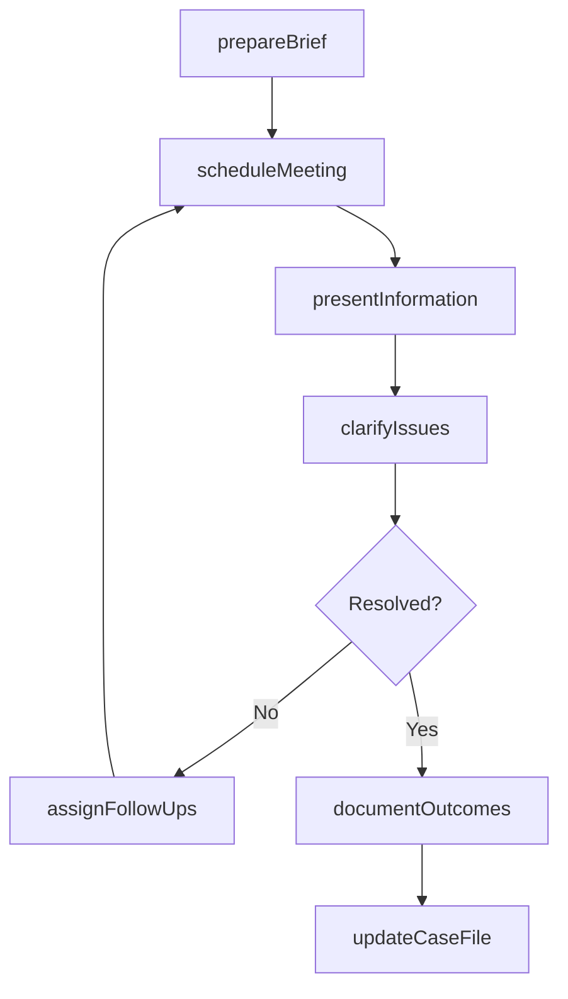
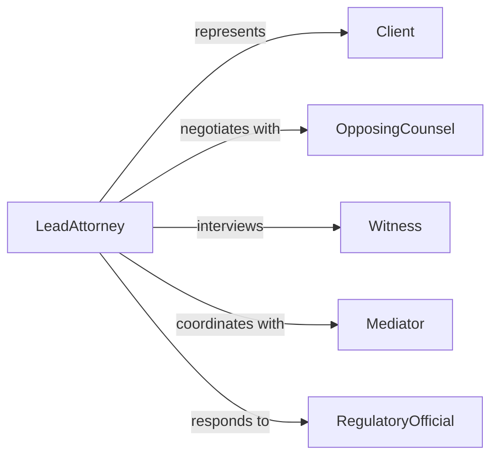

# Meet Individuals Involved Legal Processes

> Business-as-Code definition for meeting with individuals involved in legal processes to provide information and clarify issues. Models the structured communication between legal professionals and parties engaged in litigation, mediation, regulatory proceedings, or compliance matters.

## Overview

Meeting with individuals involved in legal processes involves scheduled consultations with clients, witnesses, opposing parties, mediators, and regulatory officials to exchange case-relevant information, clarify procedural requirements, and resolve outstanding questions. This definition covers meeting preparation, information presentation, issue clarification, follow-up documentation, and tracking of commitments made during the meeting. It applies across civil litigation, criminal proceedings, regulatory investigations, and alternative dispute resolution.

## Actors

| Actor | Description |
|-------|-------------|
| Client | The individual or organization represented in the legal process |
| OpposingCounsel | The attorney representing the other party in the matter |
| Witness | A person providing testimony or evidence relevant to the case |
| Mediator | A neutral party facilitating resolution between disputing parties |
| RegulatoryOfficial | A government representative involved in compliance or enforcement |
| CourtClerk | An administrative officer managing court scheduling and filings |

## Roles

| Role | Description |
|------|-------------|
| LeadAttorney | Prepares for and conducts the meeting on behalf of the client |
| Paralegal | Assembles case materials and documents meeting outcomes |
| LegalAdvisor | Provides specialized guidance on specific areas of law |
| CaseManager | Tracks all meetings, deadlines, and follow-up items across the case |

## Entities

| Entity | Description |
|--------|-------------|
| CaseFile | The complete collection of documents and evidence for a legal matter |
| MeetingBrief | A preparatory document summarizing the meeting agenda and key points |
| IssueList | A catalog of unresolved questions or disputed points to address |
| MeetingRecord | A documented summary of what was discussed and agreed upon |
| FollowUpAction | A task arising from the meeting that requires completion by a deadline |
| ConfidentialityAgreement | A binding agreement governing the disclosure of sensitive information |

## Actions

| Action | Description |
|--------|-------------|
| prepareBrief | Assemble case materials and draft an agenda for the meeting |
| scheduleMeeting | Set the date, time, location, and attendee list for the consultation |
| presentInformation | Share case facts, legal analysis, or procedural details with attendees |
| clarifyIssues | Address questions and resolve ambiguities raised during the meeting |
| documentOutcomes | Record the key points discussed, decisions made, and items agreed upon |
| assignFollowUps | Designate specific tasks to attendees with deadlines |
| updateCaseFile | Incorporate meeting outcomes and new information into the case record |

## Events

| Event | Description |
|-------|-------------|
| briefPrepared | The meeting brief and supporting materials have been assembled |
| meetingScheduled | The consultation has been placed on the calendar with all parties |
| informationPresented | Case information has been shared with meeting attendees |
| issuesClarified | Outstanding questions have been addressed and resolved |
| outcomesDocumented | Meeting decisions and discussion points have been recorded |
| followUpsAssigned | Post-meeting tasks have been designated to responsible parties |
| caseFileUpdated | The case record has been updated with new meeting information |

## Searches

| Search | Description |
|--------|-------------|
| findUpcomingMeetings | List scheduled legal consultations by case, date, or party |
| getOpenIssues | Retrieve unresolved questions for a specific case or meeting |
| getMeetingHistory | Look up past meeting records and outcomes for a case |
| getPendingFollowUps | Find outstanding post-meeting tasks by assignee or deadline |

## Workflow



## Actor Relationships



## Usage

### Calling Actions

```typescript
import { meetIndividualsInvolvedLegalProcesses } from '@headlessly/meet-individuals-involved-legal-processes'

const legal = meetIndividualsInvolvedLegalProcesses()

// Prepare a brief for a client consultation
const brief = await legal.prepareBrief({
  caseId: 'CASE-2026-0451',
  meetingType: 'client-consultation',
  agenda: [
    'Review discovery responses received from opposing counsel',
    'Discuss settlement offer and options',
    'Prepare for upcoming deposition schedule'
  ],
  documents: ['discovery-response-set-2', 'settlement-offer-letter']
})

// Schedule the meeting
await legal.scheduleMeeting({
  caseId: 'CASE-2026-0451',
  briefId: brief.id,
  attendees: ['client-john-doe', 'lead-attorney', 'paralegal'],
  date: '2026-03-18',
  time: '14:00',
  location: 'Conference Room B'
})

// Document outcomes after the meeting
await legal.documentOutcomes({
  caseId: 'CASE-2026-0451',
  briefId: brief.id,
  decisions: ['Client rejects initial settlement offer', 'Proceed with deposition preparation'],
  nextSteps: ['Draft counter-offer by March 22', 'Schedule deposition prep session']
})
```

### Event-Driven Automation

```typescript
// Auto-notify paralegal to prepare materials when meeting is scheduled
legal.meetingScheduled(async ({ caseId, briefId, date, meetingType }) => {
  await notify({
    to: 'paralegal-team',
    message: `Prepare materials for ${meetingType} on case ${caseId} scheduled for ${date}`
  })
})

// Track overdue follow-ups and alert the case manager
legal.followUpsAssigned(async ({ caseId, followUps }) => {
  for (const item of followUps) {
    scheduleReminder({
      owner: item.assignee,
      deadline: item.dueDate,
      escalateTo: 'case-manager',
      escalateAfterDays: 2
    })
  }
})
```
