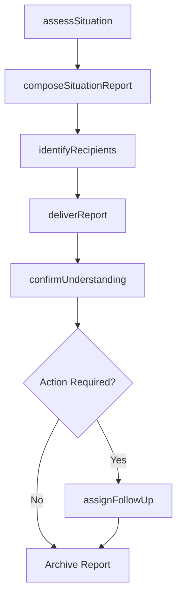
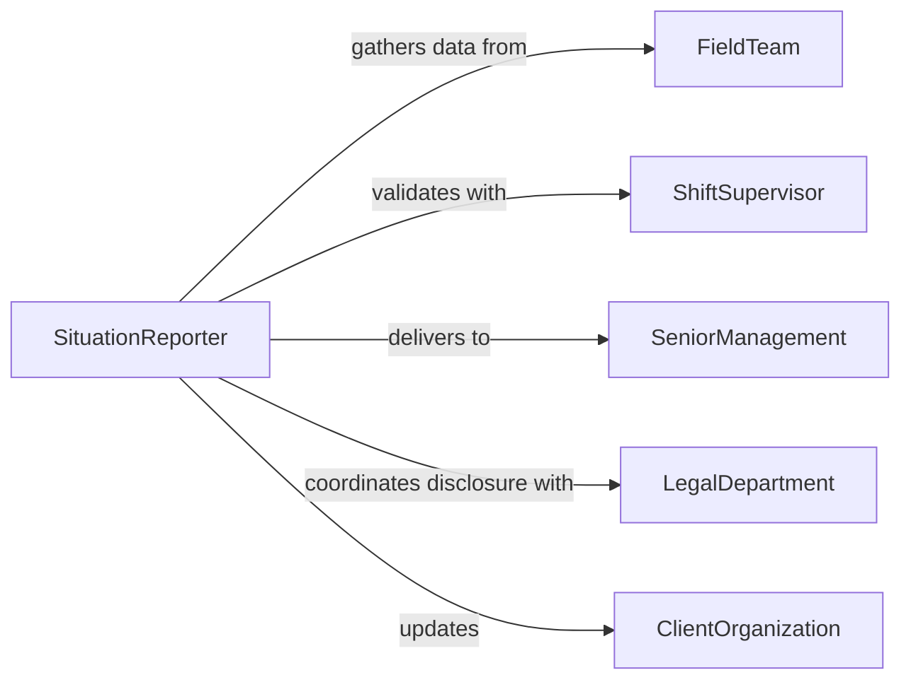

# Communicate Situation Details Appropriate Personnel

> Business-as-Code definition for communicating situation details to appropriate personnel. Models the structured reporting of operational conditions, incidents, and status updates to decision-makers and stakeholders.

## Overview

Communicating situation details to appropriate personnel involves gathering relevant facts about an operational condition, incident, or developing situation, structuring the information for clarity, and delivering it to the right people at the right time. This definition covers situation assessment, report composition, recipient identification, delivery via appropriate channels, and follow-up to ensure understanding and action.

## Actors

| Actor | Description |
|-------|-------------|
| SeniorManagement | Executive leaders who make strategic decisions based on situation reports |
| FieldTeam | On-site personnel providing firsthand observations and ground-truth data |
| ExternalAgency | Government, regulatory, or partner organization requiring situation awareness |
| LegalDepartment | Counsel advising on disclosure requirements and liability implications |
| ClientOrganization | Customer or partner who needs status updates on shared operations |

## Roles

| Role | Description |
|------|-------------|
| SituationReporter | Person who gathers facts and composes the situation report |
| ShiftSupervisor | On-duty leader who validates situation details before distribution |
| CommunicationsOfficer | Manages message formatting and channel selection for delivery |
| DecisionMaker | Recipient who acts on the situation information provided |

## Entities

| Entity | Description |
|--------|-------------|
| SituationReport | A structured communication containing details about a condition or incident |
| Situation | The operational condition, event, or incident being communicated |
| Recipient | A person or group designated to receive the situation details |
| CommunicationChannel | The medium used to deliver the report (email, radio, briefing, portal) |
| ActionItem | A follow-up task generated from the situation report |
| Acknowledgment | Confirmation that the recipient received and understood the report |

## Actions

| Action | Description |
|--------|-------------|
| assessSituation | Gather and verify facts about the current condition or incident |
| composeSituationReport | Structure the details into a clear, actionable format |
| identifyRecipients | Determine which personnel need to receive the situation details |
| deliverReport | Transmit the situation report through appropriate communication channels |
| confirmUnderstanding | Verify that recipients have received and comprehended the report |
| assignFollowUp | Create action items based on the situation details communicated |

## Events

| Event | Description |
|-------|-------------|
| situationAssessed | Facts about the condition or incident have been gathered and verified |
| reportComposed | The situation report has been structured and is ready for delivery |
| recipientsIdentified | The appropriate personnel for receiving the report have been determined |
| reportDelivered | The situation report has been transmitted to all designated recipients |
| understandingConfirmed | Recipients have acknowledged receipt and comprehension of the report |
| followUpAssigned | Action items have been created and assigned based on the report |

## Searches

| Search | Description |
|--------|-------------|
| findSituationReports | List situation reports by type, date, severity, or originator |
| getRecipients | Retrieve the personnel or groups designated for a specific report |
| getAcknowledgments | Find who has and has not confirmed receipt of a report |
| getActionItems | List follow-up tasks generated from situation reports |

## Workflow



## Actor Relationships



## Usage

### Calling Actions

```typescript
import { communicateSituationDetailsAppropriatePersonnel } from '@headlessly/communicate-situation-details-appropriate-personnel'

const sitRep = communicateSituationDetailsAppropriatePersonnel()

// Assess a developing weather situation
const situation = await sitRep.assessSituation({
  type: 'severe weather',
  location: 'Regional Distribution Center, Dallas',
  details: 'Tornado watch issued for Dallas County. High winds expected by 1400 hours.',
  source: 'National Weather Service alert'
})

// Compose and deliver the report
const report = await sitRep.composeSituationReport({
  situationId: situation.id,
  summary: 'Tornado watch active. Outdoor operations suspended. Staff sheltering protocol initiated.',
  recommendations: ['Suspend outbound shipments', 'Activate shelter-in-place', 'Secure loading docks']
})

await sitRep.identifyRecipients({
  reportId: report.id,
  recipients: ['regional-director', 'logistics-team', 'warehouse-supervisors', 'corporate-safety']
})

await sitRep.deliverReport({
  reportId: report.id,
  channels: ['email', 'sms', 'pa-system']
})
```

### Event-Driven Automation

```typescript
// Re-send to unacknowledged recipients after 15 minutes
sitRep.reportDelivered(async ({ reportId, severity }) => {
  if (severity === 'high' || severity === 'critical') {
    await scheduleTask({
      action: 'confirmUnderstanding',
      reportId,
      delay: '15m',
      resendToUnconfirmed: true
    })
  }
})

// Auto-assign follow-up tasks from report recommendations
sitRep.understandingConfirmed(async ({ reportId, recommendations }) => {
  for (const rec of recommendations) {
    await sitRep.assignFollowUp({
      reportId,
      task: rec,
      assignee: 'responsible-team-lead'
    })
  }
})
```
