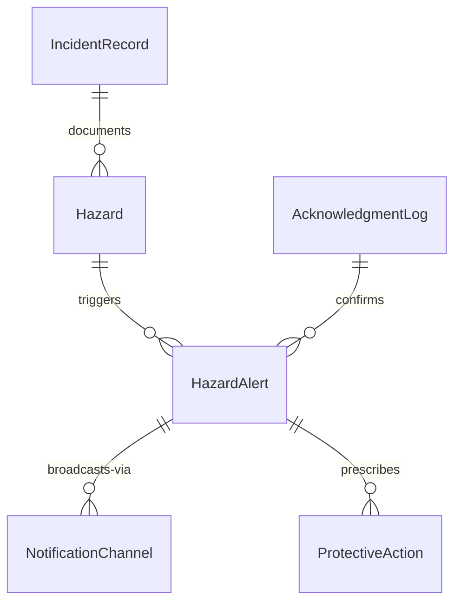
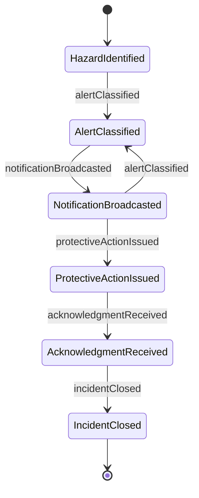
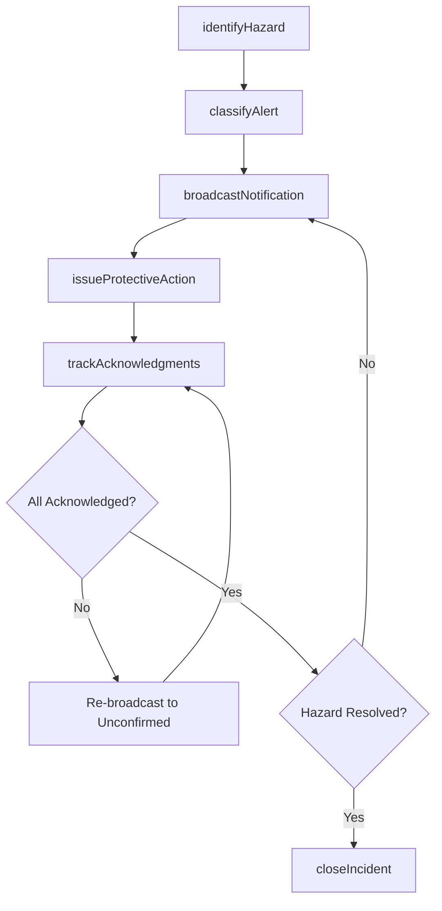
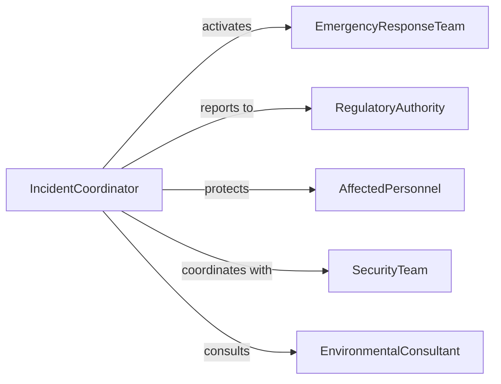

# Notify Others Emergencies Problems Hazards

> Business-as-Code definition for notifying others of emergencies, problems, or hazards. Models the full lifecycle of identifying threats, broadcasting alerts, and tracking acknowledgment across an organization.

## Overview

Notifying others of emergencies, problems, or hazards involves detecting dangerous conditions, operational failures, or safety threats and communicating them to supervisors, coworkers, emergency responders, and affected individuals. This definition covers hazard identification, alert classification, multi-channel notification, acknowledgment tracking, and incident closure for workplace safety, environmental hazards, and operational disruptions.

## Actors

| Actor | Description |
|-------|-------------|
| EmergencyResponseTeam | Internal or external team trained to handle emergencies and hazardous situations |
| RegulatoryAuthority | OSHA, EPA, or other agency requiring hazard reporting and compliance |
| AffectedPersonnel | Employees, visitors, or public who may be impacted by the hazard |
| SecurityTeam | On-site security providing access control and perimeter management during incidents |
| EnvironmentalConsultant | Specialist advising on environmental hazards and remediation |

## Roles

| Role | Description |
|------|-------------|
| HazardReporter | Person who identifies and reports the emergency, problem, or hazard |
| IncidentCoordinator | Manages the notification process and coordinates response activities |
| SafetyManager | Evaluates hazard severity and determines appropriate protective actions |
| CommunicationsLead | Drafts and distributes notifications across channels |

## Entities

| Entity | Description |
|--------|-------------|
| HazardAlert | A notification communicating an identified emergency, problem, or hazard |
| Hazard | A condition or event posing risk to health, safety, or operations |
| NotificationChannel | A communication medium such as PA system, SMS, email, or radio |
| AcknowledgmentLog | A record of who received and confirmed the alert |
| ProtectiveAction | An instruction for affected personnel such as evacuation or shelter-in-place |
| IncidentRecord | A comprehensive log of the hazard event and notification actions taken |

## Actions

| Action | Description |
|--------|-------------|
| identifyHazard | Detect and classify an emergency, problem, or hazardous condition |
| classifyAlert | Determine the severity level and appropriate notification scope |
| broadcastNotification | Distribute the hazard alert to all affected parties and channels |
| issueProtectiveAction | Communicate specific safety instructions to affected personnel |
| trackAcknowledgments | Monitor and record which recipients have confirmed the alert |
| closeIncident | Declare the hazard resolved and document the notification lifecycle |

## Events

| Event | Description |
|-------|-------------|
| hazardIdentified | An emergency, problem, or hazard has been detected |
| alertClassified | The severity and scope of the alert have been determined |
| notificationBroadcasted | The hazard alert has been distributed to affected parties |
| protectiveActionIssued | Safety instructions have been communicated to personnel |
| acknowledgmentReceived | A recipient has confirmed receipt of the hazard notification |
| incidentClosed | The hazard has been resolved and all records finalized |

## Searches

| Search | Description |
|--------|-------------|
| findAlerts | List hazard alerts by type, severity, location, or status |
| getUnacknowledged | Find personnel who have not yet confirmed receipt of an alert |
| getHazardHistory | Retrieve past hazard notifications for a location or facility |
| getProtectiveActions | List active protective action instructions by incident |


## Entity Relationships



## State Diagram



## Workflow



## Actor Relationships



## Usage

### Calling Actions

```typescript
import { notifyOthersEmergenciesProblemsHazards } from '@headlessly/notify-others-emergencies-problems-hazards'

const alerts = notifyOthersEmergenciesProblemsHazards()

// Identify a gas leak hazard
const hazard = await alerts.identifyHazard({
  type: 'gas leak',
  location: 'Plant Floor, Section D',
  severity: 'critical',
  description: 'Natural gas detected above safe threshold by area monitors',
  detectedBy: 'Automated sensor array'
})

// Classify and broadcast
await alerts.classifyAlert({
  hazardId: hazard.id,
  level: 'emergency',
  scope: ['Plant Floor', 'Adjacent Offices', 'Parking Lot B']
})

await alerts.broadcastNotification({
  hazardId: hazard.id,
  channels: ['pa-system', 'sms-all-staff', 'radio-security'],
  message: 'EMERGENCY: Gas leak detected in Section D. Evacuate Plant Floor immediately.'
})

// Issue protective action
await alerts.issueProtectiveAction({
  hazardId: hazard.id,
  action: 'evacuate',
  instructions: 'Exit via nearest emergency route. Assemble at Lot C muster point.'
})
```

### Event-Driven Automation

```typescript
// Auto-escalate when acknowledgments are incomplete after 10 minutes
alerts.notificationBroadcasted(async ({ hazardId, level }) => {
  if (level === 'emergency') {
    await scheduleTask({
      action: 'trackAcknowledgments',
      hazardId,
      delay: '10m',
      escalateUnconfirmed: true
    })
  }
})

// File regulatory report on critical incidents
alerts.incidentClosed(async ({ hazardId, type, severity }) => {
  if (severity === 'critical') {
    await submitRegulatoryReport({ hazardId, type, agency: 'OSHA' })
  }
})
```
