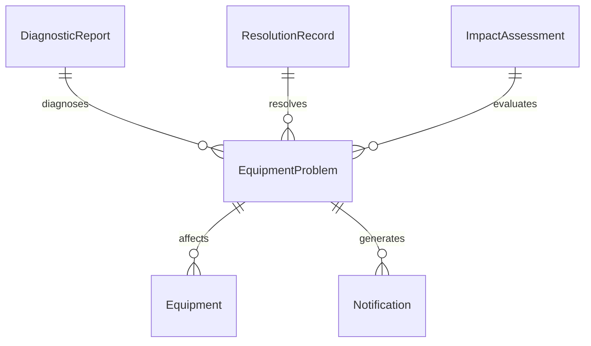
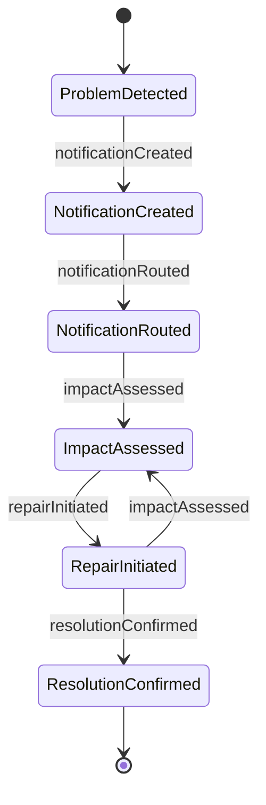
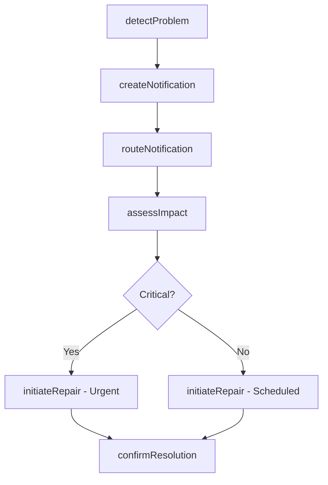
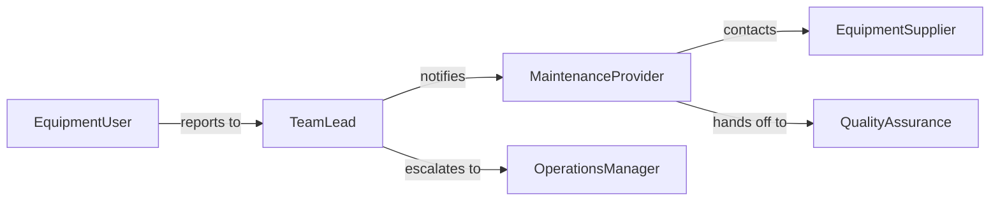

# Notify Others Equipment Problems

> Business-as-Code definition for notifying others of equipment problems. Models the process of detecting equipment issues, alerting responsible parties, and tracking resolution through to operational restoration.

## Overview

Notifying others of equipment problems involves detecting equipment failures, performance degradation, or abnormal operating conditions and promptly communicating these issues to supervisors, maintenance staff, and affected operators. This definition covers problem detection, notification creation, recipient routing, priority assessment, and resolution tracking for industrial, office, and specialized equipment.

## Actors

| Actor | Description |
|-------|-------------|
| MaintenanceProvider | Internal maintenance department or external service company performing repairs |
| EquipmentSupplier | Manufacturer or distributor providing technical support and replacement parts |
| QualityAssurance | Team verifying that equipment operates within specification after repair |
| ProductionOperations | Department relying on the equipment for ongoing work output |

## Roles

| Role | Description |
|------|-------------|
| EquipmentUser | Person operating the equipment who first detects the problem |
| TeamLead | Immediate supervisor who receives the initial problem notification |
| MaintenanceTechnician | Skilled worker who diagnoses and repairs the equipment |
| OperationsManager | Senior manager who assesses production impact and authorizes downtime |

## Entities

| Entity | Description |
|--------|-------------|
| EquipmentProblem | A documented issue describing the malfunction or degradation |
| Equipment | The machine, device, or system experiencing the problem |
| Notification | A message alerting responsible parties to the equipment issue |
| DiagnosticReport | Technical findings from inspection or testing of the equipment |
| ResolutionRecord | Documentation of actions taken to fix the problem |
| ImpactAssessment | Analysis of how the problem affects operations, safety, or quality |

## Actions

| Action | Description |
|--------|-------------|
| detectProblem | Identify an equipment malfunction or abnormal condition |
| createNotification | Document the problem and generate an alert for responsible parties |
| routeNotification | Send the notification to the appropriate recipients based on equipment type |
| assessImpact | Evaluate how the equipment problem affects operations and safety |
| initiateRepair | Begin diagnostic and repair activities on the affected equipment |
| confirmResolution | Verify the problem is fixed and the equipment is operational |

## Events

| Event | Description |
|-------|-------------|
| problemDetected | An equipment malfunction or abnormal condition has been identified |
| notificationCreated | A problem notification has been documented and prepared for distribution |
| notificationRouted | The notification has been delivered to responsible parties |
| impactAssessed | The operational and safety impact of the problem has been evaluated |
| repairInitiated | Diagnostic and repair work has begun on the equipment |
| resolutionConfirmed | The equipment problem has been fixed and verified operational |

## Searches

| Search | Description |
|--------|-------------|
| findProblems | List equipment problems by type, location, priority, or status |
| getNotifications | Retrieve notifications sent for a specific piece of equipment |
| getEquipmentStatus | Check current operational status and open problems for equipment |
| getResolutionHistory | Find past problems and their resolutions for a specific asset |


## Entity Relationships



## State Diagram



## Workflow



## Actor Relationships



## Usage

### Calling Actions

```typescript
import { notifyOthersEquipmentProblems } from '@headlessly/notify-others-equipment-problems'

const equipmentAlerts = notifyOthersEquipmentProblems()

// Detect and report a printer network issue
const problem = await equipmentAlerts.detectProblem({
  equipment: 'Industrial Printer MFP-200',
  location: 'Office 3B, 2nd Floor',
  symptom: 'Paper jam sensor triggered repeatedly, print queue stalled',
  detectedBy: 'User Martinez'
})

// Create and route notification
const notification = await equipmentAlerts.createNotification({
  problemId: problem.id,
  priority: 'medium',
  description: 'Industrial printer experiencing repeated paper jams. Print queue backed up with 47 jobs.'
})

await equipmentAlerts.routeNotification({
  notificationId: notification.id,
  recipients: ['it-support', 'office-manager']
})
```

### Event-Driven Automation

```typescript
// Notify operations manager when critical equipment goes down
equipmentAlerts.impactAssessed(async ({ problemId, impact, equipment }) => {
  if (impact.level === 'critical') {
    await notify({
      to: 'operations-manager',
      message: `Critical equipment problem: ${equipment}. Production impact: ${impact.description}`
    })
  }
})

// Auto-close notification when resolution is confirmed
equipmentAlerts.resolutionConfirmed(async ({ problemId, equipment }) => {
  await notify({
    to: 'original-reporter',
    message: `Equipment problem resolved: ${equipment} is back online.`
  })
})
```
