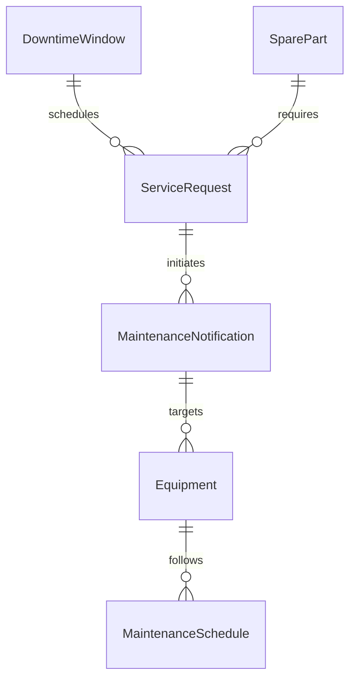
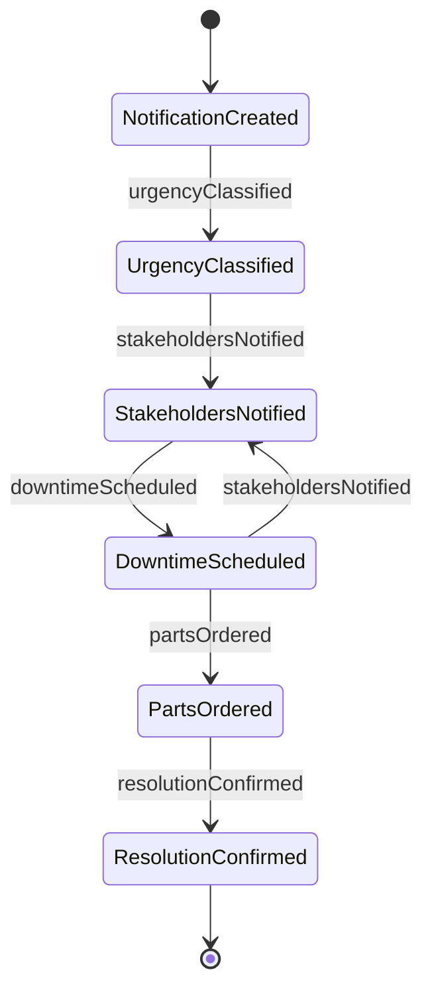
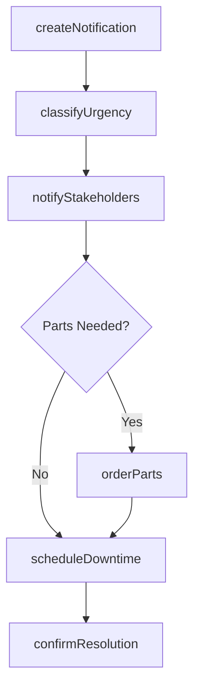
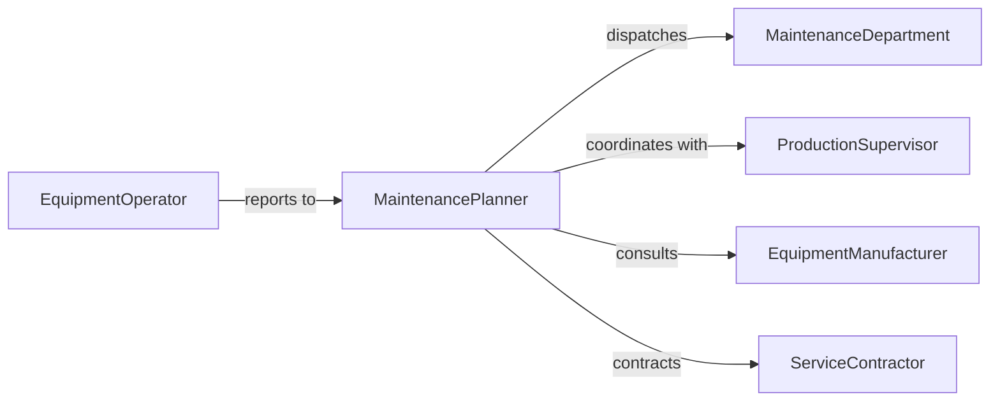

# Notify Others Equipment Repair Maintenance

> Business-as-Code definition for notifying others of equipment repair or maintenance needs. Models the communication workflow from issue detection through maintenance scheduling and stakeholder notification.

## Overview

Notifying others of equipment repair or maintenance needs involves communicating discovered or anticipated equipment issues to maintenance teams, supervisors, and affected operators so that scheduled or emergency repairs can be arranged. This definition covers preventive maintenance alerts, breakdown notifications, parts ordering triggers, and status updates to stakeholders who depend on the equipment.

## Actors

| Actor | Description |
|-------|-------------|
| MaintenanceDepartment | Internal team responsible for performing equipment repairs and upkeep |
| EquipmentManufacturer | OEM providing technical bulletins, warranty support, and parts |
| ServiceContractor | Third-party maintenance provider for specialized or overflow work |
| ProductionDepartment | Operational units whose workflows depend on equipment availability |

## Roles

| Role | Description |
|------|-------------|
| EquipmentOperator | Frontline user who detects issues and initiates notifications |
| MaintenancePlanner | Schedules repair activities and coordinates resource allocation |
| ProductionSupervisor | Manages production impact and authorizes equipment downtime |
| ReliabilityEngineer | Analyzes equipment performance data and recommends maintenance actions |

## Entities

| Entity | Description |
|--------|-------------|
| MaintenanceNotification | A communication alerting stakeholders of repair or maintenance needs |
| Equipment | A machine, tool, or system requiring maintenance attention |
| MaintenanceSchedule | A planned calendar of preventive and corrective maintenance activities |
| ServiceRequest | A formal request for maintenance or repair work |
| DowntimeWindow | An approved period during which equipment is taken offline for service |
| SparePart | A replacement component needed to complete the repair |

## Actions

| Action | Description |
|--------|-------------|
| createNotification | Generate a maintenance need notification with issue details |
| classifyUrgency | Determine whether the need is routine, urgent, or emergency |
| notifyStakeholders | Send the notification to relevant maintenance and operations personnel |
| scheduleDowntime | Coordinate an approved window for taking equipment offline |
| orderParts | Initiate procurement of required spare parts or materials |
| confirmResolution | Verify that the maintenance need has been addressed and equipment restored |

## Events

| Event | Description |
|-------|-------------|
| notificationCreated | A maintenance need notification has been generated |
| urgencyClassified | The urgency level of the maintenance need has been determined |
| stakeholdersNotified | Relevant personnel have been informed of the maintenance need |
| downtimeScheduled | An equipment downtime window has been approved and communicated |
| partsOrdered | Required replacement parts have been requested from suppliers |
| resolutionConfirmed | Equipment has been repaired and returned to operational status |

## Searches

| Search | Description |
|--------|-------------|
| findNotifications | List maintenance notifications by equipment, urgency, or status |
| getMaintenanceSchedule | Retrieve upcoming scheduled maintenance for equipment or facilities |
| getPendingParts | Find parts orders that have not yet been fulfilled |
| getEquipmentStatus | Check current operational or maintenance status of specific equipment |


## Entity Relationships



## State Diagram



## Workflow



## Actor Relationships



## Usage

### Calling Actions

```typescript
import { notifyOthersEquipmentRepairMaintenance } from '@headlessly/notify-others-equipment-repair-maintenance'

const notifications = notifyOthersEquipmentRepairMaintenance()

// Create a maintenance notification for a CNC machine
const notice = await notifications.createNotification({
  equipment: 'CNC Mill #12',
  location: 'Machine Shop Bay 3',
  issue: 'Spindle bearing vibration exceeding normal parameters',
  detectedBy: 'Operator Williams',
  detectionMethod: 'vibration monitoring sensor'
})

// Classify urgency and notify stakeholders
await notifications.classifyUrgency({
  notificationId: notice.id,
  urgency: 'urgent',
  reason: 'Bearing failure risk within 72 hours based on vibration trend'
})

await notifications.notifyStakeholders({
  notificationId: notice.id,
  recipients: ['maintenance-team', 'production-supervisor', 'reliability-engineering']
})
```

### Event-Driven Automation

```typescript
// Auto-order parts when urgent maintenance is identified
notifications.urgencyClassified(async ({ notificationId, urgency, equipment }) => {
  if (urgency === 'urgent' || urgency === 'emergency') {
    const parts = await lookupCommonParts({ equipment })
    await notifications.orderParts({ notificationId, parts })
  }
})

// Notify production when downtime is scheduled
notifications.downtimeScheduled(async ({ equipment, window }) => {
  await notify({
    to: 'production-department',
    message: `${equipment} scheduled for maintenance from ${window.start} to ${window.end}. Plan accordingly.`
  })
})
```
