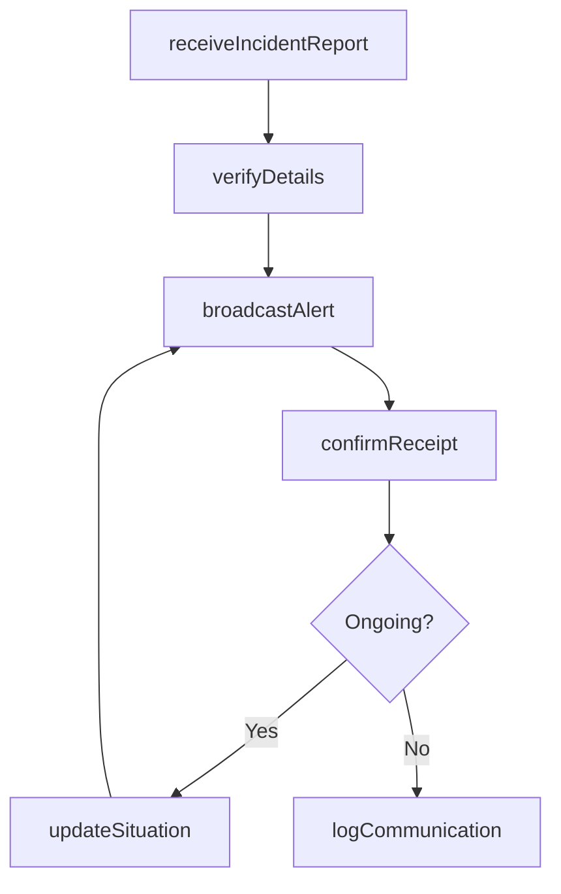
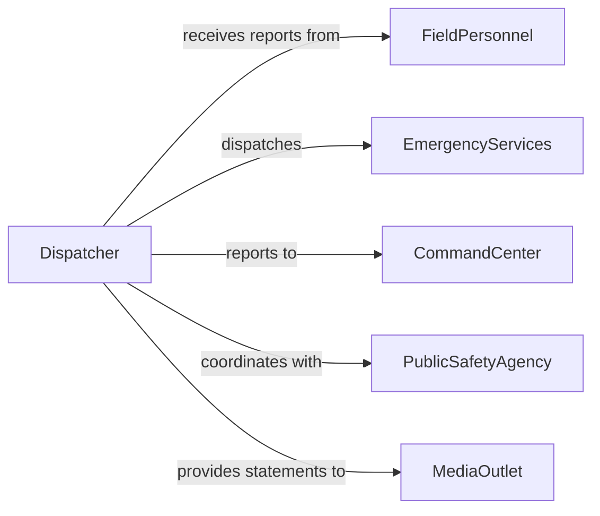

# Relay Information About Incidents Emergencies

> Business-as-Code definition for relaying incident and emergency information to personnel via communication channels. Models real-time dispatch, situation updates, and multi-channel notification workflows.

## Overview

Relaying information about incidents or emergencies to personnel using phones, two-way radios, or digital communication systems involves receiving initial reports, verifying critical details, and transmitting accurate situation updates to responders, supervisors, and affected parties. This definition covers incident intake, message formatting, channel selection, broadcast delivery, and confirmation tracking.

## Actors

| Actor | Description |
|-------|-------------|
| EmergencyServices | Fire, police, EMS, and other first responder agencies |
| FieldPersonnel | On-site workers, security guards, or patrol officers receiving incident updates |
| CommandCenter | Central operations hub coordinating emergency response |
| PublicSafetyAgency | Government agency overseeing public safety and emergency management |
| MediaOutlet | News organization requesting or receiving incident information |

## Roles

| Role | Description |
|------|-------------|
| Dispatcher | Receives incident reports and relays information to appropriate personnel |
| IncidentCommander | Senior responder who directs on-scene operations and communications |
| CommunicationsOperator | Manages radio, phone, and digital channels during incidents |
| SituationAnalyst | Evaluates incoming information and prepares situation summaries |

## Entities

| Entity | Description |
|--------|-------------|
| Incident | A reported event requiring response such as an accident, fire, or security breach |
| EmergencyBroadcast | A formatted message transmitted to personnel about an incident |
| CommunicationChannel | A phone line, radio frequency, or digital messaging system |
| SituationReport | A structured update on incident status, resources, and actions taken |
| ContactRoster | A list of personnel and their communication endpoints |
| AcknowledgmentRecord | Confirmation that a recipient received and understood the broadcast |

## Actions

| Action | Description |
|--------|-------------|
| receiveIncidentReport | Intake initial information about an incident or emergency |
| verifyDetails | Confirm the accuracy of reported incident information |
| broadcastAlert | Transmit incident information to designated personnel and channels |
| updateSituation | Send revised information as the incident develops |
| confirmReceipt | Verify that recipients have received and acknowledged the broadcast |
| logCommunication | Record all transmissions for post-incident review |

## Events

| Event | Description |
|-------|-------------|
| incidentReported | An initial incident or emergency report has been received |
| detailsVerified | Incident information has been confirmed as accurate |
| alertBroadcasted | Incident information has been transmitted to personnel |
| situationUpdated | A revised situation report has been distributed |
| receiptConfirmed | A recipient has acknowledged the emergency broadcast |
| communicationLogged | All transmissions have been recorded in the incident log |

## Searches

| Search | Description |
|--------|-------------|
| findIncidents | List incidents by type, location, severity, or date range |
| getBroadcasts | Retrieve all broadcasts sent for a specific incident |
| getAcknowledgments | Find personnel who have or have not confirmed receipt |
| getSituationReports | Retrieve situation updates for an active incident |

## Workflow



## Actor Relationships



## Usage

### Calling Actions

```typescript
import { relayInformationAboutIncidentsEmergencies } from '@headlessly/relay-information-about-incidents-emergencies'

const comms = relayInformationAboutIncidentsEmergencies()

// Receive an incident report
const incident = await comms.receiveIncidentReport({
  type: 'structure fire',
  location: '1200 Main Street, Building C',
  reportedBy: 'Security Officer Ramirez',
  severity: 'high',
  description: 'Smoke visible from third floor, east wing. Fire alarm activated.'
})

// Broadcast alert to response teams
await comms.broadcastAlert({
  incidentId: incident.id,
  channels: ['radio-frequency-3', 'sms-group-fire', 'command-center-phone'],
  message: 'Structure fire at 1200 Main St, Bldg C, 3rd floor east wing. All units respond.',
  priority: 'emergency'
})

// Update the situation as it develops
await comms.updateSituation({
  incidentId: incident.id,
  update: 'Fire contained to east wing. Evacuation of floors 2-4 complete. No injuries reported.'
})
```

### Event-Driven Automation

```typescript
// Escalate when receipts are not confirmed within 5 minutes
comms.alertBroadcasted(async ({ incidentId, recipients }) => {
  await scheduleTask({
    action: 'confirmReceipt',
    incidentId,
    delay: '5m',
    escalateUnconfirmed: true
  })
})

// Auto-log all communications when incident is resolved
comms.situationUpdated(async ({ incidentId, status }) => {
  if (status === 'resolved') {
    await comms.logCommunication({ incidentId })
  }
})
```
