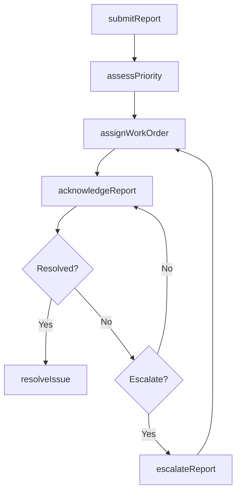
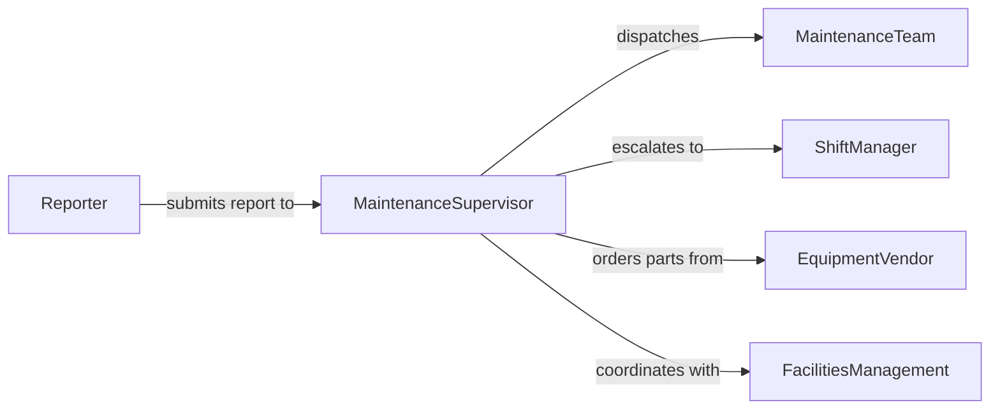

# Report Maintenance Equipment Problems Appropriate

> Business-as-Code definition for reporting maintenance or equipment problems to appropriate personnel. Models issue identification, documentation, routing, and resolution tracking.

## Overview

Reporting maintenance or equipment problems to appropriate personnel involves identifying equipment malfunctions, facility deficiencies, or infrastructure issues and formally communicating them to maintenance teams, supervisors, or facility managers. This definition covers problem detection, report creation, priority assignment, routing to responsible parties, and tracking through resolution.

## Actors

| Actor | Description |
|-------|-------------|
| MaintenanceTeam | Technicians and engineers who perform repairs and preventive maintenance |
| EquipmentVendor | External supplier providing parts, warranty service, or technical support |
| SafetyInspector | Regulatory or internal inspector who evaluates equipment compliance |
| FacilitiesManagement | Department responsible for building systems and infrastructure |

## Roles

| Role | Description |
|------|-------------|
| Reporter | Employee who identifies and submits the equipment or maintenance problem |
| MaintenanceSupervisor | Oversees repair scheduling and technician assignments |
| ShiftManager | On-duty manager who triages urgency and authorizes immediate actions |
| AssetManager | Tracks equipment lifecycle, warranties, and maintenance history |

## Entities

| Entity | Description |
|--------|-------------|
| MaintenanceReport | A formal document describing the equipment or facility problem |
| Equipment | A physical asset such as machinery, HVAC, or production tools |
| WorkOrder | An authorized request for maintenance or repair work |
| PriorityLevel | Classification of urgency (critical, high, medium, low) |
| RepairLog | Historical record of all maintenance actions on an asset |
| Attachment | Photos, videos, or diagnostic data supporting the report |

## Actions

| Action | Description |
|--------|-------------|
| submitReport | Create and file a maintenance or equipment problem report |
| assessPriority | Evaluate the severity and urgency of the reported problem |
| assignWorkOrder | Route the report to the appropriate maintenance personnel |
| acknowledgeReport | Confirm receipt and begin evaluation of the problem |
| resolveIssue | Complete repairs and close the maintenance report |
| escalateReport | Elevate the report to higher authority when standard resolution fails |

## Events

| Event | Description |
|-------|-------------|
| reportSubmitted | A maintenance or equipment problem report has been filed |
| priorityAssessed | The urgency level of the report has been determined |
| workOrderAssigned | A technician or team has been assigned to address the issue |
| reportAcknowledged | The assigned personnel have confirmed receipt of the report |
| issueResolved | The maintenance or equipment problem has been fixed |
| reportEscalated | The report has been elevated due to complexity or delay |

## Searches

| Search | Description |
|--------|-------------|
| findReports | List maintenance reports by equipment, location, priority, or status |
| getWorkOrders | Retrieve work orders by assignee, date range, or completion status |
| getEquipmentHistory | Find all past maintenance reports and repairs for a specific asset |
| getOpenIssues | List unresolved maintenance problems across facilities |

## Workflow



## Actor Relationships



## Usage

### Calling Actions

```typescript
import { reportMaintenanceEquipmentProblemsAppropriate } from '@headlessly/report-maintenance-equipment-problems-appropriate'

const maintenance = reportMaintenanceEquipmentProblemsAppropriate()

// Submit a report for a malfunctioning conveyor belt
const report = await maintenance.submitReport({
  equipment: 'Conveyor Belt #7',
  location: 'Building A, Line 3',
  description: 'Belt slipping and producing grinding noise during operation',
  attachments: ['photo_conveyor7.jpg', 'audio_grinding.mp3']
})

// Assess priority
await maintenance.assessPriority({
  reportId: report.id,
  priority: 'high',
  reason: 'Production line stoppage risk within 4 hours'
})

// Assign a work order
await maintenance.assignWorkOrder({
  reportId: report.id,
  assignee: 'Tech Team Alpha',
  scheduledDate: '2026-02-06'
})
```

### Event-Driven Automation

```typescript
// Alert shift manager on critical priority reports
maintenance.priorityAssessed(async ({ reportId, priority, equipment }) => {
  if (priority === 'critical') {
    await notify({
      to: 'shift-manager',
      message: `Critical equipment failure reported: ${equipment}. Report #${reportId}`
    })
  }
})

// Auto-escalate unacknowledged reports after 2 hours
maintenance.reportSubmitted(async ({ reportId, priority }) => {
  if (priority === 'critical') {
    await scheduleTask({
      action: 'escalateReport',
      reportId,
      delay: '2h',
      condition: 'not acknowledged'
    })
  }
})
```
