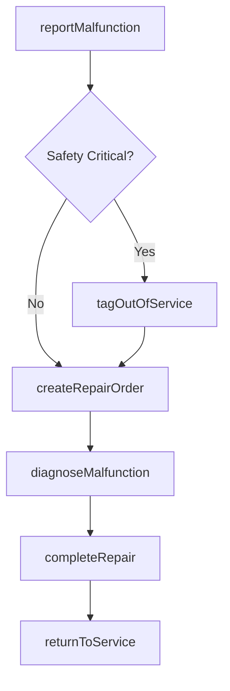
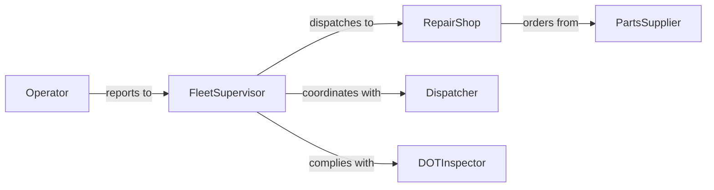

# Report Vehicle Equipment Malfunctions

> Business-as-Code definition for reporting vehicle or equipment malfunctions. Models the detection, documentation, and communication of mechanical failures to fleet management and repair teams.

## Overview

Reporting vehicle or equipment malfunctions involves detecting mechanical failures, safety defects, or performance degradation in vehicles and mobile equipment, then documenting and communicating these issues to fleet managers, mechanics, and dispatch personnel. This definition covers pre-trip inspections, in-service failure reporting, out-of-service tagging, and repair tracking for fleets, heavy equipment, and industrial vehicles.

## Actors

| Actor | Description |
|-------|-------------|
| FleetManagement | Department overseeing vehicle allocation, maintenance schedules, and compliance |
| RepairShop | Internal garage or external service center performing vehicle repairs |
| PartsSupplier | Vendor providing replacement components and materials |
| DOTInspector | Regulatory inspector enforcing vehicle safety standards |
| InsuranceCarrier | Provider assessing liability and coverage for vehicle incidents |

## Roles

| Role | Description |
|------|-------------|
| Operator | Driver or equipment operator who identifies and reports malfunctions |
| FleetSupervisor | Manages vehicle assignments and authorizes out-of-service decisions |
| Mechanic | Diagnoses and repairs reported vehicle malfunctions |
| Dispatcher | Coordinates vehicle availability and reassigns routes when units are down |

## Entities

| Entity | Description |
|--------|-------------|
| MalfunctionReport | A documented record of a vehicle or equipment failure |
| Vehicle | A truck, car, bus, or other motorized unit in the fleet |
| Equipment | Heavy machinery, trailers, or specialized mobile assets |
| InspectionChecklist | A pre-trip or post-trip safety and mechanical check form |
| RepairOrder | An authorized work request for diagnosing and fixing the malfunction |
| OutOfServiceTag | A formal designation removing a vehicle from active duty |

## Actions

| Action | Description |
|--------|-------------|
| reportMalfunction | Document and submit a vehicle or equipment malfunction |
| tagOutOfService | Designate a vehicle as unsafe for operation until repaired |
| createRepairOrder | Generate a work order for the repair shop or mechanic |
| diagnoseMalfunction | Inspect the vehicle to determine root cause of the failure |
| completeRepair | Finish repair work and clear the vehicle for return to service |
| returnToService | Certify the vehicle as operational and release it to the fleet |

## Events

| Event | Description |
|-------|-------------|
| malfunctionReported | A vehicle or equipment malfunction has been documented |
| vehicleTaggedOutOfService | A vehicle has been removed from active operation |
| repairOrderCreated | A work order has been generated for the malfunction |
| malfunctionDiagnosed | Root cause of the failure has been identified |
| repairCompleted | The vehicle has been repaired and tested |
| vehicleReturnedToService | The vehicle has been cleared for active operation |

## Searches

| Search | Description |
|--------|-------------|
| findMalfunctions | List malfunction reports by vehicle, type, severity, or date |
| getOutOfServiceVehicles | Retrieve all vehicles currently tagged out of service |
| getRepairOrders | Find repair orders by vehicle, mechanic, or completion status |
| getVehicleHistory | Retrieve full malfunction and repair history for a specific vehicle |

## Workflow



## Actor Relationships



## Usage

### Calling Actions

```typescript
import { reportVehicleEquipmentMalfunctions } from '@headlessly/report-vehicle-equipment-malfunctions'

const fleet = reportVehicleEquipmentMalfunctions()

// Report a brake system malfunction
const report = await fleet.reportMalfunction({
  vehicle: 'TRK-2847',
  type: 'Brake System',
  description: 'Soft brake pedal, increased stopping distance noted during route',
  severity: 'critical',
  reportedBy: 'Driver Johnson',
  location: 'Route 95, Mile Marker 42'
})

// Tag the vehicle out of service
await fleet.tagOutOfService({
  reportId: report.id,
  vehicle: 'TRK-2847',
  reason: 'Brake system failure - unsafe for operation'
})

// Create repair order
await fleet.createRepairOrder({
  reportId: report.id,
  assignedTo: 'Main Garage',
  priority: 'urgent'
})
```

### Event-Driven Automation

```typescript
// Reassign routes when a vehicle goes out of service
fleet.vehicleTaggedOutOfService(async ({ vehicle, reportId }) => {
  await notify({
    to: 'dispatch',
    message: `Vehicle ${vehicle} is out of service. Reassign active routes immediately.`
  })
})

// Notify fleet supervisor when repair is completed
fleet.repairCompleted(async ({ vehicle, repairOrderId }) => {
  await notify({
    to: 'fleet-supervisor',
    message: `Vehicle ${vehicle} repair complete (Order #${repairOrderId}). Ready for return-to-service inspection.`
  })
})
```
