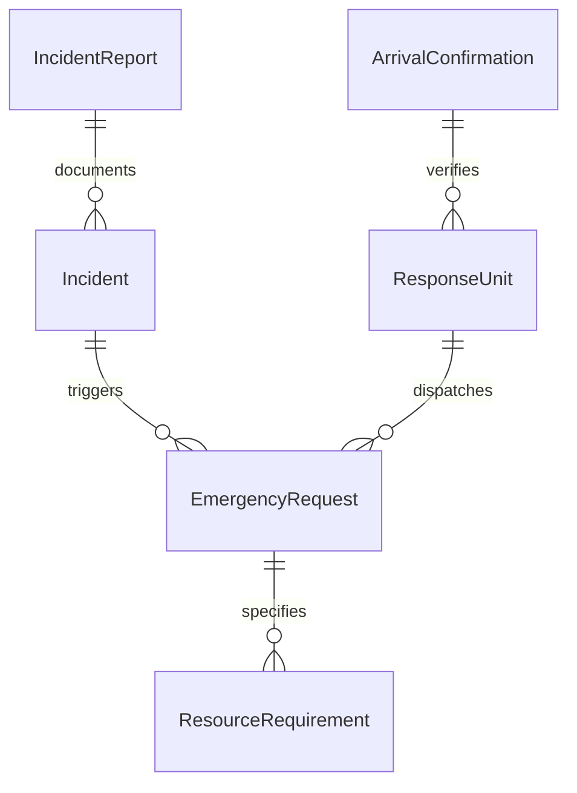
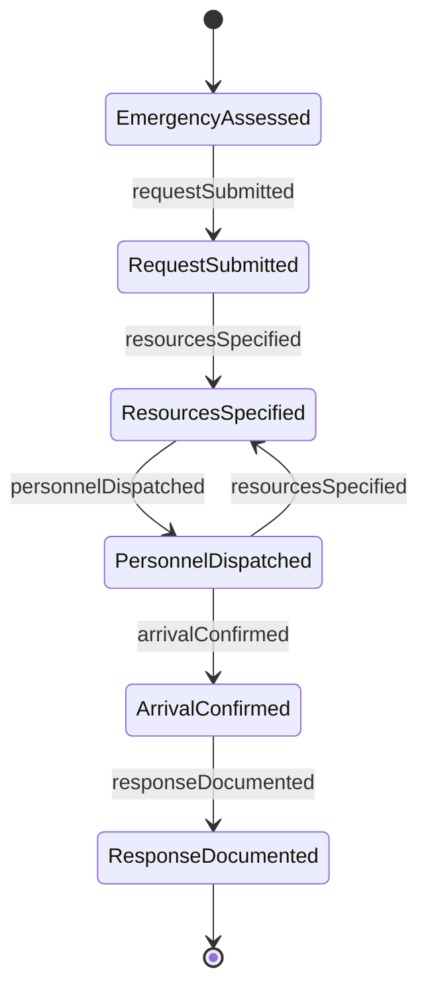
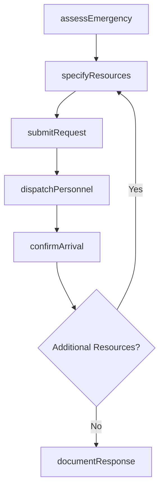
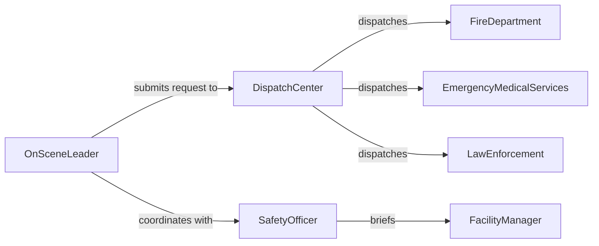

# Request Emergency Personnel

> Business-as-Code definition for requesting emergency personnel. Models the process of assessing an emergency, dispatching appropriate responders, and coordinating arrival and handoff.

## Overview

Requesting emergency personnel involves evaluating the nature and severity of an emergency situation, determining the appropriate type and quantity of responders needed, initiating the request through dispatch or emergency services, and coordinating their arrival at the scene. This definition covers emergency assessment, resource request, dispatch coordination, arrival confirmation, and post-response documentation.

## Actors

| Actor | Description |
|-------|-------------|
| FireDepartment | Municipal or private fire and rescue service responding to fire and hazmat emergencies |
| EmergencyMedicalServices | Paramedics and EMTs providing medical response and patient transport |
| LawEnforcement | Police or security forces responding to criminal, crowd, or safety incidents |
| HazmatTeam | Specialized unit handling hazardous materials incidents |
| DispatchCenter | Central communications hub that routes emergency requests to responders |

## Roles

| Role | Description |
|------|-------------|
| OnSceneLeader | Person at the emergency location who assesses the situation and initiates the request |
| EmergencyDispatcher | Operator who receives requests and coordinates responder deployment |
| SafetyOfficer | Facility or site safety professional who evaluates emergency scope |
| FacilityManager | Building or site manager who provides access and facility information to responders |

## Entities

| Entity | Description |
|--------|-------------|
| EmergencyRequest | A formal request for emergency personnel with situation details |
| Incident | The emergency event requiring personnel response |
| ResponseUnit | A team or vehicle dispatched to the emergency scene |
| ArrivalConfirmation | Verification that requested personnel have arrived on scene |
| ResourceRequirement | The type and quantity of emergency personnel and equipment needed |
| IncidentReport | Post-response documentation of the emergency and response actions |

## Actions

| Action | Description |
|--------|-------------|
| assessEmergency | Evaluate the nature, severity, and scope of the emergency situation |
| submitRequest | Initiate a formal request for emergency personnel through dispatch |
| specifyResources | Define the type and quantity of responders and equipment needed |
| dispatchPersonnel | Route emergency units to the incident location |
| confirmArrival | Verify that requested personnel have arrived at the scene |
| documentResponse | Record all details of the emergency request and response for review |

## Events

| Event | Description |
|-------|-------------|
| emergencyAssessed | The situation has been evaluated and response requirements determined |
| requestSubmitted | An emergency personnel request has been sent to dispatch |
| resourcesSpecified | Required responder types and quantities have been defined |
| personnelDispatched | Emergency units have been deployed to the scene |
| arrivalConfirmed | Requested personnel have arrived at the incident location |
| responseDocumented | The emergency response has been fully recorded |

## Searches

| Search | Description |
|--------|-------------|
| findRequests | List emergency requests by type, location, status, or date |
| getAvailableUnits | Retrieve emergency units available for dispatch by type and proximity |
| getResponseTimes | Find average and actual response times by unit type and location |
| getIncidentHistory | Retrieve past emergency requests and responses for a location |


## Entity Relationships



## State Diagram



## Workflow



## Actor Relationships



## Usage

### Calling Actions

```typescript
import { requestEmergencyPersonnel } from '@headlessly/request-emergency-personnel'

const emergency = requestEmergencyPersonnel()

// Assess a workplace emergency
const assessment = await emergency.assessEmergency({
  type: 'chemical spill',
  location: 'Warehouse B, Loading Dock 4',
  severity: 'high',
  injuries: 2,
  description: 'Forklift punctured chemical drum. Two workers exposed to fumes.'
})

// Specify required resources
await emergency.specifyResources({
  assessmentId: assessment.id,
  resources: [
    { type: 'hazmat', units: 1 },
    { type: 'ems', units: 2, reason: 'Chemical exposure treatment' },
    { type: 'fire', units: 1, reason: 'Ventilation and containment support' }
  ]
})

// Submit the request
await emergency.submitRequest({
  assessmentId: assessment.id,
  contactOnScene: 'Safety Officer Chen, ext. 4401',
  accessInstructions: 'Enter via Gate 3, proceed to Warehouse B south entrance'
})
```

### Event-Driven Automation

```typescript
// Alert facility manager when personnel are dispatched
emergency.personnelDispatched(async ({ incidentId, units }) => {
  await notify({
    to: 'facility-manager',
    message: `Emergency units dispatched to incident #${incidentId}: ${units.map(u => u.type).join(', ')}. Ensure access routes are clear.`
  })
})

// Auto-generate incident report after all units arrive
emergency.arrivalConfirmed(async ({ incidentId }) => {
  const allUnits = await emergency.findRequests({ incidentId })
  const allArrived = allUnits.every(u => u.status === 'on-scene')
  if (allArrived) {
    await emergency.documentResponse({ incidentId })
  }
})
```
