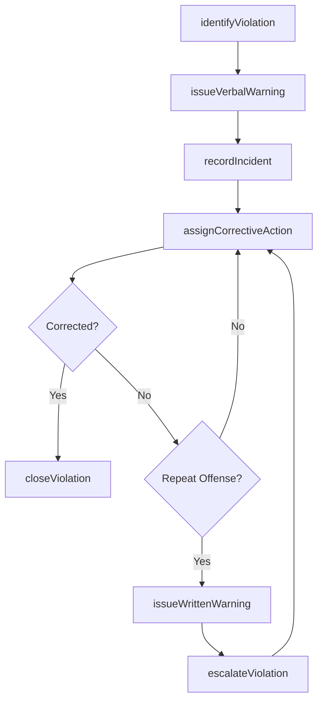
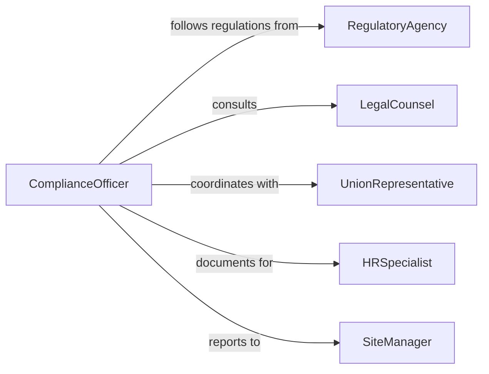

# Warn Individuals About Rule Violations

> Business-as-Code definition for warning individuals about rule violations or safety concerns. Models the process of identifying violations, issuing warnings, documenting incidents, and tracking corrective actions.

## Overview

Warning individuals about rule violations or safety concerns involves observing non-compliant behavior, communicating the specific violation or hazard, documenting the warning, and following up on corrective actions. This definition covers violation detection, verbal and written warnings, escalation procedures, and compliance tracking across workplace safety, regulatory, and organizational policy domains.

## Actors

| Actor | Description |
|-------|-------------|
| RegulatoryAgency | Government body that sets and enforces safety and compliance rules |
| LegalCounsel | Attorney providing guidance on liability and enforcement procedures |
| UnionRepresentative | Labor representative who may be present during formal warnings |
| InsuranceProvider | Carrier that assesses risk exposure from rule violations |

## Roles

| Role | Description |
|------|-------------|
| ComplianceOfficer | Monitors adherence to rules and issues formal warnings |
| SafetySupervisor | Identifies safety hazards and communicates concerns to individuals |
| HRSpecialist | Documents warnings and manages disciplinary records |
| SiteManager | Authorizes escalation of repeated violations |

## Entities

| Entity | Description |
|--------|-------------|
| Violation | A documented instance of non-compliance with a rule or regulation |
| Warning | A formal or informal notice issued to an individual about a violation |
| Rule | An organizational policy, safety regulation, or legal requirement |
| CorrectiveAction | A required step to remedy the violation and prevent recurrence |
| IncidentReport | A detailed record of the violation circumstances and warning issued |
| EscalationRecord | Documentation of progressive disciplinary steps taken |

## Actions

| Action | Description |
|--------|-------------|
| identifyViolation | Detect and document a rule violation or safety concern |
| issueVerbalWarning | Communicate the violation directly to the individual |
| issueWrittenWarning | Formally document the warning and deliver to the individual |
| assignCorrectiveAction | Specify required steps the individual must take to resolve the issue |
| escalateViolation | Elevate repeated or severe violations to higher authority |
| closeViolation | Confirm corrective actions are complete and close the record |
| recordIncident | File the full incident report for compliance tracking |

## Events

| Event | Description |
|-------|-------------|
| violationIdentified | A rule violation or safety concern has been detected |
| verbalWarningIssued | An individual has been verbally notified of their violation |
| writtenWarningIssued | A formal written warning has been delivered and signed |
| correctiveActionAssigned | Required remediation steps have been communicated |
| violationEscalated | The violation has been elevated for further disciplinary action |
| violationClosed | Corrective actions are verified complete and the case is closed |
| incidentRecorded | A full incident report has been filed in the compliance system |

## Searches

| Search | Description |
|--------|-------------|
| findViolations | List violations by individual, rule, location, or date range |
| getWarningHistory | Retrieve all warnings issued to a specific individual |
| getOpenCorrectiveActions | Find assigned corrective actions not yet completed |
| getEscalations | List violations that have been escalated for further action |

## Workflow



## Actor Relationships



## Usage

### Calling Actions

```typescript
import { warnIndividualsAboutRuleViolations } from '@headlessly/warn-individuals-about-rule-violations'

const warnings = warnIndividualsAboutRuleViolations()

// Identify a safety violation
const violation = await warnings.identifyViolation({
  individual: 'EMP-4521',
  rule: 'PPE-003: Required hard hat in construction zones',
  location: 'Site B, Sector 4',
  description: 'Employee observed in active construction zone without hard hat',
  severity: 'high'
})

// Issue a verbal warning
await warnings.issueVerbalWarning({
  violationId: violation.id,
  issuedBy: 'Safety Supervisor Martinez',
  notes: 'Employee reminded of mandatory PPE policy and provided replacement hard hat'
})

// Assign corrective action
await warnings.assignCorrectiveAction({
  violationId: violation.id,
  action: 'Complete PPE safety refresher training within 48 hours',
  deadline: '2026-02-07'
})
```

### Event-Driven Automation

```typescript
// Escalate on third violation within 90 days
warnings.violationIdentified(async ({ individual, rule }) => {
  const history = await warnings.getWarningHistory({
    individual,
    rule,
    withinDays: 90
  })
  if (history.length >= 2) {
    await warnings.escalateViolation({ individual, rule, reason: 'Third violation in 90 days' })
  }
})

// Notify HR when written warning is issued
warnings.writtenWarningIssued(async ({ individual, violationId }) => {
  await notify({
    to: 'hr-department',
    message: `Written warning issued to ${individual} for violation #${violationId}`
  })
})
```
