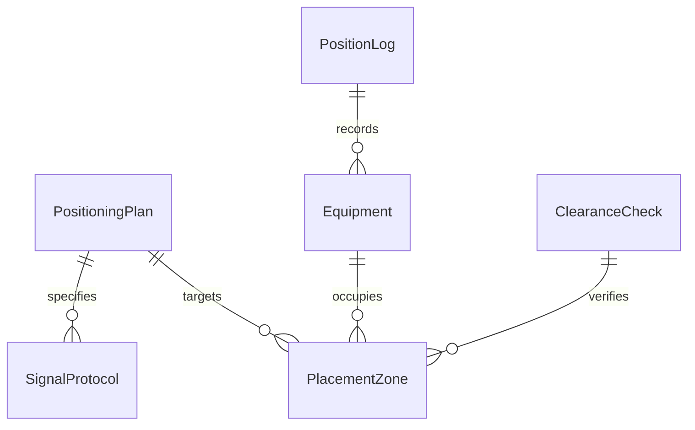
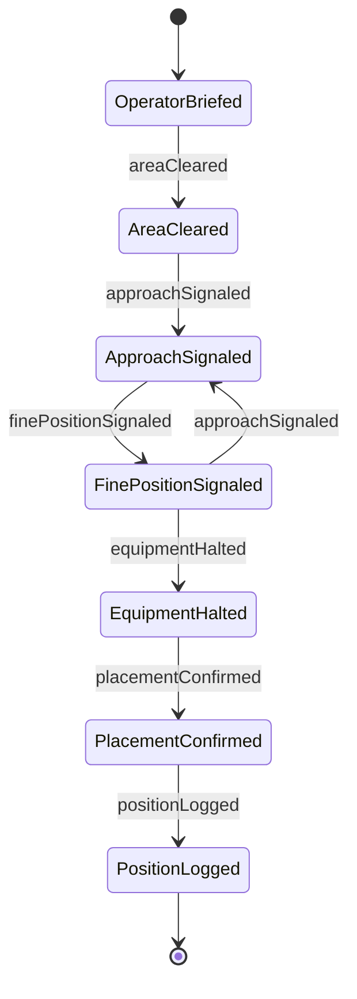
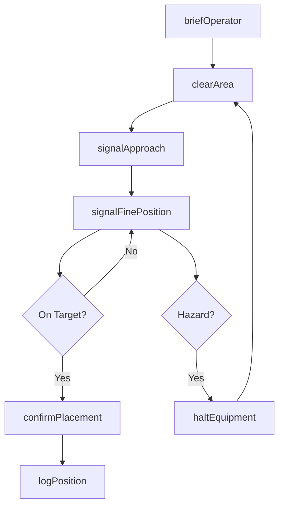
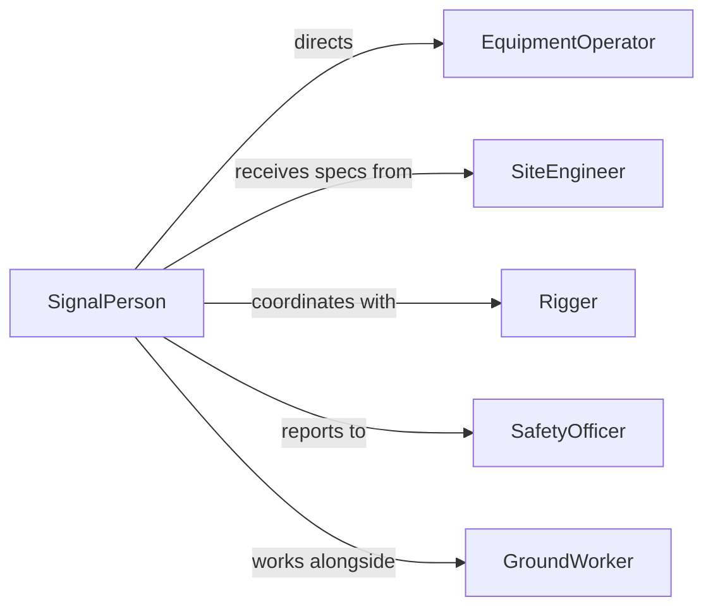

# Signal Equipment Operators Indicate Proper

> Business-as-Code definition for signaling equipment operators to indicate proper equipment positioning. Models the communication protocols used to guide cranes, forklifts, excavators, and other heavy equipment into precise locations on job sites.

## Overview

Signaling equipment operators to indicate proper positioning involves using standardized hand signals, radio communication, or electronic guidance systems to direct heavy machinery into exact locations required for safe and effective work. This activity is essential on construction sites, manufacturing floors, and logistics operations where operators have obstructed sightlines and depend on ground spotters or riggers to achieve precise equipment placement. The definition covers signal sequences from initial approach through fine positioning and placement confirmation.

## Actors

| Actor | Description |
|-------|-------------|
| EquipmentOperator | Controls the machinery being positioned |
| Rigger | Attaches loads and signals the operator during lifting and placement |
| SiteEngineer | Specifies the exact positioning coordinates and tolerances |
| SafetyOfficer | Monitors positioning activities for compliance with safety protocols |
| GroundWorker | Clears the area and assists with positioning guides |

## Roles

| Role | Description |
|------|-------------|
| SignalPerson | Provides standardized directional signals to the equipment operator |
| LiftSupervisor | Oversees the entire positioning operation and authorizes critical moves |
| PositioningEngineer | Determines exact placement requirements based on plans and surveys |
| SpotterAssistant | Provides secondary sightline coverage for blind spots |

## Entities

| Entity | Description |
|--------|-------------|
| PositioningPlan | A document specifying the target location, approach path, and tolerances |
| SignalProtocol | The agreed-upon set of signals and their meanings for the operation |
| Equipment | The machine being directed into position |
| PlacementZone | The designated area where the equipment must be positioned |
| ClearanceCheck | A verified inspection that the positioning area is safe |
| PositionLog | A record of the final equipment placement with coordinates and timestamps |

## Actions

| Action | Description |
|--------|-------------|
| briefOperator | Communicate the positioning plan and signal protocol to the operator |
| clearArea | Verify the placement zone is free of personnel and obstructions |
| signalApproach | Direct the equipment toward the general positioning area |
| signalFinePosition | Guide precise adjustments to achieve exact placement |
| haltEquipment | Issue an immediate stop signal to the operator |
| confirmPlacement | Verify the equipment is in the correct position within tolerance |
| logPosition | Record the final placement coordinates and completion details |

## Events

| Event | Description |
|-------|-------------|
| operatorBriefed | The operator has been informed of the positioning plan and signals |
| areaCleared | The placement zone has been verified as safe and unobstructed |
| approachSignaled | The equipment has been directed toward the positioning area |
| finePositionSignaled | Precise adjustment signals have been communicated |
| equipmentHalted | The operator has stopped the equipment on signal |
| placementConfirmed | The equipment position has been verified as correct |
| positionLogged | The final placement details have been recorded |

## Searches

| Search | Description |
|--------|-------------|
| findActivePositioning | List equipment currently being directed into position |
| getPositioningHistory | Retrieve past placement records by equipment or site zone |
| getPendingPlacements | Find positioning tasks awaiting execution |


## Entity Relationships



## State Diagram



## Workflow



## Actor Relationships



## Usage

### Calling Actions

```typescript
import { signalEquipmentOperatorsIndicateProper } from '@headlessly/signal-equipment-operators-indicate-proper'

const positioning = signalEquipmentOperatorsIndicateProper()

// Brief the crane operator on the lift plan
await positioning.briefOperator({
  equipmentId: 'CRANE-12',
  operatorId: 'op-205',
  positioningPlan: {
    target: { x: 45.2, y: 12.8, zone: 'Grid-D4' },
    approach: 'north',
    tolerance: '0.5m'
  },
  signalProtocol: 'OSHA-standard-hand-signals'
})

// Clear the placement area
await positioning.clearArea({
  zone: 'Grid-D4',
  radius: '15m',
  personnelCheck: true
})

// Confirm final placement
await positioning.confirmPlacement({
  equipmentId: 'CRANE-12',
  actualPosition: { x: 45.1, y: 12.9 },
  withinTolerance: true
})
```

### Event-Driven Automation

```typescript
// Halt all nearby operations when equipment is stopped for hazard
positioning.equipmentHalted(async ({ equipmentId, zone, reason }) => {
  await notify({
    to: 'site-safety',
    message: `Equipment ${equipmentId} halted in ${zone}: ${reason}`
  })
  await pauseNearbyOperations({ zone, radius: '25m' })
})

// Auto-generate placement documentation on confirmation
positioning.placementConfirmed(async ({ equipmentId, position, timestamp }) => {
  await generateReport({
    type: 'equipment-placement',
    equipmentId,
    position,
    timestamp,
    sendTo: 'site-engineer'
  })
})
```
