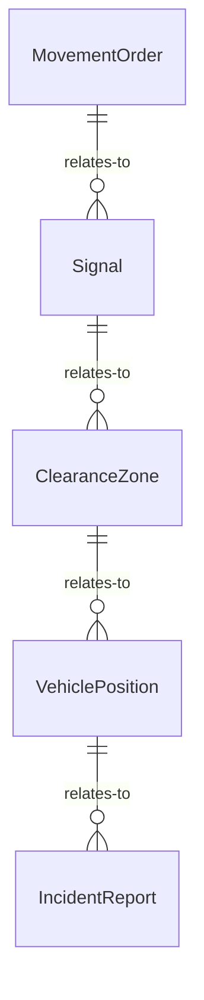
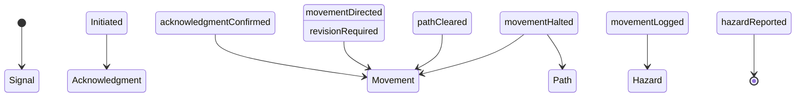
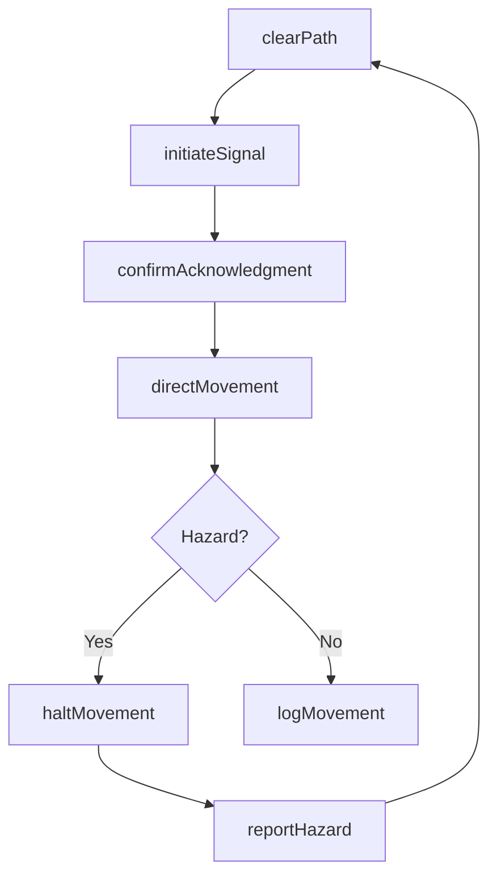
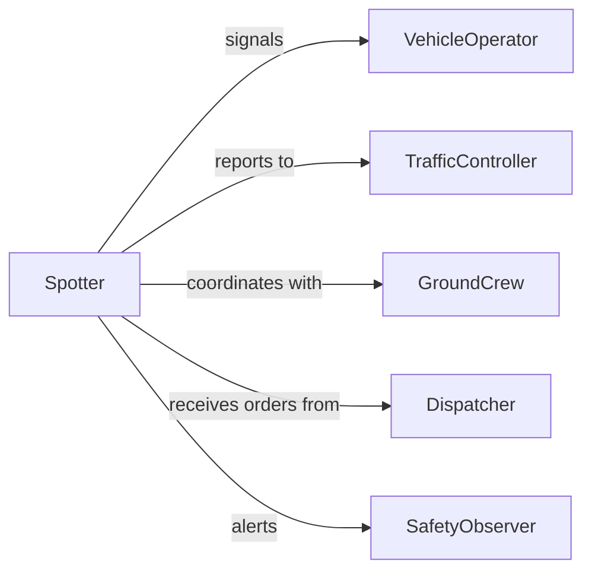

# Signal Others Coordinate Vehicle Movement

> Business-as-Code definition for signaling others to coordinate vehicle movement. Models the communication protocols for directing vehicles in loading zones, construction sites, airports, and other areas where safe movement depends on coordinated signals.

## Overview

Signaling others to coordinate vehicle movement involves using standardized hand signals, flags, radios, or electronic systems to direct the positioning and routing of vehicles in operational areas. This activity is critical in logistics yards, construction sites, airport tarmacs, and warehouse loading docks where vehicle operators have limited visibility and must rely on ground personnel for safe navigation. The definition covers signal initiation, acknowledgment, and movement confirmation to prevent collisions and maintain efficient traffic flow.

## Actors

| Actor | Description |
|-------|-------------|
| VehicleOperator | Drives or operates the vehicle being directed |
| GroundCrew | Personnel on the ground providing directional signals |
| TrafficController | Monitors and manages overall vehicle flow in the operational area |
| SafetyObserver | Watches for hazards and ensures safe clearances during movement |
| Dispatcher | Assigns vehicle movement tasks and communicates priorities |

## Roles

| Role | Description |
|------|-------------|
| Spotter | Provides direct visual signals to the vehicle operator |
| YardMaster | Oversees all vehicle movements within a defined area |
| CommunicationsOperator | Manages radio or electronic signal coordination |
| MovementPlanner | Sequences vehicle movements to avoid conflicts |

## Entities

| Entity | Description |
|--------|-------------|
| MovementOrder | A directive specifying which vehicle to move and its destination |
| Signal | A standardized communication (hand, flag, radio, or electronic) directing action |
| ClearanceZone | A defined area that must be free of obstructions before movement |
| VehiclePosition | The current location and heading of a vehicle in the operational area |
| IncidentReport | A record of any near-miss or collision event during vehicle movement |

## Actions

| Action | Description |
|--------|-------------|
| initiateSignal | Begin a directional signal to the vehicle operator |
| confirmAcknowledgment | Verify the operator has received and understood the signal |
| directMovement | Guide the vehicle along the intended path using signals |
| haltMovement | Issue a stop signal to immediately cease vehicle motion |
| clearPath | Verify that the movement corridor is free of personnel and obstacles |
| logMovement | Record the completed vehicle movement with timestamps and positions |
| reportHazard | Communicate an observed safety concern in the movement zone |

## Events

| Event | Description |
|-------|-------------|
| signalInitiated | A directional signal has been issued to the vehicle operator |
| acknowledgmentConfirmed | The operator has confirmed receipt of the signal |
| movementDirected | The vehicle is actively being guided along its path |
| movementHalted | A stop signal has been issued and the vehicle has stopped |
| pathCleared | The movement corridor has been verified as unobstructed |
| movementLogged | The completed movement has been recorded in the system |
| hazardReported | A safety concern has been flagged in the movement area |

## Searches

| Search | Description |
|--------|-------------|
| findActiveMovements | List vehicles currently being directed in the operational area |
| getMovementHistory | Retrieve past vehicle movement records by zone or time period |
| getPendingOrders | Find movement orders awaiting execution |


## Entity Relationships



## State Diagram



## Workflow



## Actor Relationships



## Usage

### Calling Actions

```typescript
import { signalOthersCoordinateVehicleMovement } from '@headlessly/signal-others-coordinate-vehicle-movement'

const signals = signalOthersCoordinateVehicleMovement()

// Clear the path before directing a truck to Bay 7
await signals.clearPath({
  zone: 'Loading Dock A',
  corridor: 'Lane 3 to Bay 7',
  checkpoints: ['intersection-1', 'pedestrian-crossing-2']
})

// Initiate a signal to the driver
const signal = await signals.initiateSignal({
  vehicleId: 'TRK-445',
  direction: 'reverse',
  destination: 'Bay 7',
  signalType: 'hand'
})

// Confirm the driver acknowledged
await signals.confirmAcknowledgment({
  signalId: signal.id,
  vehicleId: 'TRK-445',
  method: 'horn-tap'
})
```

### Event-Driven Automation

```typescript
// Alert safety team when a hazard is reported
signals.hazardReported(async ({ zone, hazard, reportedBy }) => {
  await notify({
    to: 'safety-team',
    message: `Hazard in ${zone}: ${hazard.description} - reported by ${reportedBy}`
  })
  await signals.haltMovement({ zone })
})

// Auto-log completed movements for compliance
signals.movementLogged(async ({ vehicleId, zone, timestamps }) => {
  await complianceLog.record({
    type: 'vehicle-movement',
    vehicleId,
    zone,
    startTime: timestamps.start,
    endTime: timestamps.end
  })
})
```
