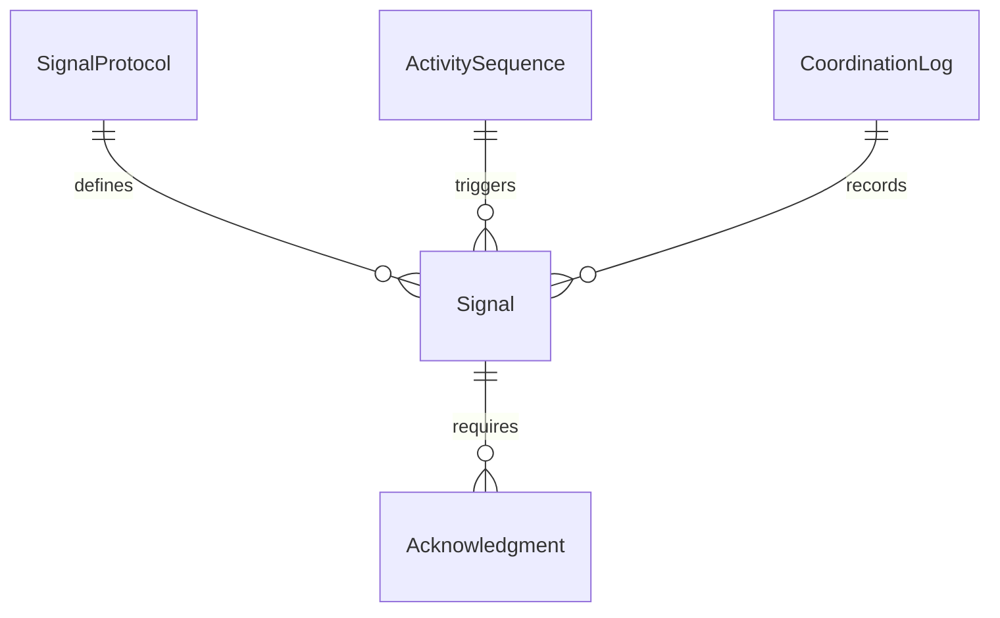
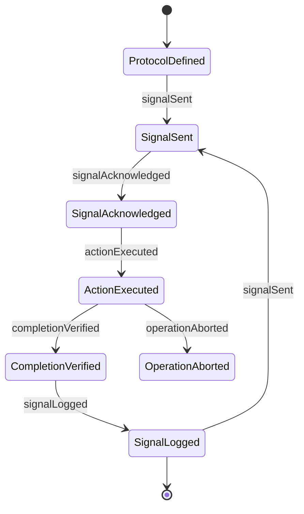
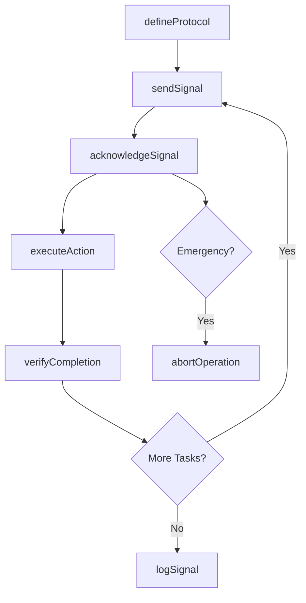
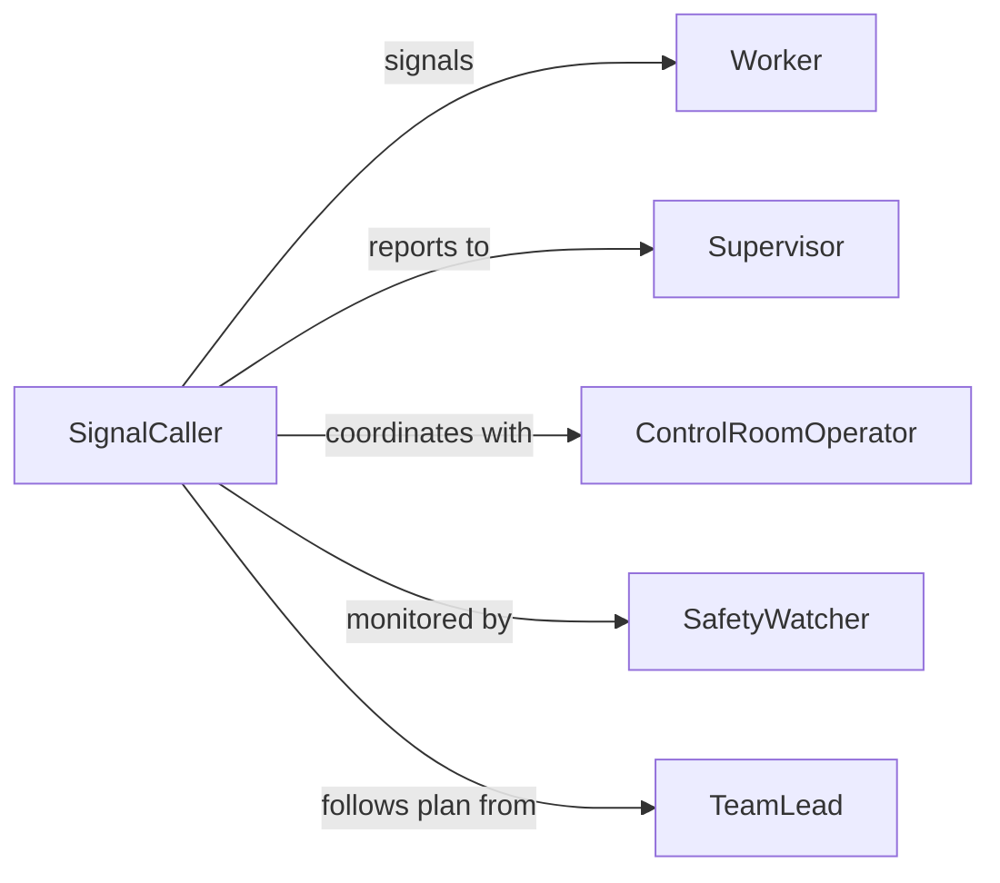

# Signal Others Coordinate Work Activities

> Business-as-Code definition for signaling others to coordinate work activities. Models the use of visual, auditory, and electronic signals to synchronize tasks among workers in environments where verbal communication is impractical.

## Overview

Signaling others to coordinate work activities involves using standardized non-verbal communication methods to synchronize operations among workers who are physically separated, in high-noise environments, or performing tasks that require precise timing. This applies across construction, manufacturing, aviation, maritime, and emergency response operations where hand signals, flags, lights, horns, or radio codes ensure safe and efficient task coordination. The definition covers signal initiation, acknowledgment, and completion tracking.

## Actors

| Actor | Description |
|-------|-------------|
| TeamLead | Initiates signals to coordinate crew activities |
| Worker | Receives and responds to coordination signals |
| ControlRoomOperator | Monitors operations remotely and relays signals electronically |
| SafetyWatcher | Observes activities to ensure signal compliance and worker safety |
| Supervisor | Authorizes complex operations that require coordinated signaling |

## Roles

| Role | Description |
|------|-------------|
| SignalCaller | Originates and transmits coordination signals to workers |
| Responder | Acknowledges signals and executes the directed action |
| SignalMonitor | Tracks that all signals are properly sent, received, and acknowledged |
| OperationsCoordinator | Plans the sequence of activities that require signaling |

## Entities

| Entity | Description |
|--------|-------------|
| Signal | A standardized visual, auditory, or electronic communication |
| SignalProtocol | The documented set of signals and their meanings for an operation |
| ActivitySequence | The ordered list of tasks that must be coordinated through signals |
| Acknowledgment | A confirmation that a signal was received and understood |
| CoordinationLog | A record of all signals exchanged during an operation |

## Actions

| Action | Description |
|--------|-------------|
| defineProtocol | Establish the signal set and meanings for a specific operation |
| sendSignal | Transmit a coordination signal to one or more workers |
| acknowledgeSignal | Confirm receipt and understanding of a received signal |
| executeAction | Perform the work activity directed by the signal |
| verifyCompletion | Confirm that the signaled activity has been completed |
| logSignal | Record the signal exchange in the coordination log |
| abortOperation | Issue an emergency stop signal to halt all coordinated activities |

## Events

| Event | Description |
|-------|-------------|
| protocolDefined | The signal protocol for the operation has been established |
| signalSent | A coordination signal has been transmitted |
| signalAcknowledged | A worker has confirmed receipt of the signal |
| actionExecuted | The directed work activity has been performed |
| completionVerified | The signaled task has been confirmed as complete |
| signalLogged | The signal exchange has been recorded |
| operationAborted | An emergency stop signal has been issued |

## Searches

| Search | Description |
|--------|-------------|
| findActiveOperations | List operations currently using signal coordination |
| getSignalLog | Retrieve the signal exchange history for a specific operation |
| getPendingAcknowledgments | Find signals that have been sent but not yet acknowledged |


## Entity Relationships



## State Diagram



## Workflow



## Actor Relationships



## Usage

### Calling Actions

```typescript
import { signalOthersCoordinateWorkActivities } from '@headlessly/signal-others-coordinate-work-activities'

const coordination = signalOthersCoordinateWorkActivities()

// Define the signal protocol for a concrete pour
await coordination.defineProtocol({
  operationId: 'OP-2240',
  operationType: 'concrete-pour',
  signals: [
    { code: 'GREEN-FLAG', meaning: 'Begin pouring' },
    { code: 'RED-FLAG', meaning: 'Stop pouring immediately' },
    { code: 'CIRCLE-ARM', meaning: 'Move boom left' },
    { code: 'TWO-BLAST', meaning: 'All clear' }
  ]
})

// Send a signal to begin the operation
const signal = await coordination.sendSignal({
  operationId: 'OP-2240',
  signalCode: 'GREEN-FLAG',
  recipients: ['crew-pump', 'crew-finishers']
})

// Verify task completion
await coordination.verifyCompletion({
  operationId: 'OP-2240',
  taskId: 'pour-section-A',
  verifiedBy: 'lead-finisher'
})
```

### Event-Driven Automation

```typescript
// Escalate unacknowledged signals after timeout
coordination.signalSent(async ({ signalId, operationId, recipients }) => {
  setTimeout(async () => {
    const pending = await coordination.getPendingAcknowledgments({ operationId })
    if (pending.some(s => s.id === signalId)) {
      await notify({
        to: 'operations-supervisor',
        message: `Signal ${signalId} not acknowledged within timeout`
      })
    }
  }, 30000)
})

// Auto-log all completed operations
coordination.completionVerified(async ({ operationId, taskId, verifiedBy }) => {
  await coordination.logSignal({
    operationId,
    entry: `Task ${taskId} completed, verified by ${verifiedBy}`
  })
})
```
