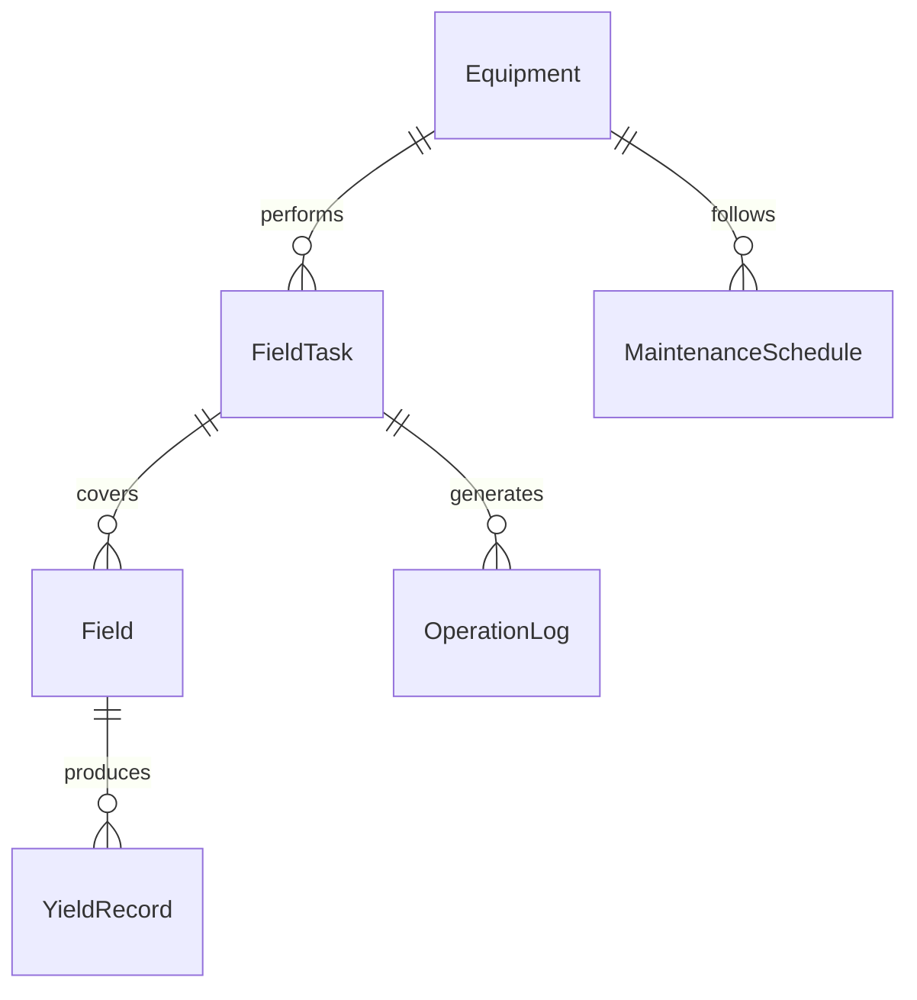
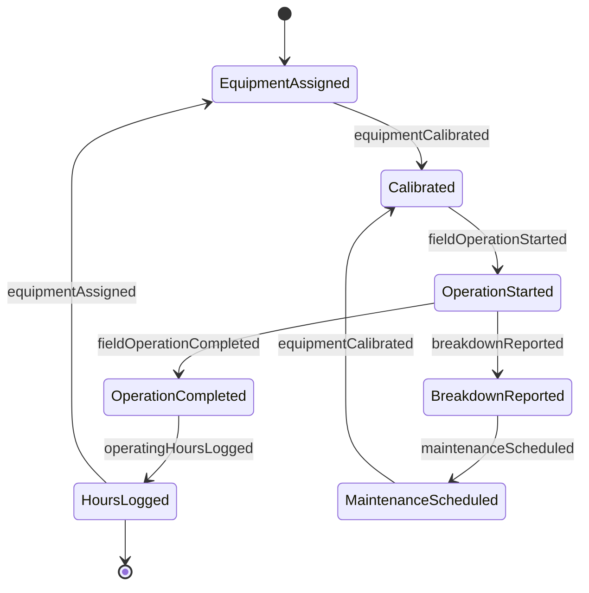
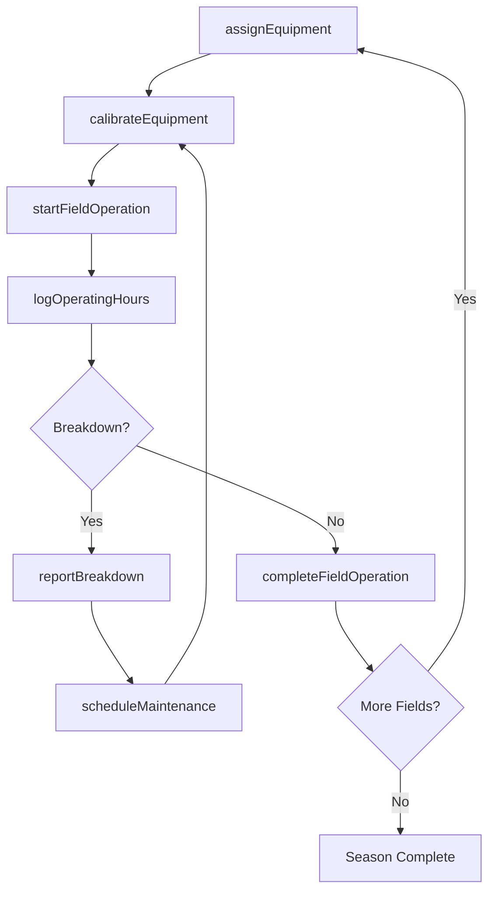
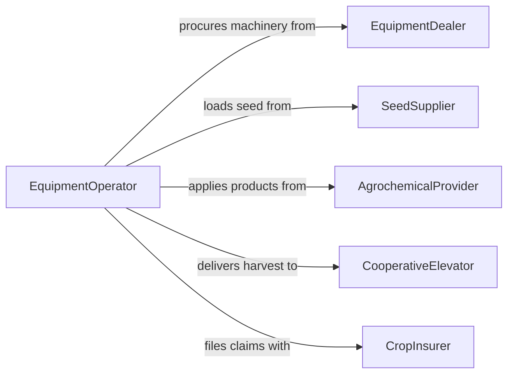

# Operate Farming Equipment

> Business-as-Code definition for farming equipment operations. Models the lifecycle of operating tractors, harvesters, planters, and other agricultural machinery for crop production and field management.

## Overview

Operating farming equipment encompasses the use of tractors, combines, planters, sprayers, and tillage implements to prepare fields, plant crops, apply treatments, and harvest yields. This definition provides actions for equipment operation and field task execution, events for tracking progress and equipment status, and searches for operational records.

## Actors

| Actor | Description |
|-------|-------------|
| EquipmentDealer | Sells and services tractors, combines, and implements |
| SeedSupplier | Provides seed stock and planting recommendations |
| AgrochemicalProvider | Supplies fertilizers, herbicides, and pesticides |
| CooperativeElevator | Receives harvested grain and manages storage |
| CropInsurer | Provides insurance coverage for crop loss and equipment damage |

## Roles

| Role | Description |
|------|-------------|
| EquipmentOperator | Drives and controls farming machinery in the field |
| FarmManager | Plans field operations and assigns equipment to tasks |
| FieldMechanic | Performs on-site repairs and preventive maintenance |
| PrecisionAgSpecialist | Configures GPS guidance and variable-rate application systems |

## Entities

| Entity | Description |
|--------|-------------|
| Equipment | A tractor, combine, planter, or other farming machine |
| FieldTask | A planned operation such as planting, spraying, or harvesting for a specific field |
| Field | A defined parcel of land where operations are performed |
| OperationLog | A record of equipment use including hours, fuel, and area covered |
| MaintenanceSchedule | A planned timeline for equipment servicing and part replacement |
| YieldRecord | Harvest data including volume, moisture content, and field location |

## Actions

| Action | Description |
|--------|-------------|
| assignEquipment | Assign a piece of equipment to a specific field task |
| startFieldOperation | Begin a field task such as planting, tilling, or harvesting |
| completeFieldOperation | Mark a field task as finished and log results |
| logOperatingHours | Record equipment runtime, fuel consumption, and area covered |
| calibrateEquipment | Adjust equipment settings for seed rate, depth, or spray volume |
| scheduleMaintenance | Plan a preventive maintenance service for equipment |
| reportBreakdown | Log an equipment malfunction requiring repair |

## Events

| Event | Description |
|-------|-------------|
| equipmentAssigned | A machine has been assigned to a field task |
| fieldOperationStarted | A field operation has commenced |
| fieldOperationCompleted | A field operation has been finished |
| operatingHoursLogged | Equipment runtime data has been recorded |
| equipmentCalibrated | Equipment settings have been adjusted |
| breakdownReported | An equipment failure has been logged |
| maintenanceScheduled | A preventive service has been planned |

## Searches

| Search | Description |
|--------|-------------|
| findEquipment | List equipment by type, status, or assigned field |
| getFieldTasks | Retrieve field tasks by date, field, or equipment |
| getOperatingLogs | Query equipment usage records by machine or time period |
| findMaintenanceSchedules | Locate upcoming or overdue maintenance for equipment |
| getYieldRecords | Retrieve harvest data by field, crop, or season |


## Entity Relationships



## State Diagram



## Workflow



## Actor Relationships



## Usage

### Calling Actions

```typescript
import { operateFarmingEquipment } from '@headlessly/operate-farming-equipment'

const farming = operateFarmingEquipment()

// Assign a tractor to a planting task
const assignment = await farming.assignEquipment({
  equipmentId: 'tractor-jd-8370r',
  fieldTaskId: 'plant-corn-north-40',
  field: 'North 40'
})

// Start the planting operation
await farming.startFieldOperation({
  fieldTaskId: 'plant-corn-north-40',
  operation: 'planting',
  settings: { seedRate: 34000, rowSpacing: 30 }
})

// Log operating hours after completion
await farming.logOperatingHours({
  equipmentId: 'tractor-jd-8370r',
  hours: 8.5,
  fuelGallons: 42,
  acresCovered: 120
})
```

### Event-Driven Automation

```typescript
// Schedule maintenance when hours threshold is reached
farming.operatingHoursLogged(async ({ equipmentId, totalHours }) => {
  if (totalHours % 250 < 10) {
    await farming.scheduleMaintenance({
      equipmentId,
      serviceType: '250-hour-interval',
      priority: 'routine'
    })
  }
})

// Alert farm manager on equipment breakdown
farming.breakdownReported(async ({ equipmentId, description, fieldTaskId }) => {
  await notify({
    to: 'farm-manager',
    message: `Equipment ${equipmentId} breakdown during task ${fieldTaskId}: ${description}`
  })
})
```
