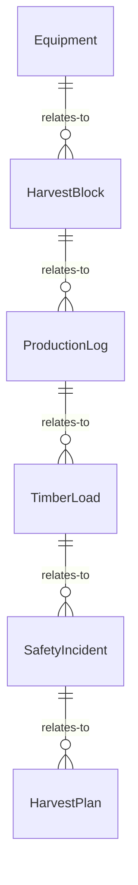
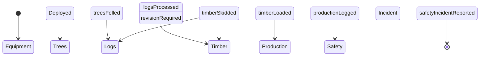
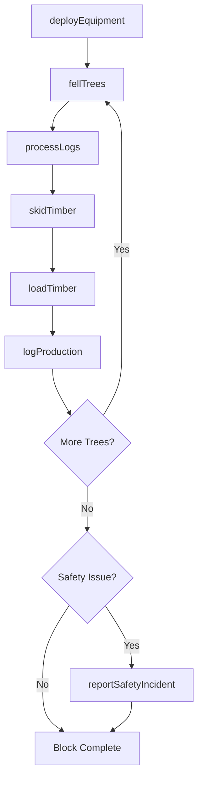
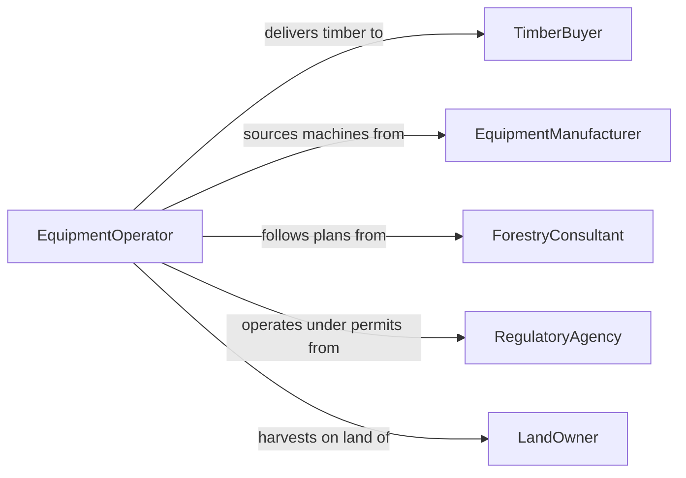

# Operate Forestry Equipment

> Business-as-Code definition for forestry equipment operations. Models the use of harvesters, skidders, feller bunchers, and chippers for timber harvesting, land clearing, and forest management.

## Overview

Operating forestry equipment involves running specialized machines such as feller bunchers, harvesters, skidders, forwarders, and chippers to fell trees, process logs, and transport timber from harvest sites. This definition provides actions for equipment deployment and timber processing, events for tracking production and safety incidents, and searches for harvest and equipment records.

## Actors

| Actor | Description |
|-------|-------------|
| TimberBuyer | Purchases harvested logs and timber products |
| EquipmentManufacturer | Produces and supports forestry machines and attachments |
| ForestryConsultant | Develops harvest plans and marks trees for cutting |
| RegulatoryAgency | Enforces logging permits, environmental buffers, and safety standards |
| LandOwner | Owns the forest land where harvesting operations take place |

## Roles

| Role | Description |
|------|-------------|
| EquipmentOperator | Runs feller bunchers, harvesters, skidders, and other forestry machines |
| LoggingSupervisor | Plans daily operations, assigns crews, and monitors production |
| ForestryMechanic | Maintains and repairs forestry equipment on-site |
| SafetyOfficer | Enforces safety protocols and investigates incidents |

## Entities

| Entity | Description |
|--------|-------------|
| Equipment | A feller buncher, harvester, skidder, forwarder, or chipper |
| HarvestBlock | A designated area of forest approved for timber cutting |
| ProductionLog | A record of trees felled, volume processed, and hours worked |
| TimberLoad | A batch of logs scaled and prepared for transport |
| SafetyIncident | A record of a near-miss, injury, or equipment accident |
| HarvestPlan | A document specifying cutting boundaries, species, and environmental protections |

## Actions

| Action | Description |
|--------|-------------|
| deployEquipment | Move equipment to a harvest block and prepare for operation |
| fellTrees | Operate a feller buncher or chainsaw to cut standing trees |
| processLogs | Delimb and buck felled trees into merchantable log lengths |
| skidTimber | Transport felled trees or logs from the stump to a landing |
| loadTimber | Place processed logs onto trucks for transport |
| logProduction | Record volumes, species, and hours for a shift |
| reportSafetyIncident | Document a safety event or near-miss on site |

## Events

| Event | Description |
|-------|-------------|
| equipmentDeployed | A machine has been moved to a harvest block and is operational |
| treesFelled | A set of trees has been cut in a harvest block |
| logsProcessed | Felled trees have been delimbed and bucked into logs |
| timberSkidded | Logs have been transported to the landing area |
| timberLoaded | A truck has been loaded with logs for transport |
| productionLogged | Shift production data has been recorded |
| safetyIncidentReported | A safety event has been documented |

## Searches

| Search | Description |
|--------|-------------|
| findHarvestBlocks | List harvest blocks by status, location, or permit date |
| getProductionLogs | Retrieve production records by block, operator, or date |
| getEquipmentStatus | Check availability, location, and condition of forestry equipment |
| findSafetyIncidents | Locate safety records by severity, date, or site |


## Entity Relationships



## State Diagram



## Workflow



## Actor Relationships



## Usage

### Calling Actions

```typescript
import { operateForestryEquipment } from '@headlessly/operate-forestry-equipment'

const forestry = operateForestryEquipment()

// Deploy a feller buncher to a harvest block
await forestry.deployEquipment({
  equipmentId: 'feller-buncher-tigercat-875',
  harvestBlockId: 'block-142-north',
  operatorId: 'op-thompson'
})

// Log production for the shift
await forestry.logProduction({
  harvestBlockId: 'block-142-north',
  operatorId: 'op-thompson',
  treesFelled: 85,
  volumeBoardFeet: 12400,
  hoursWorked: 9.5
})

// Load timber onto a truck
await forestry.loadTimber({
  timberLoadId: 'load-2026-0205-03',
  species: ['Douglas Fir', 'Western Red Cedar'],
  volumeBoardFeet: 4800,
  truckId: 'truck-kenworth-18'
})
```

### Event-Driven Automation

```typescript
// Alert supervisor when production target is met
forestry.productionLogged(async ({ harvestBlockId, cumulativeVolume, targetVolume }) => {
  if (cumulativeVolume >= targetVolume) {
    await notify({
      to: 'logging-supervisor',
      message: `Harvest block ${harvestBlockId} has reached its volume target`
    })
  }
})

// Trigger safety review on incident
forestry.safetyIncidentReported(async ({ incidentId, severity, harvestBlockId }) => {
  if (severity === 'serious') {
    await notify({
      to: 'safety-officer',
      message: `Serious safety incident ${incidentId} at block ${harvestBlockId}`
    })
  }
})
```
