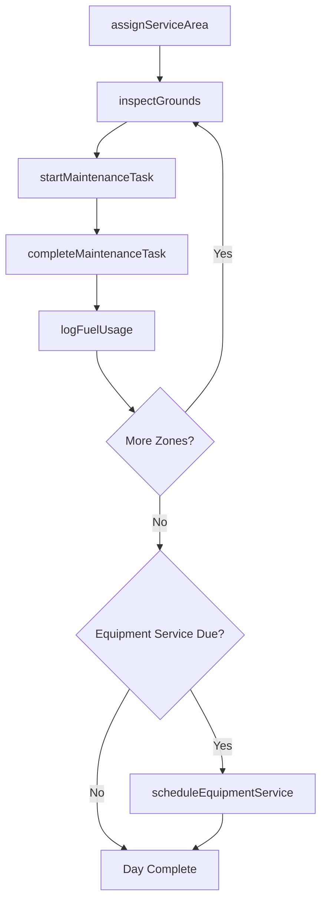
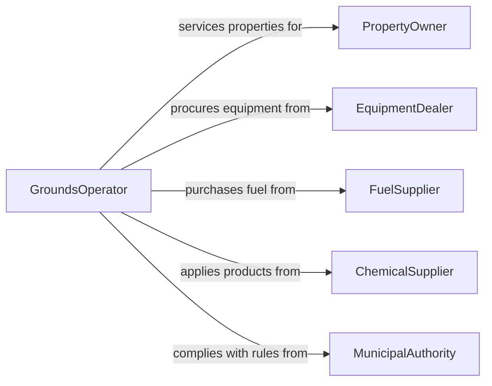

# Operate Grounds Maintenance Equipment

> Business-as-Code definition for grounds maintenance equipment operations. Models the use of mowers, trimmers, blowers, aerators, and other landscaping machinery for property and turf management.

## Overview

Operating grounds maintenance equipment involves using mowers, edgers, trimmers, leaf blowers, aerators, and spreaders to maintain lawns, athletic fields, parks, and commercial landscapes. This definition provides actions for scheduling and executing maintenance tasks, events for tracking completion and equipment health, and searches for service history and property records.

## Actors

| Actor | Description |
|-------|-------------|
| PropertyOwner | Contracts for grounds maintenance services on their property |
| EquipmentDealer | Sells and services mowers, trimmers, and other grounds equipment |
| FuelSupplier | Provides gasoline, diesel, or battery charging for equipment |
| ChemicalSupplier | Supplies fertilizers, herbicides, and turf treatments |
| MunicipalAuthority | Sets noise ordinances, chemical application rules, and mowing schedules for public lands |

## Roles

| Role | Description |
|------|-------------|
| GroundsOperator | Operates mowers, trimmers, blowers, and other maintenance equipment |
| CrewSupervisor | Assigns tasks to operators and inspects completed work |
| EquipmentManager | Tracks fleet condition, fuel usage, and maintenance schedules |
| TurfSpecialist | Advises on mowing heights, aeration timing, and turf health |

## Entities

| Entity | Description |
|--------|-------------|
| Equipment | A mower, trimmer, blower, aerator, or spreader used for grounds work |
| ServiceArea | A defined property or zone scheduled for maintenance |
| MaintenanceTask | A planned activity such as mowing, edging, or leaf removal |
| ServiceLog | A record of completed work including area, duration, and equipment used |
| FuelRecord | A log of fuel or battery consumption by equipment |
| InspectionReport | An assessment of turf condition and maintenance quality |

## Actions

| Action | Description |
|--------|-------------|
| assignServiceArea | Assign an operator and equipment to a property or zone |
| startMaintenanceTask | Begin a grounds task such as mowing or edging |
| completeMaintenanceTask | Mark a grounds task as finished and log results |
| inspectGrounds | Evaluate turf condition and note areas needing attention |
| logFuelUsage | Record fuel or battery consumption for a piece of equipment |
| scheduleEquipmentService | Plan blade sharpening, oil changes, or other equipment maintenance |

## Events

| Event | Description |
|-------|-------------|
| serviceAreaAssigned | An operator has been assigned to a property or zone |
| maintenanceTaskStarted | A grounds maintenance task has begun |
| maintenanceTaskCompleted | A grounds maintenance task has been finished |
| groundsInspected | A turf or property inspection has been completed |
| fuelUsageLogged | Fuel or battery consumption has been recorded |
| equipmentServiceScheduled | An equipment maintenance service has been planned |
| equipmentFailureReported | A grounds equipment malfunction has been logged |

## Searches

| Search | Description |
|--------|-------------|
| findServiceAreas | List properties or zones by location, schedule, or status |
| getServiceLogs | Retrieve completed maintenance records by area or date |
| getEquipmentStatus | Check current condition and availability of grounds equipment |
| findUpcomingTasks | Locate scheduled maintenance tasks by date or property |

## Workflow



## Actor Relationships



## Usage

### Calling Actions

```typescript
import { operateGroundsMaintenanceEquipment } from '@headlessly/operate-grounds-maintenance-equipment'

const grounds = operateGroundsMaintenanceEquipment()

// Assign an operator to a property
const assignment = await grounds.assignServiceArea({
  operatorId: 'op-martinez',
  serviceAreaId: 'corporate-campus-east',
  equipment: ['mower-ztr-72', 'trimmer-echo-225']
})

// Start a mowing task
await grounds.startMaintenanceTask({
  serviceAreaId: 'corporate-campus-east',
  taskType: 'mowing',
  mowingHeight: { inches: 3.5 }
})

// Complete and log the task
await grounds.completeMaintenanceTask({
  taskId: assignment.taskId,
  areaCovered: { acres: 8.2 },
  duration: { minutes: 135 }
})
```

### Event-Driven Automation

```typescript
// Schedule blade sharpening after accumulated mowing hours
grounds.maintenanceTaskCompleted(async ({ equipmentIds, duration }) => {
  for (const equipmentId of equipmentIds) {
    const status = await grounds.getEquipmentStatus({ equipmentId })
    if (status.hoursSinceSharpening > 40) {
      await grounds.scheduleEquipmentService({
        equipmentId,
        serviceType: 'blade-sharpening'
      })
    }
  }
})

// Notify supervisor when equipment fails
grounds.equipmentFailureReported(async ({ equipmentId, operatorId, description }) => {
  await notify({
    to: 'crew-supervisor',
    message: `Equipment ${equipmentId} failure reported by ${operatorId}: ${description}`
  })
})
```
