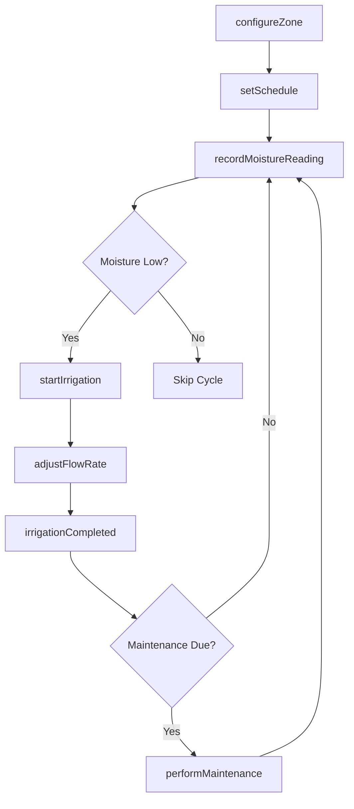
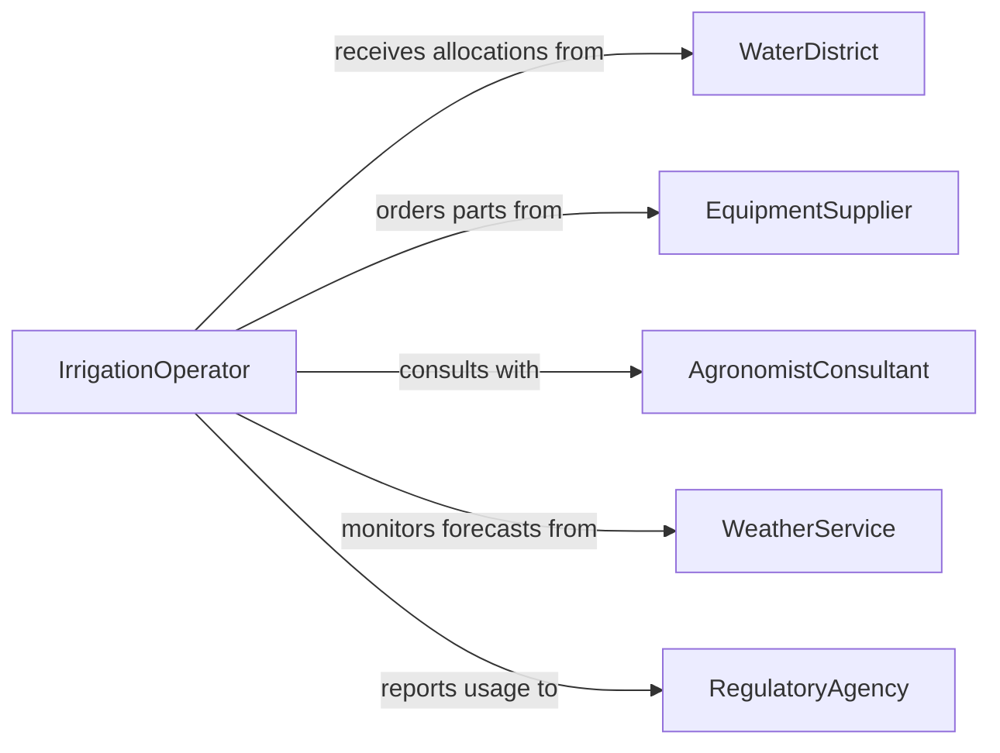

# Operate Irrigation Systems

> Business-as-Code definition for irrigation system operations. Models the complete lifecycle of configuring, running, monitoring, and maintaining irrigation infrastructure for agricultural and landscaping applications.

## Overview

Operating irrigation systems involves configuring water delivery schedules, monitoring soil moisture and weather conditions, and adjusting flow rates to optimize crop or landscape health. This definition exposes actions for system control and scheduling, events for automated responses to environmental changes, and searches for operational data retrieval.

## Actors

| Actor | Description |
|-------|-------------|
| WaterDistrict | Provides water allocation quotas and delivery schedules |
| EquipmentSupplier | Supplies irrigation hardware, nozzles, and replacement parts |
| AgronomistConsultant | Advises on water requirements for specific crops or soil types |
| WeatherService | Provides forecasts and precipitation data for scheduling |
| RegulatoryAgency | Enforces water usage regulations and conservation mandates |

## Roles

| Role | Description |
|------|-------------|
| IrrigationOperator | Configures and runs irrigation equipment on a daily basis |
| FarmManager | Oversees water allocation strategy across fields |
| MaintenanceTechnician | Inspects, repairs, and maintains irrigation infrastructure |
| WaterResourcePlanner | Plans seasonal water budgets and conservation measures |

## Entities

| Entity | Description |
|--------|-------------|
| IrrigationZone | A defined area served by a specific set of sprinklers or drip lines |
| Schedule | A timed plan specifying when and how long each zone receives water |
| FlowRate | The volume of water delivered per unit time to a zone |
| SoilMoistureReading | A sensor measurement of current moisture levels in the soil |
| WaterAllocation | The permitted volume of water available for a period |
| MaintenanceRecord | A log of repairs, inspections, and part replacements |

## Actions

| Action | Description |
|--------|-------------|
| configureZone | Define or update an irrigation zone with nozzle types and coverage area |
| setSchedule | Create or modify a watering schedule for one or more zones |
| startIrrigation | Begin water delivery to a specified zone or set of zones |
| stopIrrigation | Halt water delivery to a specified zone or set of zones |
| adjustFlowRate | Increase or decrease water flow to match current conditions |
| recordMoistureReading | Log a soil moisture sensor reading for a zone |
| performMaintenance | Record a maintenance action such as filter cleaning or nozzle replacement |

## Events

| Event | Description |
|-------|-------------|
| irrigationStarted | Water delivery has begun for a zone |
| irrigationCompleted | Scheduled watering cycle has finished |
| flowRateAdjusted | Water flow has been changed for a zone |
| moistureThresholdReached | Soil moisture has hit a target or critical level |
| scheduleUpdated | An irrigation schedule has been modified |
| maintenancePerformed | A maintenance task has been completed on the system |
| waterAllocationExceeded | Water usage has surpassed the permitted allocation |

## Searches

| Search | Description |
|--------|-------------|
| findSchedules | List irrigation schedules by zone, date range, or status |
| getMoistureReadings | Retrieve soil moisture data by zone and time period |
| getWaterUsage | Calculate total water consumption by zone or period |
| findMaintenanceRecords | Locate maintenance history for specific equipment or zones |

## Workflow



## Actor Relationships



## Usage

### Calling Actions

```typescript
import { operateIrrigationSystems } from '@headlessly/operate-irrigation-systems'

const irrigation = operateIrrigationSystems()

// Configure a new irrigation zone
const zone = await irrigation.configureZone({
  name: 'North Field - Section A',
  nozzleType: 'drip',
  coverageArea: { acres: 12.5 },
  soilType: 'loam'
})

// Set a watering schedule
await irrigation.setSchedule({
  zoneId: zone.id,
  startTime: '05:00',
  duration: { minutes: 45 },
  days: ['monday', 'wednesday', 'friday']
})

// Start irrigation manually
await irrigation.startIrrigation({
  zoneId: zone.id,
  flowRate: { gallonsPerMinute: 150 }
})
```

### Event-Driven Automation

```typescript
// Auto-irrigate when soil is too dry
irrigation.moistureThresholdReached(async ({ zoneId, moistureLevel }) => {
  if (moistureLevel < 25) {
    await irrigation.startIrrigation({
      zoneId,
      flowRate: { gallonsPerMinute: 120 }
    })
  }
})

// Alert when water allocation is exceeded
irrigation.waterAllocationExceeded(async ({ zoneId, usagePercent }) => {
  await notify({
    to: 'farm-manager',
    message: `Zone ${zoneId} has exceeded water allocation at ${usagePercent}%`
  })
  await irrigation.stopIrrigation({ zoneId })
})
```
