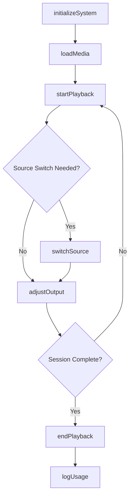
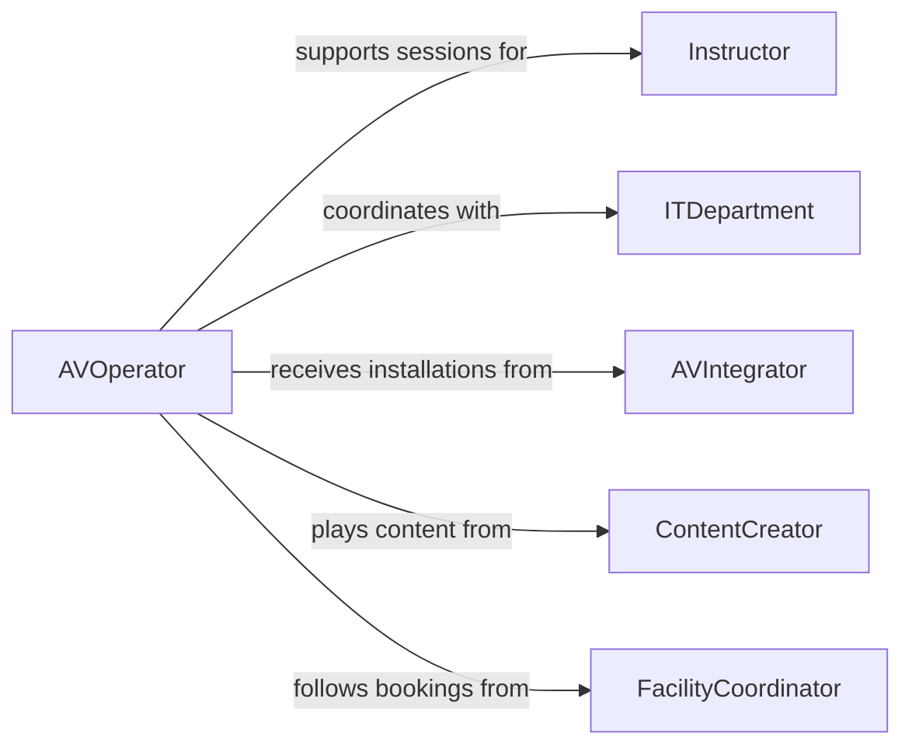

# Operate Audio-visual Equipment

> Business-as-Code definition for audio-visual equipment operations. Models the setup, calibration, and management of integrated audio and visual systems for education, training, and corporate communication environments.

## Overview

Operating audio-visual equipment involves configuring and running combined audio and visual systems such as interactive displays, video conferencing units, PA systems, and media players in classrooms, training rooms, and corporate settings. This definition provides actions for system setup and media management, events for tracking playback and connectivity, and searches for scheduling and equipment records.

## Actors

| Actor | Description |
|-------|-------------|
| Instructor | Uses AV systems to deliver educational or training content |
| ITDepartment | Provides network connectivity and technical support for AV systems |
| AVIntegrator | Designs, installs, and maintains permanent AV installations |
| ContentCreator | Produces slides, videos, and multimedia materials for display |
| FacilityCoordinator | Manages room bookings and physical setup requirements |

## Roles

| Role | Description |
|------|-------------|
| AVOperator | Sets up and runs audio-visual equipment for scheduled sessions |
| TechnicalSupport | Troubleshoots connectivity and hardware issues during sessions |
| MediaCoordinator | Manages content queues and playback sequences |
| SystemAdministrator | Configures network settings and firmware for AV devices |

## Entities

| Entity | Description |
|--------|-------------|
| AVSystem | An integrated audio-visual unit combining display, speakers, and inputs |
| MediaAsset | A video, slideshow, or audio file queued for playback |
| RoomBooking | A scheduled reservation of a room with AV requirements |
| PlaybackQueue | An ordered list of media assets for sequential display |
| ConnectionProfile | A saved configuration for input sources and network settings |
| UsageRecord | A log of system uptime, sessions hosted, and issues encountered |

## Actions

| Action | Description |
|--------|-------------|
| initializeSystem | Power on and configure an AV system for a scheduled session |
| loadMedia | Queue media assets for playback on a display or speaker system |
| startPlayback | Begin playing queued media content |
| switchSource | Change the active input source on a display or audio system |
| adjustOutput | Modify volume, brightness, or resolution settings |
| endPlayback | Stop media playback and return system to standby |
| logUsage | Record session duration, content played, and any issues |

## Events

| Event | Description |
|-------|-------------|
| systemInitialized | An AV system has been powered on and configured |
| mediaLoaded | Media assets have been queued for playback |
| playbackStarted | Media content playback has begun |
| sourceSwitch | The active input source has been changed |
| outputAdjusted | Volume, brightness, or resolution has been modified |
| playbackEnded | Media playback has been stopped |
| connectionLost | Network or signal connectivity has been interrupted |

## Searches

| Search | Description |
|--------|-------------|
| findAVSystems | List audio-visual systems by room, type, or availability |
| getRoomBookings | Retrieve scheduled sessions by date, room, or organizer |
| getUsageRecords | Query system usage logs by device or time period |
| findMediaAssets | Locate media files by format, title, or upload date |

## Workflow



## Actor Relationships



## Usage

### Calling Actions

```typescript
import { operateAudioVisualEquipment } from '@headlessly/operate-audio-visual-equipment'

const avSystem = operateAudioVisualEquipment()

// Initialize the system for a training session
const session = await avSystem.initializeSystem({
  roomId: 'training-room-204',
  connectionProfile: 'corporate-wifi-av',
  displayMode: 'presentation'
})

// Load and start media playback
await avSystem.loadMedia({
  systemId: session.systemId,
  assets: ['onboarding-video.mp4', 'safety-training-slides.pptx']
})

await avSystem.startPlayback({
  systemId: session.systemId,
  autoAdvance: true
})
```

### Event-Driven Automation

```typescript
// Auto-reconnect on connection loss
avSystem.connectionLost(async ({ systemId, lastKnownProfile }) => {
  await avSystem.initializeSystem({
    systemId,
    connectionProfile: lastKnownProfile,
    displayMode: 'presentation'
  })
  await notify({
    to: 'technical-support',
    message: `AV system ${systemId} lost connection and was reinitialized`
  })
})

// Log usage when playback ends
avSystem.playbackEnded(async ({ systemId, sessionDuration, assetsPlayed }) => {
  await avSystem.logUsage({
    systemId,
    duration: sessionDuration,
    mediaCount: assetsPlayed.length
  })
})
```
