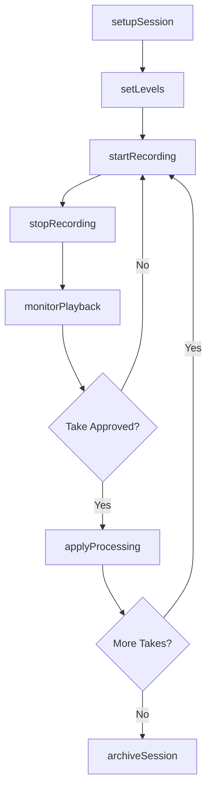
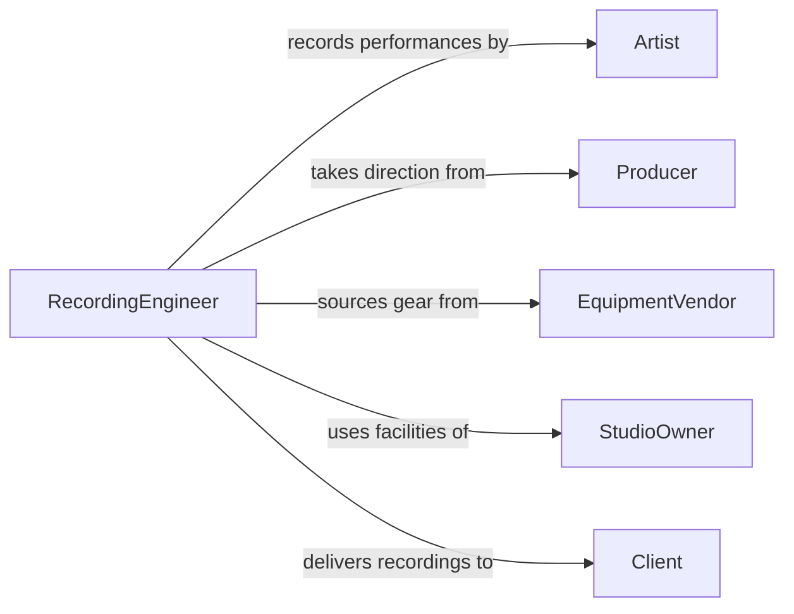

# Operate Audio Recording Equipment

> Business-as-Code definition for audio recording equipment operations. Models the setup, calibration, and use of microphones, mixers, digital audio workstations, and recording interfaces for capturing and producing audio content.

## Overview

Operating audio recording equipment involves positioning microphones, configuring preamps and mixers, setting recording levels, and capturing audio for music production, podcasting, broadcast, and field recording. This definition provides actions for session setup and signal chain management, events for tracking recording progress and quality issues, and searches for session archives and equipment inventory.

## Actors

| Actor | Description |
|-------|-------------|
| Artist | Performs music or voice content to be recorded |
| Producer | Directs the creative and technical aspects of a recording session |
| EquipmentVendor | Supplies microphones, interfaces, monitors, and recording hardware |
| StudioOwner | Provides recording space and permanent installed equipment |
| Client | Commissions audio recordings for commercial or personal use |

## Roles

| Role | Description |
|------|-------------|
| RecordingEngineer | Operates recording equipment and manages signal chains |
| MixingEngineer | Balances and processes recorded tracks into a final mix |
| StudioTechnician | Maintains and repairs recording hardware and wiring |
| SessionCoordinator | Schedules studio time and manages session logistics |

## Entities

| Entity | Description |
|--------|-------------|
| RecordingSession | A scheduled block of time for capturing audio in a studio or field |
| SignalChain | The path from microphone through preamp, mixer, and interface to recording medium |
| AudioTrack | A single channel or stem of recorded audio |
| MicrophonePlacement | The position and orientation of a microphone relative to a sound source |
| RecordingProject | A collection of sessions and tracks for a single production |
| EquipmentPreset | Saved settings for gain, EQ, compression, and routing on a mixer or interface |

## Actions

| Action | Description |
|--------|-------------|
| setupSession | Configure microphones, signal chains, and recording software for a session |
| setLevels | Adjust gain staging and input levels across the signal chain |
| startRecording | Begin capturing audio to the recording medium |
| stopRecording | End audio capture and save the recorded material |
| monitorPlayback | Listen to recorded takes through studio monitors or headphones |
| applyProcessing | Add EQ, compression, or effects to a recorded track |
| archiveSession | Save and catalog all session files, notes, and settings |

## Events

| Event | Description |
|-------|-------------|
| sessionSetupCompleted | Recording equipment has been configured and tested |
| levelsSet | Gain staging and input levels have been finalized |
| recordingStarted | Audio capture has begun |
| recordingStopped | Audio capture has ended and material has been saved |
| takeApproved | A recorded take has been accepted by the producer or artist |
| clippingDetected | Audio signal has exceeded the maximum level causing distortion |
| sessionArchived | All session files and metadata have been saved to storage |

## Searches

| Search | Description |
|--------|-------------|
| findSessions | List recording sessions by date, project, or artist |
| getAudioTracks | Retrieve recorded tracks by session, format, or status |
| findEquipment | Locate available microphones, interfaces, and mixers |
| getSessionArchives | Search archived session files by project or date range |

## Workflow



## Actor Relationships



## Usage

### Calling Actions

```typescript
import { operateAudioRecordingEquipment } from '@headlessly/operate-audio-recording-equipment'

const recording = operateAudioRecordingEquipment()

// Set up a recording session
const session = await recording.setupSession({
  projectId: 'album-blue-horizon',
  studio: 'Studio A',
  microphones: [
    { id: 'mic-u87', placement: 'vocal-booth-center', preamp: 'neve-1073' },
    { id: 'mic-sm57', placement: 'guitar-amp-cone', preamp: 'api-512' }
  ],
  sampleRate: 96000,
  bitDepth: 24
})

// Set levels and start recording
await recording.setLevels({
  sessionId: session.id,
  channels: [
    { input: 1, gainDb: -12, peakTarget: -6 },
    { input: 2, gainDb: -18, peakTarget: -8 }
  ]
})

await recording.startRecording({ sessionId: session.id, takeNumber: 1 })
```

### Event-Driven Automation

```typescript
// Alert engineer on clipping
recording.clippingDetected(async ({ sessionId, channel, peakLevel }) => {
  await notify({
    to: 'recording-engineer',
    message: `Clipping on channel ${channel} at ${peakLevel}dB in session ${sessionId}`
  })
})

// Auto-archive when all takes are approved
recording.takeApproved(async ({ sessionId, takeNumber, projectId }) => {
  const tracks = await recording.getAudioTracks({ sessionId })
  const allApproved = tracks.every(t => t.status === 'approved')
  if (allApproved) {
    await recording.archiveSession({ sessionId, projectId })
  }
})
```
