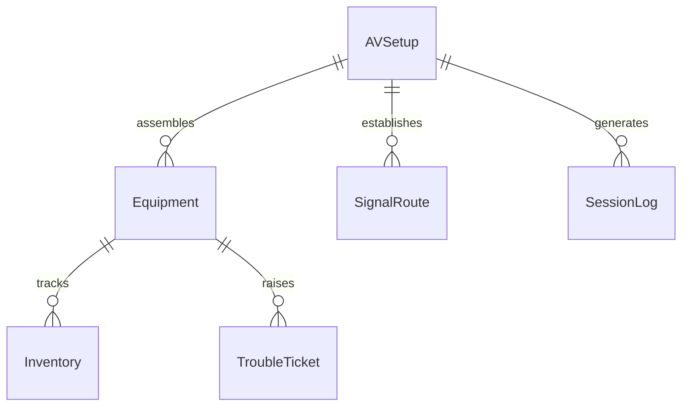
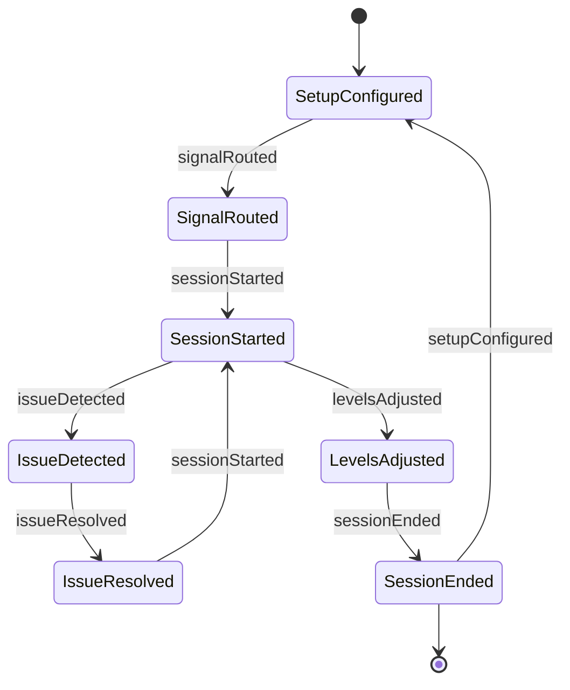
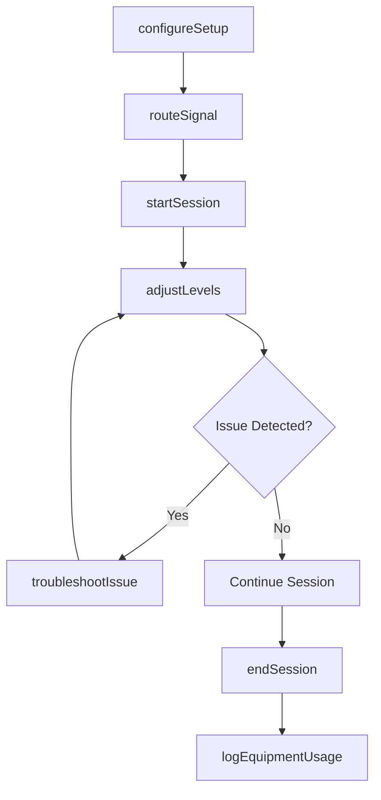
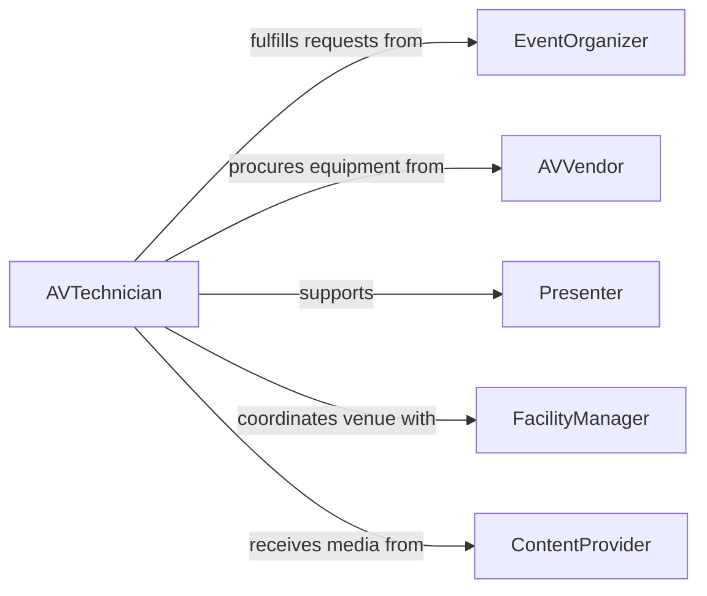

# Operate Audiovisual Equipment

> Business-as-Code definition for audiovisual equipment operations. Models the setup, operation, and management of projectors, displays, speakers, and integrated AV systems for presentations, events, and conferences.

## Overview

Operating audiovisual equipment involves setting up and running projectors, screens, microphones, speakers, video switchers, and display systems for meetings, conferences, classrooms, and live events. This definition provides actions for equipment configuration and signal management, events for tracking system status and session progress, and searches for equipment inventory and usage records.

## Actors

| Actor | Description |
|-------|-------------|
| EventOrganizer | Requests AV services and defines presentation requirements |
| AVVendor | Supplies projectors, displays, mixers, and related hardware |
| Presenter | Delivers content using the audiovisual setup |
| FacilityManager | Provides venue access and coordinates room configurations |
| ContentProvider | Supplies media files, slides, and video feeds for display |

## Roles

| Role | Description |
|------|-------------|
| AVTechnician | Sets up, operates, and troubleshoots audiovisual systems |
| AVSupervisor | Plans equipment allocation and oversees technician assignments |
| SystemsEngineer | Designs and maintains permanent AV installations |
| MediaOperator | Manages playback and switching of audio and video sources |

## Entities

| Entity | Description |
|--------|-------------|
| Equipment | A projector, display, speaker, mixer, or switcher used in AV setups |
| AVSetup | A configured arrangement of equipment for a specific event or room |
| SignalRoute | A defined path for audio or video signals between source and output |
| SessionLog | A record of an AV session including start time, duration, and issues |
| Inventory | The catalog of available AV equipment and its current status |
| TroubleTicket | A logged issue with AV equipment requiring resolution |

## Actions

| Action | Description |
|--------|-------------|
| configureSetup | Arrange and connect AV equipment for a venue or event |
| routeSignal | Direct audio or video from a source to one or more outputs |
| startSession | Begin an AV session and confirm all systems are live |
| endSession | Shut down AV equipment and log session details |
| adjustLevels | Modify audio volume, video brightness, or display settings |
| troubleshootIssue | Diagnose and resolve a technical problem with AV equipment |
| logEquipmentUsage | Record hours and condition of equipment after use |

## Events

| Event | Description |
|-------|-------------|
| setupConfigured | AV equipment has been arranged and connected for an event |
| signalRouted | An audio or video signal path has been established |
| sessionStarted | An AV session is live and all systems are operational |
| sessionEnded | An AV session has been concluded and equipment powered down |
| levelsAdjusted | Audio or video output levels have been changed |
| issueDetected | A technical problem has been identified with AV equipment |
| issueResolved | A previously reported AV issue has been fixed |

## Searches

| Search | Description |
|--------|-------------|
| findEquipment | List AV equipment by type, location, or availability |
| getSessionLogs | Retrieve session records by date, venue, or event |
| findTroubleTickets | Locate open or resolved AV issues by equipment or date |
| getInventoryStatus | Check current availability and condition of AV equipment |


## Entity Relationships



## State Diagram



## Workflow



## Actor Relationships



## Usage

### Calling Actions

```typescript
import { operateAudiovisualEquipment } from '@headlessly/operate-audiovisual-equipment'

const av = operateAudiovisualEquipment()

// Configure AV setup for a conference room
const setup = await av.configureSetup({
  venue: 'Main Conference Hall',
  equipment: ['projector-epson-5050', 'mixer-yamaha-tf1', 'display-samsung-85'],
  layout: 'theater'
})

// Route presenter laptop to main display
await av.routeSignal({
  setupId: setup.id,
  source: 'hdmi-input-1',
  outputs: ['projector-main', 'display-confidence']
})

// Start the session
await av.startSession({
  setupId: setup.id,
  eventName: 'Q1 All-Hands Meeting',
  expectedDuration: { minutes: 90 }
})
```

### Event-Driven Automation

```typescript
// Auto-notify technician on issue detection
av.issueDetected(async ({ setupId, equipmentId, description }) => {
  await notify({
    to: 'av-technician-on-call',
    message: `AV issue in setup ${setupId}: ${description} (${equipmentId})`
  })
})

// Log usage and schedule maintenance after session ends
av.sessionEnded(async ({ setupId, equipmentIds, duration }) => {
  for (const equipmentId of equipmentIds) {
    await av.logEquipmentUsage({ equipmentId, hours: duration.hours })
  }
})
```
