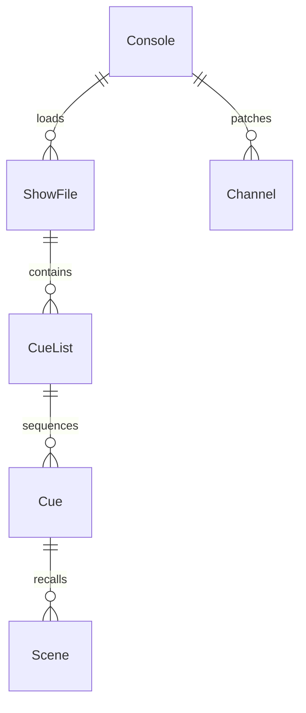
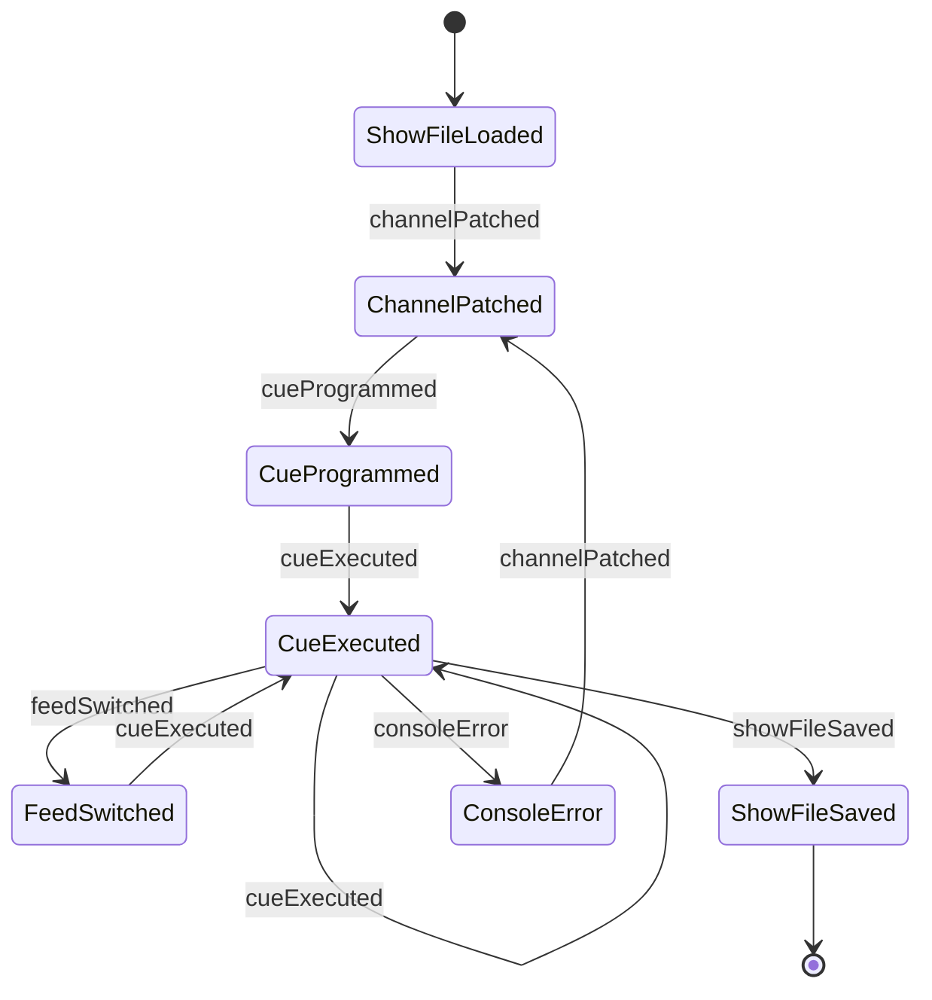
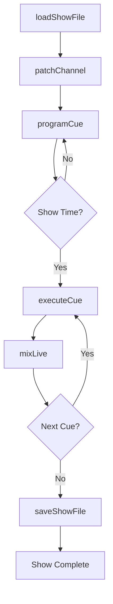
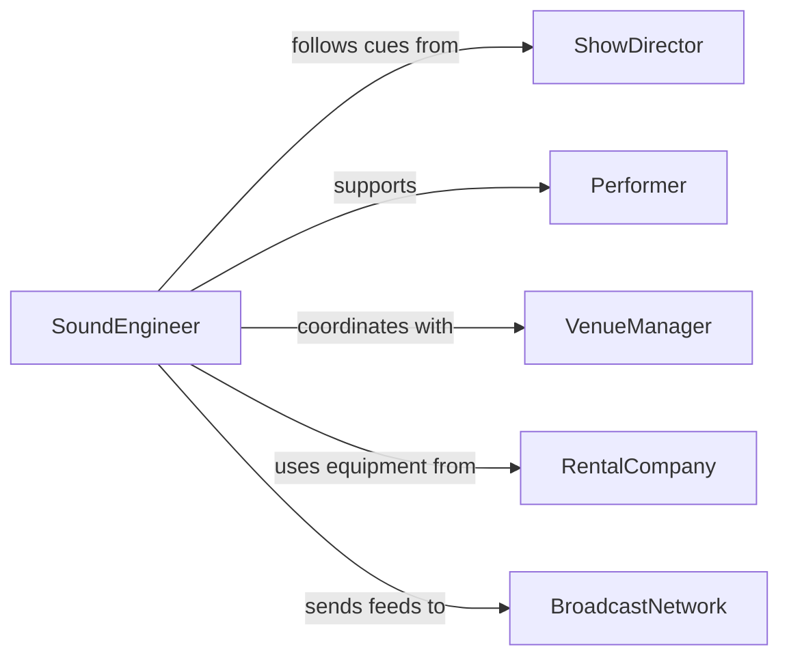

# Operate Control Consoles Sound Lighting

> Business-as-Code definition for operating control consoles for sound, lighting, or video. Models the programming, execution, and live management of mixing boards, lighting desks, and video switchers for live performances, broadcasts, and events.

## Overview

Operating control consoles for sound, lighting, or video involves programming cue sequences, mixing live audio, controlling lighting fixtures, and switching video feeds during performances, broadcasts, and corporate events. This definition provides actions for console programming and live operation, events for tracking cue execution and system changes, and searches for show files and equipment configurations.

## Actors

| Actor | Description |
|-------|-------------|
| ShowDirector | Defines creative vision and calls cues during performances |
| Performer | Delivers the live content that sound, lighting, and video support |
| VenueManager | Provides the physical space and house technical systems |
| RentalCompany | Supplies consoles, fixtures, and video switching equipment |
| BroadcastNetwork | Receives video and audio feeds for live or recorded distribution |

## Roles

| Role | Description |
|------|-------------|
| SoundEngineer | Operates the audio mixing console during live events |
| LightingDesigner | Programs and runs the lighting console for performances |
| VideoDirector | Manages the video switcher and selects camera feeds |
| StageManager | Coordinates cue timing between sound, lighting, and video |
| SystemsTechnician | Patches signal routing and maintains console hardware |

## Entities

| Entity | Description |
|--------|-------------|
| Console | A mixing board, lighting desk, or video switcher used to control outputs |
| CueList | An ordered sequence of programmed changes for sound, lighting, or video |
| Cue | A single programmed change in levels, positions, or scenes |
| ShowFile | A saved configuration containing all cues, presets, and routing for a production |
| Channel | An individual input or output on a console mapped to a source or fixture |
| Scene | A preset combination of levels and settings recalled as a group |

## Actions

| Action | Description |
|--------|-------------|
| loadShowFile | Load a saved configuration of cues and settings onto a console |
| programCue | Create or edit a cue in the cue list with specific levels and timing |
| executeCue | Trigger a programmed cue during a live performance |
| mixLive | Make real-time adjustments to audio, lighting, or video levels |
| switchFeed | Change the active video source on a video switcher |
| saveShowFile | Save the current console state and cue list to storage |
| patchChannel | Assign a physical input or output to a logical channel on the console |

## Events

| Event | Description |
|-------|-------------|
| showFileLoaded | A saved configuration has been loaded onto a console |
| cueProgrammed | A new cue has been created or an existing cue has been modified |
| cueExecuted | A programmed cue has been triggered during performance |
| feedSwitched | The active video source has been changed |
| channelPatched | A physical input or output has been mapped to a logical channel |
| showFileSaved | The current console configuration has been saved |
| consoleError | A technical issue has been detected on a console |

## Searches

| Search | Description |
|--------|-------------|
| findShowFiles | List saved show files by production, venue, or date |
| getCueList | Retrieve the cue sequence for a specific show file |
| getChannelPatch | Look up input/output assignments for a console |
| findConsoles | Locate available consoles by type, venue, or status |


## Entity Relationships



## State Diagram



## Workflow



## Actor Relationships



## Usage

### Calling Actions

```typescript
import { operateControlConsoles } from '@headlessly/operate-control-consoles-sound-lighting'

const console = operateControlConsoles()

// Load a saved show file onto the lighting console
await console.loadShowFile({
  consoleId: 'lighting-grandma3',
  showFileId: 'spring-gala-2026',
  production: 'Annual Spring Gala'
})

// Program a new lighting cue
await console.programCue({
  consoleId: 'lighting-grandma3',
  cueNumber: 12.5,
  description: 'Stage wash blue for ballad',
  fadeTime: { seconds: 4 },
  levels: { wash: 80, spots: 0, movers: 'position-center-blue' }
})

// Execute a cue during performance
await console.executeCue({
  consoleId: 'lighting-grandma3',
  cueNumber: 12.5
})
```

### Event-Driven Automation

```typescript
// Log all cue executions for post-show review
console.cueExecuted(async ({ consoleId, cueNumber, timestamp, production }) => {
  await logEvent({
    type: 'cue-execution',
    consoleId,
    cueNumber,
    timestamp,
    production
  })
})

// Alert technician on console error
console.consoleError(async ({ consoleId, errorType, description }) => {
  await notify({
    to: 'systems-technician',
    message: `Console ${consoleId} error: ${errorType} - ${description}`
  })
})
```
