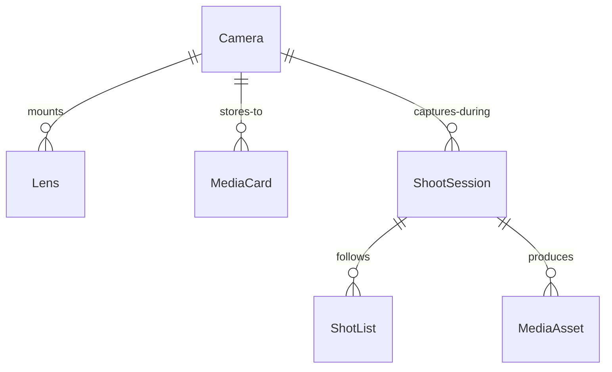
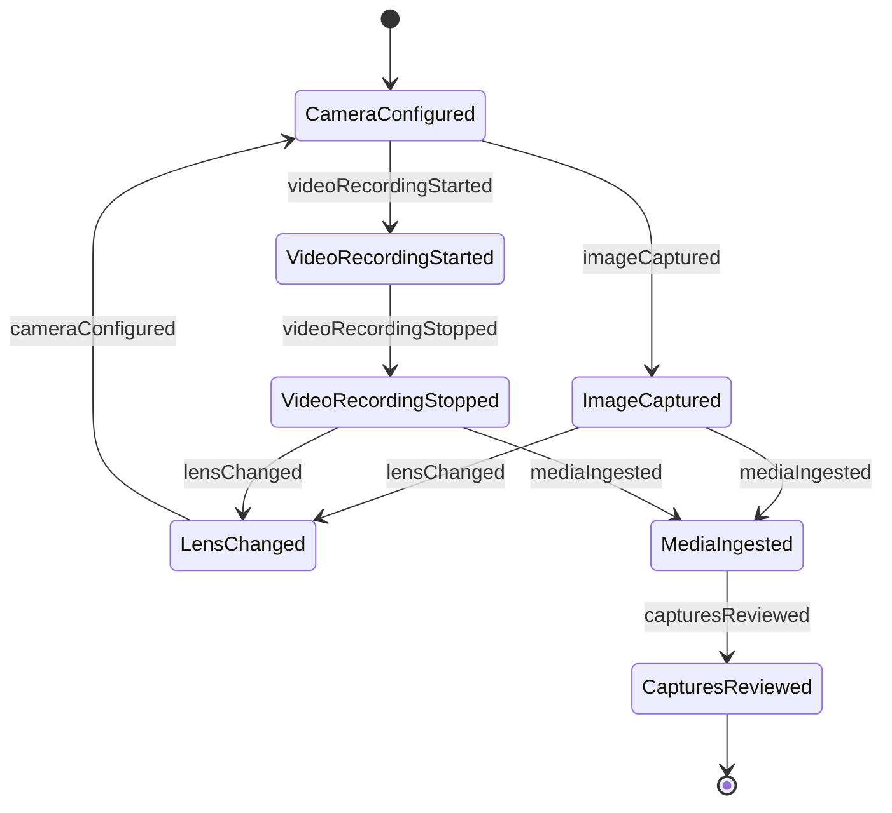
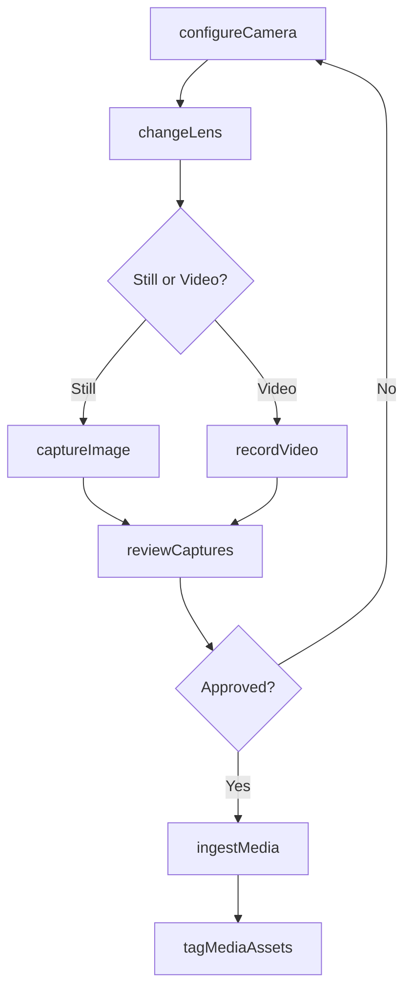
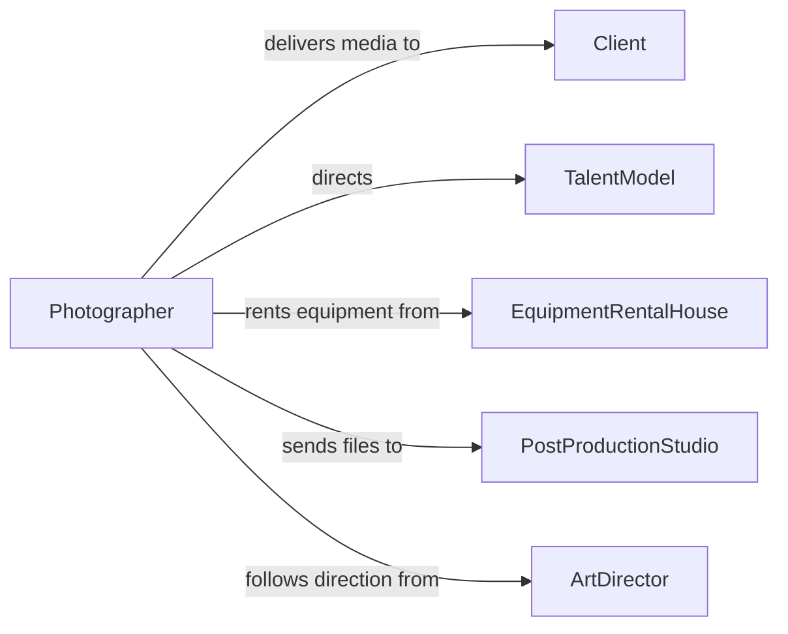

# Operate Still Video Cameras Related

> Business-as-Code definition for operating still or video cameras and related equipment. Models the setup, capture, and management of photography and videography workflows for commercial, editorial, and production environments.

## Overview

Operating still or video cameras involves selecting lenses and settings, composing shots, capturing images or video, and managing digital media files for photography studios, film productions, journalism, and commercial shoots. This definition provides actions for camera configuration and content capture, events for tracking session progress and media quality, and searches for asset management and equipment tracking.

## Actors

| Actor | Description |
|-------|-------------|
| Client | Commissions photography or videography for commercial or personal use |
| TalentModel | Appears in front of the camera as the subject of the shoot |
| EquipmentRentalHouse | Provides cameras, lenses, tripods, and grip equipment |
| PostProductionStudio | Receives captured media for editing, color grading, and delivery |
| ArtDirector | Guides the visual style and composition of the shoot |

## Roles

| Role | Description |
|------|-------------|
| Photographer | Operates still cameras and composes photographic images |
| Videographer | Operates video cameras and manages motion capture |
| CameraAssistant | Manages focus pulling, lens changes, and equipment setup |
| DigitalImageTechnician | Monitors exposure, manages media ingest, and verifies image quality on set |

## Entities

| Entity | Description |
|--------|-------------|
| Camera | A still or video camera body used for capturing images or footage |
| Lens | An optical element attached to a camera to control focal length and aperture |
| MediaCard | A removable storage device containing captured images or video |
| ShootSession | A scheduled block of time for capturing images or video at a location |
| MediaAsset | A captured photograph or video clip with associated metadata |
| ShotList | A planned sequence of shots to be captured during a session |

## Actions

| Action | Description |
|--------|-------------|
| configureCamera | Set exposure, white balance, resolution, and frame rate on a camera |
| captureImage | Take a still photograph with current camera settings |
| recordVideo | Start or stop video recording on a camera |
| changeLens | Swap the current lens for a different focal length or type |
| ingestMedia | Transfer captured files from media cards to storage systems |
| reviewCaptures | Examine captured images or footage for quality and composition |
| tagMediaAssets | Apply metadata tags such as subject, location, and project to captured files |

## Events

| Event | Description |
|-------|-------------|
| cameraConfigured | Camera settings have been set for the current shooting conditions |
| imageCaptured | A still photograph has been taken |
| videoRecordingStarted | Video capture has begun on a camera |
| videoRecordingStopped | Video capture has ended and the clip has been saved |
| lensChanged | A lens swap has been completed on a camera body |
| mediaIngested | Captured files have been transferred to storage |
| capturesReviewed | A set of images or clips has been examined and approved or flagged |

## Searches

| Search | Description |
|--------|-------------|
| findMediaAssets | List captured images or videos by session, date, or tag |
| getShootSessions | Retrieve session records by project, location, or photographer |
| findEquipment | Locate cameras and lenses by type, availability, or serial number |
| getShotList | Retrieve the planned shot sequence for a session |


## Entity Relationships



## State Diagram



## Workflow



## Actor Relationships



## Usage

### Calling Actions

```typescript
import { operateStillVideoCameras } from '@headlessly/operate-still-video-cameras-related'

const camera = operateStillVideoCameras()

// Configure camera for a portrait session
await camera.configureCamera({
  cameraId: 'canon-r5-001',
  iso: 400,
  aperture: 2.8,
  shutterSpeed: '1/200',
  whiteBalance: 'daylight',
  format: 'RAW'
})

// Capture a series of images
const image = await camera.captureImage({
  cameraId: 'canon-r5-001',
  shotListItem: 'headshot-formal-01',
  burstMode: false
})

// Ingest media to storage
await camera.ingestMedia({
  mediaCardId: 'cfexpress-card-a',
  destination: 'project-corporate-headshots/raw',
  verifyChecksum: true
})
```

### Event-Driven Automation

```typescript
// Auto-tag ingested media with session metadata
camera.mediaIngested(async ({ sessionId, assetIds, projectId }) => {
  for (const assetId of assetIds) {
    await camera.tagMediaAssets({
      assetId,
      tags: { sessionId, projectId, ingestionDate: new Date().toISOString() }
    })
  }
})

// Notify post-production when review is complete
camera.capturesReviewed(async ({ sessionId, approvedCount, flaggedCount }) => {
  if (flaggedCount === 0) {
    await notify({
      to: 'post-production-studio',
      message: `Session ${sessionId}: all ${approvedCount} captures approved and ready for editing`
    })
  }
})
```
