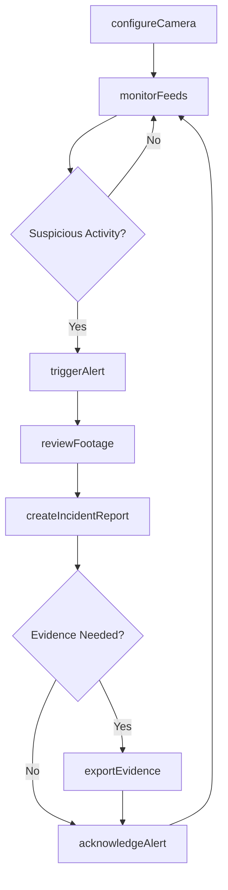
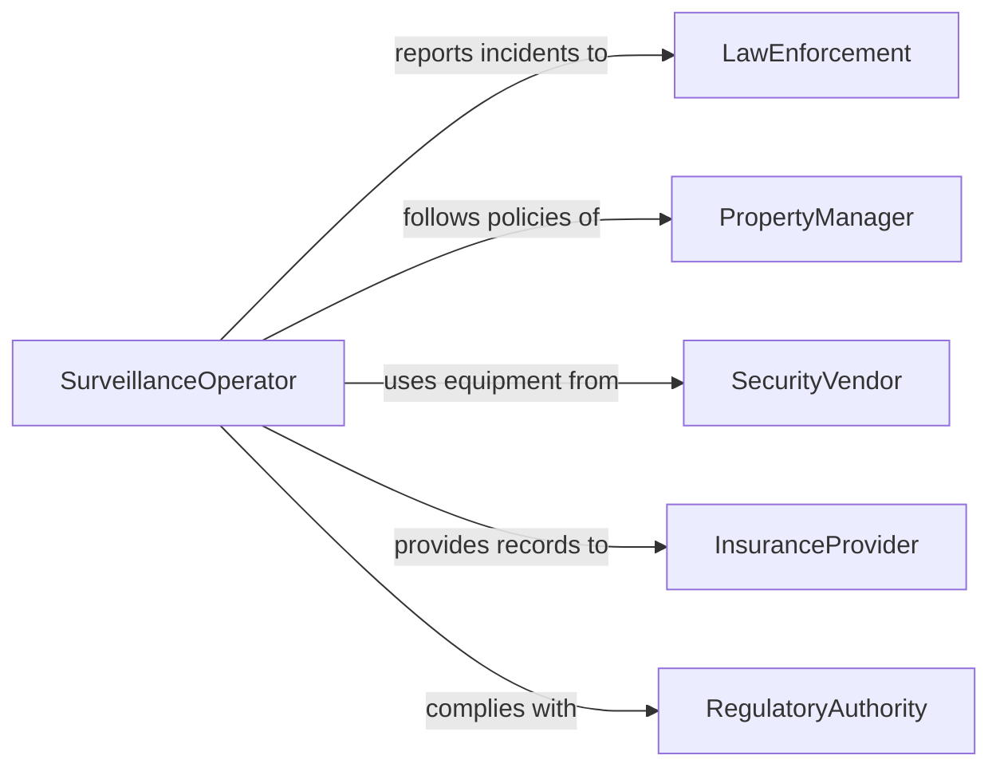

# Operate Surveillance Equipment Detect Suspicious

> Business-as-Code definition for surveillance equipment operations to detect suspicious or illegal activities. Models the configuration, monitoring, and management of CCTV cameras, motion sensors, and video analytics systems for security and loss prevention.

## Overview

Operating surveillance equipment to detect suspicious or illegal activities involves configuring security cameras, monitoring live feeds, reviewing recorded footage, and responding to alerts from motion detection and video analytics systems. This definition provides actions for camera management and incident detection, events for real-time alerting and evidence capture, and searches for footage retrieval and incident history.

## Actors

| Actor | Description |
|-------|-------------|
| PropertyManager | Authorizes surveillance coverage areas and access policies |
| LawEnforcement | Receives reports and evidence of criminal activity |
| SecurityVendor | Supplies cameras, recording systems, and video analytics software |
| InsuranceProvider | Requires surveillance records for claims and risk assessment |
| RegulatoryAuthority | Enforces privacy laws and surveillance compliance standards |

## Roles

| Role | Description |
|------|-------------|
| SurveillanceOperator | Monitors live camera feeds and responds to alerts |
| SecuritySupervisor | Manages surveillance schedules and reviews incident reports |
| SystemsAdministrator | Configures cameras, storage, and analytics software |
| InvestigationsOfficer | Reviews footage and prepares evidence packages for incidents |

## Entities

| Entity | Description |
|--------|-------------|
| Camera | A CCTV or IP camera positioned to monitor a specific area |
| MonitoringZone | A defined area covered by one or more cameras |
| Alert | A system-generated notification triggered by motion, analytics, or manual input |
| Footage | Recorded video from a camera during a specified time window |
| IncidentReport | A documented record of a suspicious or illegal activity observed |
| EvidencePackage | A curated collection of footage clips and metadata for an investigation |

## Actions

| Action | Description |
|--------|-------------|
| configureCamera | Set up or adjust camera position, resolution, and recording schedule |
| monitorFeeds | Actively watch live camera feeds for suspicious activity |
| triggerAlert | Generate a manual alert based on observed suspicious behavior |
| reviewFootage | Examine recorded video for a specific time window or event |
| createIncidentReport | Document a detected suspicious or illegal activity |
| exportEvidence | Package footage clips and metadata for law enforcement or legal use |
| acknowledgeAlert | Mark a system-generated alert as reviewed and categorized |

## Events

| Event | Description |
|-------|-------------|
| cameraConfigured | A camera has been set up or its settings have been changed |
| motionDetected | Automated motion detection has triggered in a monitoring zone |
| alertTriggered | A manual or system alert has been generated |
| alertAcknowledged | An alert has been reviewed and categorized by an operator |
| suspiciousActivityIdentified | An operator has confirmed suspicious behavior on camera |
| incidentReportCreated | A formal incident report has been documented |
| evidenceExported | A package of footage and metadata has been prepared for external use |

## Searches

| Search | Description |
|--------|-------------|
| findAlerts | List alerts by zone, severity, time range, or status |
| getFootage | Retrieve recorded video by camera, date, or time window |
| findIncidentReports | Locate incident reports by type, date, or zone |
| getCameraStatus | Check operational status and recording state of cameras |

## Workflow



## Actor Relationships



## Usage

### Calling Actions

```typescript
import { operateSurveillanceEquipment } from '@headlessly/operate-surveillance-equipment-detect-suspicious'

const surveillance = operateSurveillanceEquipment()

// Configure a camera for a monitoring zone
await surveillance.configureCamera({
  cameraId: 'cam-lobby-north-01',
  zone: 'main-lobby',
  resolution: '4K',
  recordingMode: 'continuous',
  motionSensitivity: 'high'
})

// Review footage for a specific time window
const footage = await surveillance.reviewFootage({
  cameraId: 'cam-lobby-north-01',
  startTime: '2026-02-05T02:00:00Z',
  endTime: '2026-02-05T03:30:00Z'
})

// Create an incident report
await surveillance.createIncidentReport({
  zone: 'main-lobby',
  description: 'Unauthorized individual attempted to access restricted area',
  footageIds: [footage.id],
  severity: 'high'
})
```

### Event-Driven Automation

```typescript
// Alert security on motion detection after hours
surveillance.motionDetected(async ({ cameraId, zone, timestamp }) => {
  const hour = new Date(timestamp).getHours()
  if (hour >= 22 || hour < 6) {
    await notify({
      to: 'security-supervisor',
      message: `After-hours motion detected in ${zone} on camera ${cameraId}`
    })
  }
})

// Auto-export evidence when incident is created with high severity
surveillance.incidentReportCreated(async ({ incidentId, severity, footageIds }) => {
  if (severity === 'high') {
    await surveillance.exportEvidence({
      incidentId,
      footageIds,
      recipient: 'law-enforcement'
    })
  }
})
```
