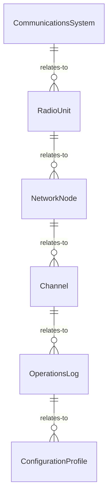
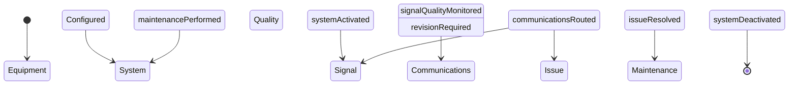
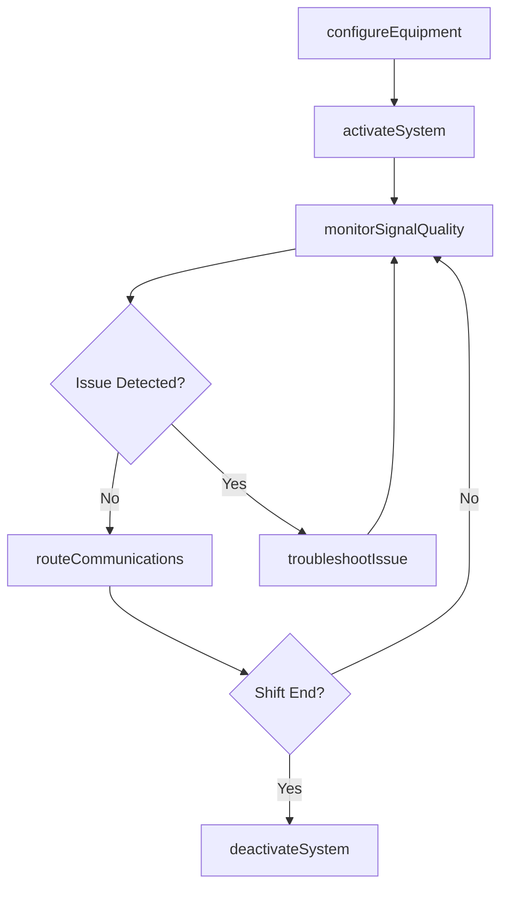
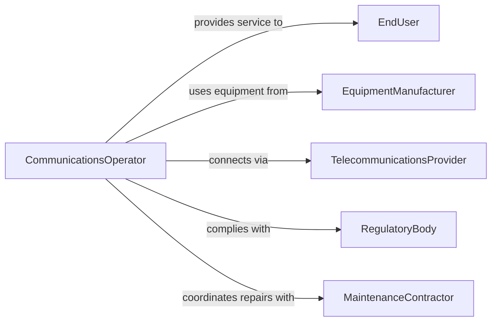

# Operate Communications Equipment Systems

> Business-as-Code definition for operating communications equipment or systems. Models the configuration, operation, monitoring, and troubleshooting of radio, telephone, satellite, and network communications infrastructure.

## Overview

Operating communications equipment or systems involves configuring, activating, monitoring, and maintaining the hardware and software used to transmit voice, data, and video communications. This activity covers radio systems, telephone networks, satellite links, digital communications platforms, and the coordination of multi-channel communications for operational needs.

## Actors

| Actor | Description |
|-------|-------------|
| EndUser | Individual or department relying on communications services |
| EquipmentManufacturer | Vendor supplying communications hardware and firmware |
| TelecommunicationsProvider | Carrier providing network connectivity and bandwidth |
| RegulatoryBody | Authority governing spectrum usage and communications standards |
| MaintenanceContractor | Third-party technician servicing communications equipment |

## Roles

| Role | Description |
|------|-------------|
| CommunicationsOperator | Configures and operates communications equipment daily |
| SystemsEngineer | Designs and maintains communications system architecture |
| NetworkAdministrator | Manages network configurations and connectivity |
| DispatchCoordinator | Routes and prioritizes communications traffic |

## Entities

| Entity | Description |
|--------|-------------|
| CommunicationsSystem | Integrated platform for transmitting and receiving signals |
| RadioUnit | Portable or fixed radio transceiver |
| NetworkNode | Point in the communications network that routes traffic |
| Channel | Designated frequency or digital pathway for communications |
| OperationsLog | Record of system usage, outages, and maintenance events |
| ConfigurationProfile | Saved settings for equipment frequencies, power, and modes |

## Actions

| Action | Description |
|--------|-------------|
| configureEquipment | Set up frequencies, channels, and operational parameters |
| activateSystem | Power on and bring a communications system to operational status |
| monitorSignalQuality | Track signal strength, clarity, and interference levels |
| routeCommunications | Direct traffic through appropriate channels and nodes |
| troubleshootIssue | Diagnose and resolve communications failures or degradation |
| performMaintenance | Execute scheduled or corrective maintenance on equipment |
| deactivateSystem | Safely power down and secure communications equipment |

## Events

| Event | Description |
|-------|-------------|
| equipmentConfigured | Communications equipment has been set up with operating parameters |
| systemActivated | A communications system has been brought online |
| signalQualityMonitored | Signal metrics have been captured and evaluated |
| communicationsRouted | Traffic has been directed through designated channels |
| issueResolved | A communications failure or degradation has been fixed |
| maintenancePerformed | Equipment maintenance has been completed |
| systemDeactivated | A communications system has been safely powered down |

## Searches

| Search | Description |
|--------|-------------|
| findOperationsLogs | List system usage and event logs by date or system |
| getActiveChannels | Retrieve channels currently in use by system or operator |
| getEquipmentStatus | Check operational status of specific communications equipment |
| findMaintenanceRecords | Search maintenance history by equipment or date range |


## Entity Relationships



## State Diagram



## Workflow



## Actor Relationships



## Usage

### Calling Actions

```typescript
import { operateCommunicationsEquipmentSystems } from '@headlessly/operate-communications-equipment-systems'

const comms = operateCommunicationsEquipmentSystems()

// Configure a radio system for field operations
await comms.configureEquipment({
  equipmentId: 'radio-base-station-04',
  profile: {
    frequency: '155.475 MHz',
    power: '50W',
    mode: 'FM-narrowband',
    squelch: 3
  }
})

// Activate the system
await comms.activateSystem({
  systemId: 'field-comms-network-alpha',
  operator: 'tech-garcia',
  channels: ['ops-primary', 'ops-secondary', 'emergency']
})

// Monitor signal quality
const signal = await comms.monitorSignalQuality({
  systemId: 'field-comms-network-alpha',
  channel: 'ops-primary'
})
```

### Event-Driven Automation

```typescript
// Auto-failover on signal degradation
comms.signalQualityMonitored(async ({ systemId, channel, signalStrength }) => {
  if (signalStrength < -90) {
    await comms.routeCommunications({
      systemId,
      fromChannel: channel,
      toChannel: 'ops-secondary',
      reason: 'Signal degradation below threshold'
    })
  }
})

// Schedule maintenance on recurring issues
comms.issueResolved(async ({ equipmentId, issueType }) => {
  const history = await comms.findMaintenanceRecords({ equipmentId, months: 3 })
  const sameIssues = history.filter(r => r.issueType === issueType)
  if (sameIssues.length >= 3) {
    await comms.performMaintenance({
      equipmentId,
      type: 'preventive',
      reason: `Recurring ${issueType} - ${sameIssues.length} incidents in 3 months`
    })
  }
})
```
