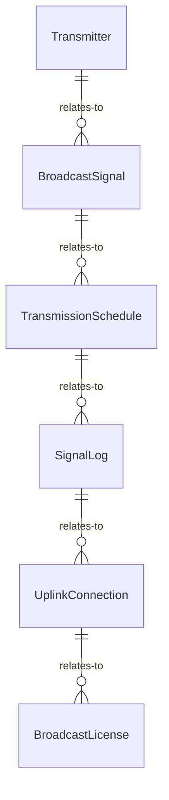
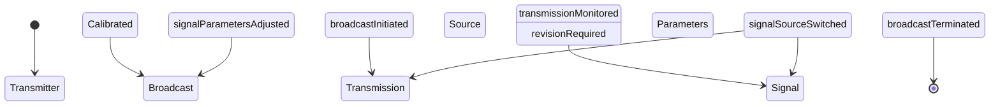
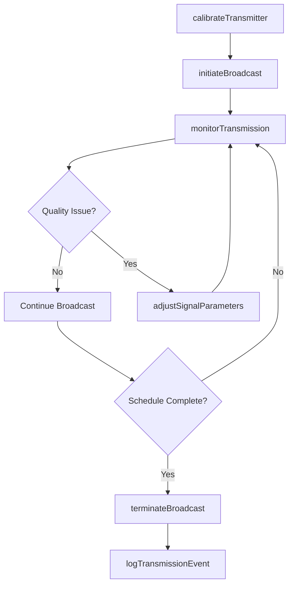
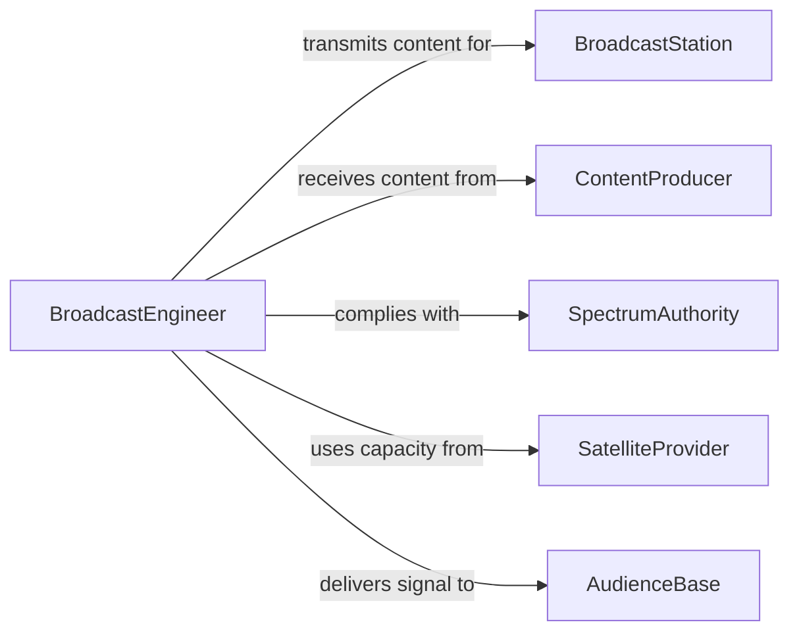

# Operate Communications Transmissions Broadcasting Equi

> Business-as-Code definition for operating communications, transmissions, or broadcasting equipment. Models the setup, live operation, signal management, and quality control of broadcast and transmission systems.

## Overview

Operating communications, transmissions, or broadcasting equipment involves the setup, calibration, live operation, and monitoring of systems used to transmit audio, video, and data signals to audiences or receiving stations. This activity covers broadcast tower operations, satellite uplink management, studio-to-transmitter links, and the real-time quality assurance of transmitted signals.

## Actors

| Actor | Description |
|-------|-------------|
| BroadcastStation | Media outlet transmitting content to audiences |
| ContentProducer | Entity creating audio or video content for transmission |
| SpectrumAuthority | Regulatory body governing broadcast frequencies and power levels |
| SatelliteProvider | Vendor providing satellite transponder capacity |
| AudienceBase | Receiving public or subscriber base of transmitted content |

## Roles

| Role | Description |
|------|-------------|
| BroadcastEngineer | Configures and operates transmission and broadcasting equipment |
| TransmitterTechnician | Maintains and monitors transmitter hardware at tower sites |
| MasterControlOperator | Manages live broadcast switching and signal routing |
| SignalQualityAnalyst | Monitors output signal integrity and compliance |

## Entities

| Entity | Description |
|--------|-------------|
| Transmitter | Hardware that amplifies and sends broadcast signals |
| BroadcastSignal | The audio, video, or data stream being transmitted |
| TransmissionSchedule | Timetable of planned broadcasts and maintenance windows |
| SignalLog | Record of signal metrics including power, frequency, and quality |
| UplinkConnection | Satellite or microwave link from studio to transmitter |
| BroadcastLicense | Regulatory authorization to transmit on assigned frequencies |

## Actions

| Action | Description |
|--------|-------------|
| calibrateTransmitter | Adjust transmitter settings for optimal signal output |
| initiateBroadcast | Start live transmission of content on designated frequencies |
| monitorTransmission | Track signal quality, power levels, and interference |
| switchSignalSource | Route transmission from one content source to another |
| adjustSignalParameters | Modify frequency, power, or encoding during transmission |
| terminateBroadcast | End a live transmission and power down equipment |
| logTransmissionEvent | Record operational metrics and notable events |

## Events

| Event | Description |
|-------|-------------|
| transmitterCalibrated | Transmitter settings have been optimized for broadcast |
| broadcastInitiated | A live transmission has begun on designated frequencies |
| transmissionMonitored | Signal quality metrics have been captured and evaluated |
| signalSourceSwitched | Transmission has been routed to a different content source |
| signalParametersAdjusted | Frequency, power, or encoding has been modified |
| broadcastTerminated | A live transmission has been ended |
| transmissionEventLogged | Operational data has been recorded in the signal log |

## Searches

| Search | Description |
|--------|-------------|
| findSignalLogs | List signal records by transmitter, date, or quality range |
| getTransmissionSchedule | Retrieve upcoming broadcasts by channel or time slot |
| getTransmitterStatus | Check current operational state of a specific transmitter |
| findBroadcastEvents | Search broadcast events by type, date, or operator |


## Entity Relationships



## State Diagram



## Workflow



## Actor Relationships



## Usage

### Calling Actions

```typescript
import { operateCommunicationsTransmissionsBroadcastingEqui } from '@headlessly/operate-communications-transmissions-broadcasting-equipment'

const broadcast = operateCommunicationsTransmissionsBroadcastingEqui()

// Calibrate a transmitter before a live broadcast
await broadcast.calibrateTransmitter({
  transmitterId: 'tx-tower-east-01',
  targetFrequency: '98.7 MHz',
  targetPower: '10kW',
  mode: 'stereo-FM'
})

// Initiate a live broadcast
await broadcast.initiateBroadcast({
  transmitterId: 'tx-tower-east-01',
  source: 'studio-a-master',
  channel: 'WXYZ-FM',
  scheduledDuration: '4h'
})

// Monitor transmission quality
const quality = await broadcast.monitorTransmission({
  transmitterId: 'tx-tower-east-01',
  metrics: ['signal-to-noise', 'deviation', 'reflected-power']
})
```

### Event-Driven Automation

```typescript
// Auto-adjust on signal degradation
broadcast.transmissionMonitored(async ({ transmitterId, signalToNoise }) => {
  if (signalToNoise < 40) {
    await broadcast.adjustSignalParameters({
      transmitterId,
      adjustment: 'increase-power',
      reason: `Signal-to-noise ratio dropped to ${signalToNoise} dB`
    })
  }
})

// Log and notify on unscheduled broadcast termination
broadcast.broadcastTerminated(async ({ transmitterId, reason, scheduled }) => {
  if (!scheduled) {
    await notify({
      to: 'broadcast-engineering',
      message: `Unscheduled termination on ${transmitterId}: ${reason}`
    })
    await broadcast.logTransmissionEvent({
      transmitterId,
      type: 'unscheduled-termination',
      details: reason
    })
  }
})
```
