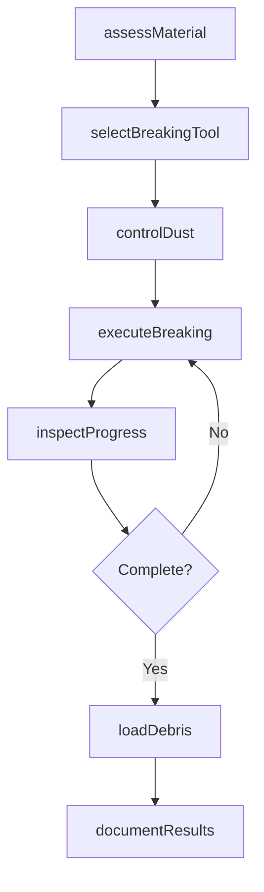
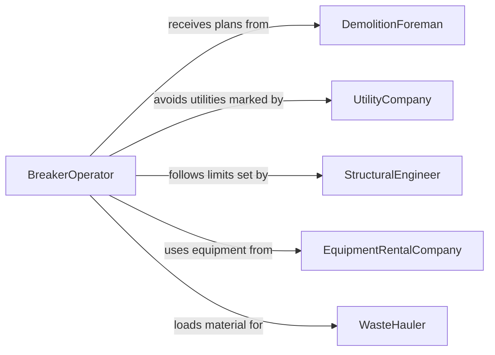

# Break Up Rock Asphalt Concrete

> Business-as-Code definition for breaking up rock, asphalt, or concrete. Models the use of hydraulic breakers, jackhammers, pneumatic tools, and crushing equipment to fracture and remove hard materials during demolition, construction, and road repair.

## Overview

Breaking up rock, asphalt, or concrete involves operating hydraulic breakers, jackhammers, pneumatic hammers, and concrete crushers to fracture hard materials for removal or recycling. This activity occurs during road repair, building demolition, foundation removal, and site preparation. Operators control impact force, positioning, and depth to fragment materials efficiently while minimizing damage to surrounding structures and utilities. This definition exposes actions for each breaking operation, events for progress and safety tracking, and searches for job and equipment records.

## Actors

| Actor | Description |
|-------|-------------|
| DemolitionContractor | Commissions breaking and removal of concrete or asphalt structures |
| EquipmentRentalCompany | Supplies hydraulic breakers, jackhammers, and crushing equipment |
| WasteHauler | Transports broken material to disposal or recycling facilities |
| UtilityCompany | Identifies underground utilities that must be protected during breaking |
| StructuralEngineer | Assesses structural impact and defines safe breaking boundaries |

## Roles

| Role | Description |
|------|-------------|
| BreakerOperator | Operates hydraulic breakers and jackhammers to fracture material |
| DemolitionForeman | Plans the breaking sequence and supervises the crew |
| Spotter | Monitors for hazards and guides the operator during operations |
| EquipmentMechanic | Maintains breaking tools and replaces worn bits and chisels |

## Entities

| Entity | Description |
|--------|-------------|
| BreakingJob | A work order specifying the material, area, and depth to be broken |
| BreakerUnit | A registered hydraulic breaker, jackhammer, or crusher with specifications |
| MaterialFragment | Broken pieces of rock, asphalt, or concrete produced during the operation |
| DebrisLoadout | A record of broken material loaded for hauling and disposal |
| DustControlPlan | A documented plan for suppressing dust during breaking operations |
| BreakingPermit | Authorization to perform breaking work at a specific location |

## Actions

| Action | Description |
|--------|-------------|
| assessMaterial | Evaluate the type, thickness, and reinforcement of material to be broken |
| selectBreakingTool | Choose the appropriate breaker, bit, or chisel for the material type |
| executeBreaking | Operate the breaker to fracture the target material |
| controlDust | Apply water or suppressants to minimize airborne dust during operations |
| loadDebris | Transfer broken material into hauling vehicles or containers |
| inspectProgress | Check the breaking area for remaining material and structural stability |
| documentResults | Record the area cleared, material volume, and equipment usage |

## Events

| Event | Description |
|-------|-------------|
| materialAssessed | The material type and condition have been evaluated |
| breakingToolSelected | The appropriate breaker and bit have been chosen for the job |
| breakingExecuted | A section of material has been fractured |
| dustControlled | Dust suppression measures have been applied |
| debrisLoaded | Broken material has been loaded into a haul vehicle |
| progressInspected | The breaking area has been checked for completion |
| reinforcementEncountered | Rebar or other reinforcement has been exposed during breaking |

## Searches

| Search | Description |
|--------|-------------|
| findBreakingJobs | List breaking jobs by site, material type, or status |
| getEquipmentUsage | Retrieve breaker usage records by unit, operator, or date |
| getDebrisVolumes | Look up volumes of material broken and hauled by job |
| findBreakingPermits | List permits by site, date, or approval status |

## Workflow



## Actor Relationships



## Usage

### Calling Actions

```typescript
import { breakUpRockAsphaltConcrete } from '@headlessly/break-up-rock-asphalt-concrete'

const breaking = breakUpRockAsphaltConcrete()

// Assess the material before starting
const assessment = await breaking.assessMaterial({
  jobId: 'BRK-2026-0088',
  materialType: 'reinforced-concrete',
  thicknessCm: 30,
  areaM2: 45
})

// Execute breaking with dust control
await breaking.controlDust({
  jobId: 'BRK-2026-0088',
  method: 'water-spray',
  flowRateLpm: 15
})

await breaking.executeBreaking({
  jobId: 'BRK-2026-0088',
  unitId: 'HYD-BRK-450',
  targetDepthCm: 30,
  sectionId: 'SEC-A1'
})
```

### Event-Driven Automation

```typescript
// Alert when reinforcement is encountered
breaking.reinforcementEncountered(async ({ jobId, sectionId, reinforcementType }) => {
  await notify({
    to: 'demolition-foreman',
    message: `${reinforcementType} found in section ${sectionId} of job ${jobId} - switch to cutting tool`
  })
})

// Track debris removal progress
breaking.debrisLoaded(async ({ jobId, volumeM3, haulerId }) => {
  await notify({
    to: 'project-manager',
    message: `${volumeM3}m3 debris loaded by ${haulerId} on job ${jobId}`
  })
})
```
