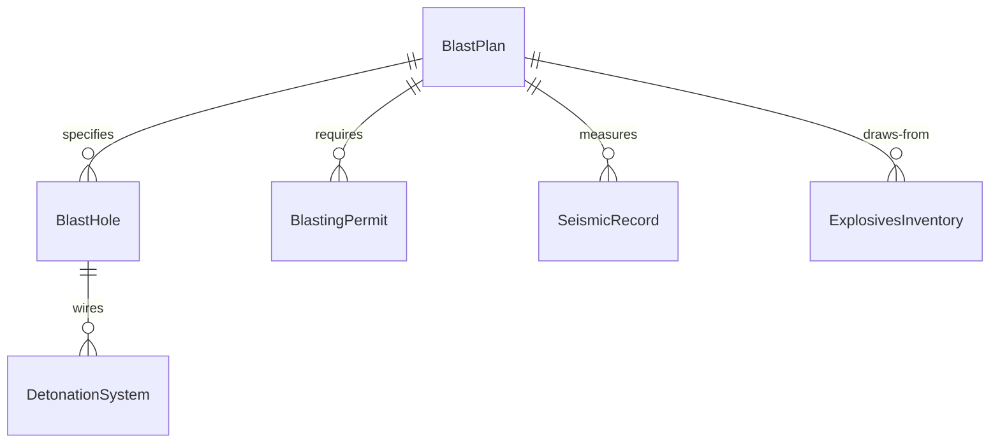
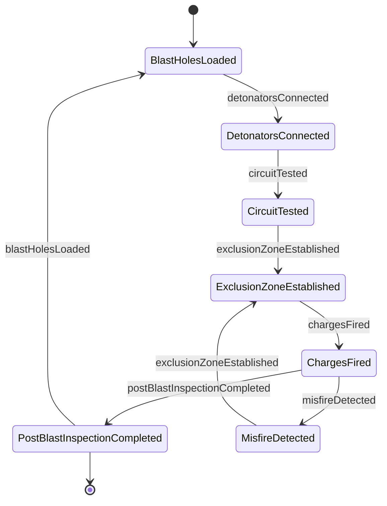
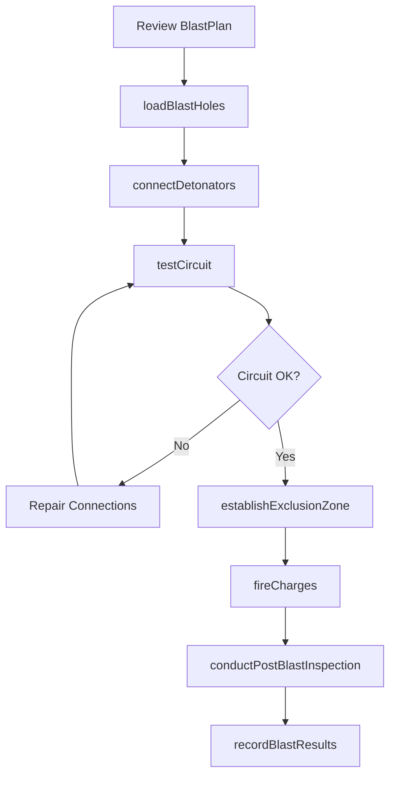
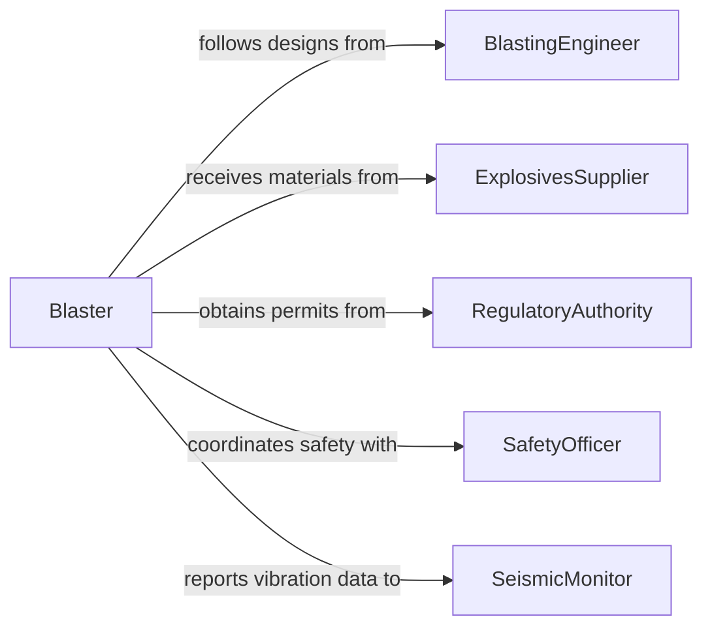

# Operate Detonation Equipment

> Business-as-Code definition for operating detonation equipment. Models the setup, wiring, testing, and firing of blasting systems used in mining, quarrying, demolition, and construction to fragment rock and structures.

## Overview

Operating detonation equipment involves preparing, connecting, testing, and initiating explosive charges and blasting systems to break rock, demolish structures, or clear obstacles. This includes loading blast holes, connecting detonators and lead wires, testing circuits for continuity, establishing safety perimeters, and firing charges in controlled sequences. Operators must comply with federal and state explosives regulations and coordinate closely with blasting engineers and safety personnel. This definition exposes actions for each phase of the blasting process, events for safety and compliance tracking, and searches for blast records and inventory.

## Actors

| Actor | Description |
|-------|-------------|
| ExplosivesSupplier | Provides explosive materials, detonators, and blasting accessories |
| RegulatoryAuthority | Issues blasting permits and enforces explosives handling regulations |
| BlastingEngineer | Designs blast patterns, charge weights, and delay sequences |
| PropertyOwner | Owns structures or land adjacent to the blast site |
| SeismicMonitor | Measures ground vibration and air overpressure from blasts |

## Roles

| Role | Description |
|------|-------------|
| Blaster | Licensed operator who wires, tests, and fires the detonation system |
| BlastForeman | Supervises the blasting crew and enforces safety procedures |
| PowderHandler | Loads explosive materials into blast holes under supervision |
| SafetyOfficer | Establishes exclusion zones and coordinates blast warnings |

## Entities

| Entity | Description |
|--------|-------------|
| BlastPlan | A documented design specifying hole patterns, charge weights, and timing |
| DetonationSystem | The assembly of detonators, lead wires, and firing device |
| BlastHole | A drilled hole loaded with explosive charges |
| BlastingPermit | Regulatory authorization to conduct blasting at a specific site |
| SeismicRecord | Ground vibration and air overpressure measurements from a blast |
| ExplosivesInventory | A tracked inventory of explosive materials and detonators on site |

## Actions

| Action | Description |
|--------|-------------|
| loadBlastHoles | Place explosive charges into drilled holes per the blast plan |
| connectDetonators | Wire detonators to the firing circuit in the specified sequence |
| testCircuit | Verify continuity and resistance of the blasting circuit before firing |
| establishExclusionZone | Set up safety perimeters and post guards at all access points |
| fireCharges | Initiate the detonation sequence using the firing device |
| conductPostBlastInspection | Inspect the blast site for misfires and structural stability |
| recordBlastResults | Document blast outcomes including fragmentation and seismic data |

## Events

| Event | Description |
|-------|-------------|
| blastHolesLoaded | All holes have been loaded with explosive charges per the plan |
| detonatorsConnected | The firing circuit has been fully wired and connected |
| circuitTested | The blasting circuit has passed continuity and resistance checks |
| exclusionZoneEstablished | Safety perimeters are in place and all personnel are clear |
| chargesFired | The detonation sequence has been initiated |
| postBlastInspectionCompleted | The site has been inspected and declared safe for re-entry |
| misfireDetected | One or more charges failed to detonate as planned |

## Searches

| Search | Description |
|--------|-------------|
| findBlastPlans | List blast plans by site, project, or approval status |
| getBlastRecords | Retrieve blast results and seismic data by date or location |
| getExplosivesInventory | Check current stock of explosive materials and detonators |
| findMisfires | List misfire incidents by site, date, or resolution status |


## Entity Relationships



## State Diagram



## Workflow



## Actor Relationships



## Usage

### Calling Actions

```typescript
import { operateDetonationEquipment } from '@headlessly/operate-detonation-equipment'

const blasting = operateDetonationEquipment()

// Load blast holes per the plan
await blasting.loadBlastHoles({
  blastPlanId: 'BP-QUARRY-2026-012',
  holes: [
    { holeId: 'H-01', chargeKg: 4.5, depth: 6.0 },
    { holeId: 'H-02', chargeKg: 4.5, depth: 6.0 },
    { holeId: 'H-03', chargeKg: 5.0, depth: 6.5 }
  ]
})

// Test the circuit before firing
const test = await blasting.testCircuit({
  blastPlanId: 'BP-QUARRY-2026-012',
  expectedResistanceOhms: 12.4,
  tolerancePercent: 5
})

// Fire the charges
await blasting.fireCharges({
  blastPlanId: 'BP-QUARRY-2026-012',
  firingDeviceId: 'FD-DYNO-001',
  blasterId: 'BL-7742'
})
```

### Event-Driven Automation

```typescript
// Alert on misfire detection
blasting.misfireDetected(async ({ blastPlanId, holeIds, siteId }) => {
  await notify({
    to: 'blast-foreman',
    message: `MISFIRE on plan ${blastPlanId} at site ${siteId}: holes ${holeIds.join(', ')} did not detonate`
  })
})

// Log seismic data after every blast
blasting.chargesFired(async ({ blastPlanId, timestamp }) => {
  await notify({
    to: 'seismic-monitor',
    message: `Blast ${blastPlanId} fired at ${timestamp} - collect vibration readings`
  })
})
```
