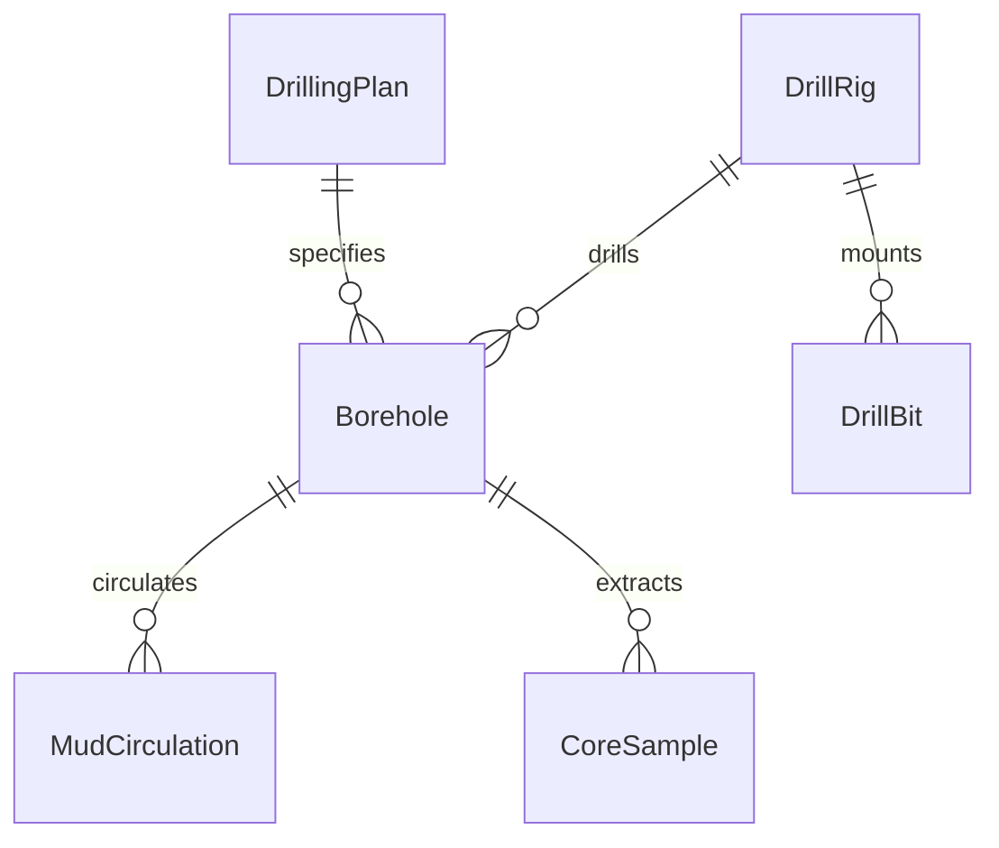
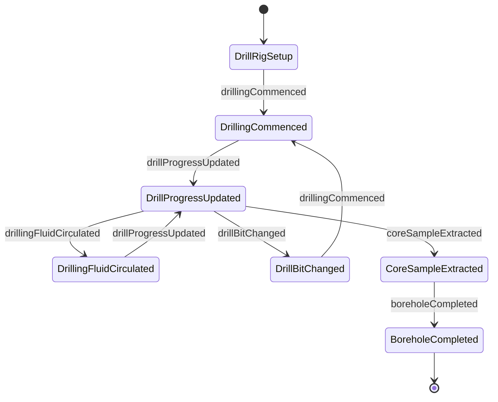
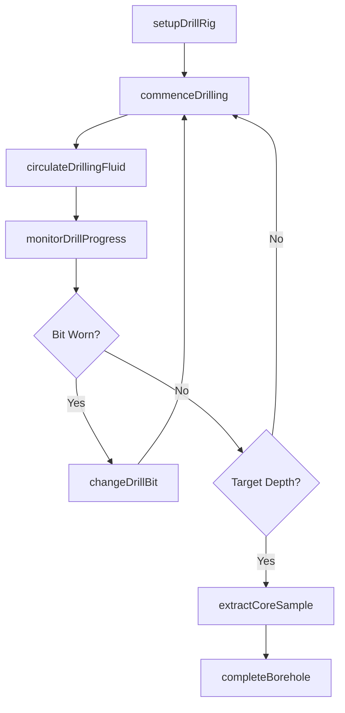
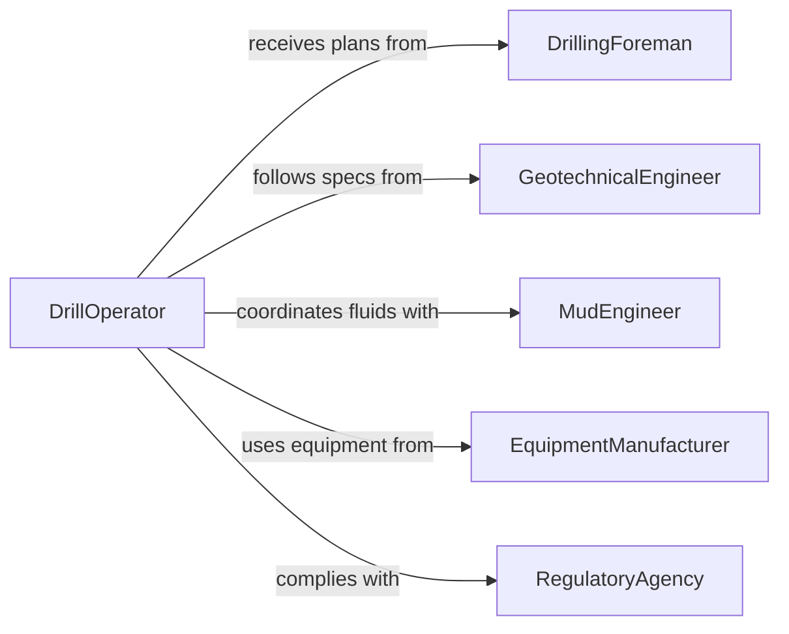

# Operate Drilling Equipment

> Business-as-Code definition for operating drilling equipment. Models the use of rotary drills, percussion drills, directional drilling rigs, and augers to bore holes for foundations, wells, utilities, and blasting in construction, mining, and oil and gas operations.

## Overview

Operating drilling equipment involves controlling rotary drills, percussion rigs, directional boring machines, and earth augers to create holes in soil, rock, and other substrates. Applications include well drilling, foundation pilings, utility conduit installation, blast hole preparation, and geotechnical sampling. Operators manage drill speed, torque, pressure, and fluid circulation while monitoring depth and formation conditions. This definition exposes actions for drilling operations, events for progress and safety monitoring, and searches for drilling records and equipment status.

## Actors

| Actor | Description |
|-------|-------------|
| DrillingContractor | Commissions and manages drilling operations for projects |
| EquipmentManufacturer | Supplies drilling rigs, bits, and downhole tools |
| GeotechnicalEngineer | Specifies borehole locations, depths, and sampling requirements |
| FluidSupplier | Provides drilling fluids, muds, and circulation materials |
| RegulatoryAgency | Issues drilling permits and enforces environmental standards |

## Roles

| Role | Description |
|------|-------------|
| DrillOperator | Controls the drilling rig and manages the drilling process |
| DrillingForeman | Supervises drilling crews and coordinates operational sequences |
| Derrickhand | Handles drill pipe and assists with tool changes on the rig |
| MudEngineer | Monitors and adjusts drilling fluid properties |
| SafetyAdvisor | Enforces safety protocols and conducts site hazard assessments |

## Entities

| Entity | Description |
|--------|-------------|
| DrillingPlan | A documented specification of hole location, depth, diameter, and method |
| DrillRig | A registered drilling machine with configuration and service history |
| Borehole | A drilled hole with recorded depth, diameter, and formation data |
| DrillBit | A cutting tool attached to the drill string for boring through material |
| MudCirculation | A record of drilling fluid flow rates, pressures, and properties |
| CoreSample | A geological sample extracted during the drilling process |

## Actions

| Action | Description |
|--------|-------------|
| setupDrillRig | Position, level, and configure the drilling rig at the borehole location |
| commenceDrilling | Begin boring into the ground at the specified parameters |
| monitorDrillProgress | Track depth, rate of penetration, and formation conditions |
| circulateDrillingFluid | Maintain fluid flow to cool the bit and remove cuttings |
| changeDrillBit | Replace a worn or damaged bit with the appropriate type |
| extractCoreSample | Retrieve a geological core sample from the borehole |
| completeBorehole | Finish the hole, install casing if required, and secure the site |

## Events

| Event | Description |
|-------|-------------|
| drillRigSetup | The rig has been positioned and configured at the borehole location |
| drillingCommenced | Boring operations have begun at the specified location |
| drillProgressUpdated | Depth and penetration rate readings have been recorded |
| drillingFluidCirculated | Fluid flow and pressure have been adjusted or recorded |
| drillBitChanged | A worn or damaged bit has been replaced |
| coreSampleExtracted | A geological core sample has been retrieved from the borehole |
| boreholeCompleted | The borehole has been drilled to target depth and secured |

## Searches

| Search | Description |
|--------|-------------|
| findDrillingPlans | List drilling plans by project, location, or status |
| getBoreholeData | Retrieve depth, diameter, and formation data by borehole |
| getDrillRigStatus | Check operational status and location of drilling rigs |
| findCoreSamples | List core samples by borehole, depth, or formation type |


## Entity Relationships



## State Diagram



## Workflow



## Actor Relationships



## Usage

### Calling Actions

```typescript
import { operateDrillingEquipment } from '@headlessly/operate-drilling-equipment'

const drilling = operateDrillingEquipment()

// Setup the drill rig at the borehole location
await drilling.setupDrillRig({
  rigId: 'RIG-SANDVIK-DR461',
  boreholeId: 'BH-2026-0033',
  coordinates: { lat: 39.7392, lng: -104.9903 },
  targetDepthM: 15.0,
  diameterMm: 152
})

// Commence drilling
await drilling.commenceDrilling({
  rigId: 'RIG-SANDVIK-DR461',
  boreholeId: 'BH-2026-0033',
  rotationRpm: 120,
  thrustKn: 45
})

// Monitor progress
const progress = await drilling.monitorDrillProgress({
  boreholeId: 'BH-2026-0033',
  currentDepthM: 8.5,
  penetrationRateMPerHr: 3.2
})
```

### Event-Driven Automation

```typescript
// Alert when target depth is reached
drilling.boreholeCompleted(async ({ boreholeId, finalDepthM, rigId }) => {
  await notify({
    to: 'drilling-foreman',
    message: `Borehole ${boreholeId} completed at ${finalDepthM}m by rig ${rigId}`
  })
})

// Track bit wear for maintenance scheduling
drilling.drillBitChanged(async ({ rigId, bitId, depthDrilledM, reason }) => {
  await notify({
    to: 'equipment-manager',
    message: `Bit ${bitId} on rig ${rigId} replaced after ${depthDrilledM}m - reason: ${reason}`
  })
})
```
