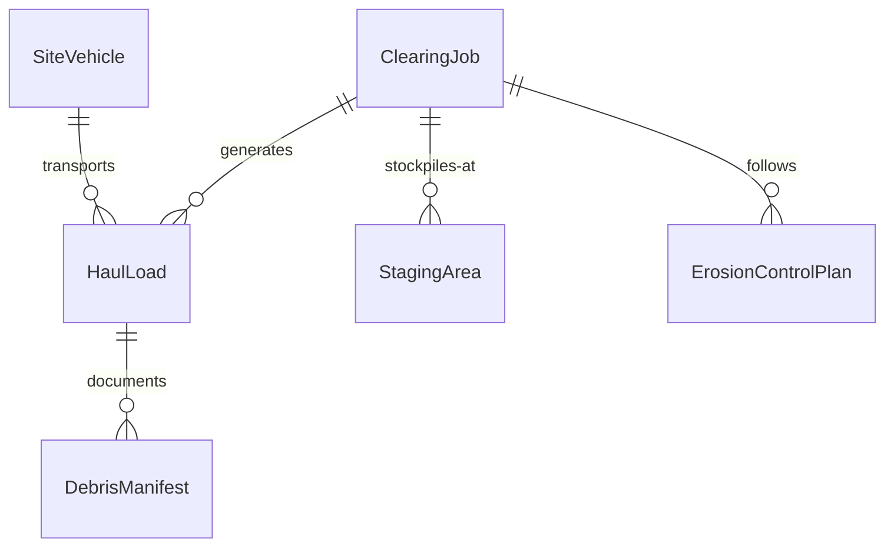
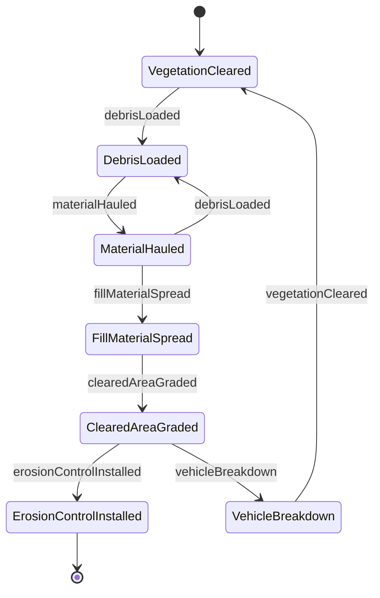
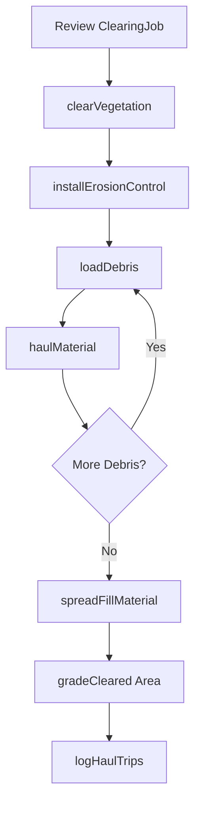
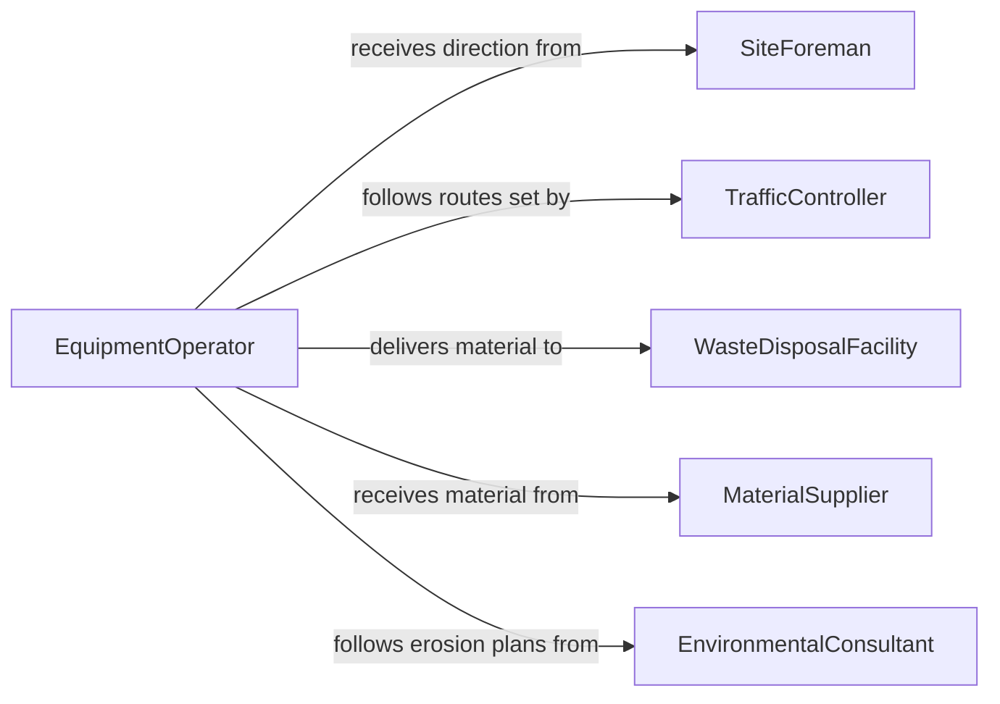

# Operate Equipment Vehicles Clear Construction

> Business-as-Code definition for operating equipment or vehicles to clear construction sites or move materials. Models the use of skid steers, wheel loaders, dump trucks, and site-clearing machinery to remove debris, transport materials, and prepare construction areas.

## Overview

Operating equipment or vehicles to clear construction sites or move materials involves controlling skid steers, wheel loaders, dump trucks, compact track loaders, and brush-clearing machines to remove vegetation, debris, and spoil from construction areas and to transport fill, aggregate, and building materials between staging areas and work zones. Operators coordinate with site supervisors and traffic controllers to maintain safe, efficient material flow. This definition exposes actions for site-clearing and material-handling operations, events for progress tracking, and searches for job and equipment records.

## Actors

| Actor | Description |
|-------|-------------|
| GeneralContractor | Commissions site-clearing and material-handling work |
| EquipmentRentalCompany | Supplies loaders, dump trucks, and clearing machinery |
| WasteDisposalFacility | Receives debris and spoil material for disposal or recycling |
| MaterialSupplier | Delivers aggregate, fill, and construction materials to the site |
| EnvironmentalConsultant | Advises on erosion control and protected-area restrictions |

## Roles

| Role | Description |
|------|-------------|
| EquipmentOperator | Controls loaders, dump trucks, and clearing equipment |
| SiteForeman | Directs clearing sequences and material staging plans |
| TrafficController | Manages vehicle routing and pedestrian safety on site |
| EquipmentMechanic | Maintains and repairs site-clearing and hauling equipment |

## Entities

| Entity | Description |
|--------|-------------|
| ClearingJob | A work order specifying the area, materials, and scope of site clearing |
| HaulLoad | A single trip of material transported by dump truck or loader |
| StagingArea | A designated zone for stockpiling materials before placement |
| DebrisManifest | A record of debris type, volume, and disposal destination |
| SiteVehicle | A registered loader, dump truck, or clearing machine with specifications |
| ErosionControlPlan | A documented plan for managing stormwater and soil erosion during clearing |

## Actions

| Action | Description |
|--------|-------------|
| clearVegetation | Remove trees, brush, and ground cover from the construction area |
| loadDebris | Scoop and transfer debris into dump trucks or roll-off containers |
| haulMaterial | Transport material between the work zone, staging area, or disposal site |
| spreadFillMaterial | Distribute aggregate, soil, or gravel across the prepared area |
| gradeCleared Area | Level the cleared surface to rough grade specifications |
| installErosionControl | Place silt fences, berms, or blankets to prevent soil erosion |
| logHaulTrips | Record load counts, material types, and trip durations |

## Events

| Event | Description |
|-------|-------------|
| vegetationCleared | Trees and brush have been removed from the designated area |
| debrisLoaded | Debris has been loaded into a haul vehicle or container |
| materialHauled | A load of material has been transported to its destination |
| fillMaterialSpread | Aggregate or fill has been distributed across the work area |
| clearedAreaGraded | The cleared surface has been leveled to rough grade |
| erosionControlInstalled | Erosion prevention measures have been put in place |
| vehicleBreakdown | A site vehicle has experienced a mechanical failure |

## Searches

| Search | Description |
|--------|-------------|
| findClearingJobs | List clearing jobs by site, status, or date range |
| getHaulLogs | Retrieve haul trip records by vehicle, material, or destination |
| getSiteVehicleStatus | Check operational status and location of site vehicles |
| getDebrisManifests | Look up debris disposal records by job or disposal facility |


## Entity Relationships



## State Diagram



## Workflow



## Actor Relationships



## Usage

### Calling Actions

```typescript
import { operateEquipmentVehiclesClearConstruction } from '@headlessly/operate-equipment-vehicles-clear-construction'

const siteClear = operateEquipmentVehiclesClearConstruction()

// Clear vegetation from the building footprint
await siteClear.clearVegetation({
  jobId: 'CLR-2026-0041',
  areaM2: 2500,
  vegetationType: 'brush-and-small-trees',
  unitId: 'CTL-CAT-289D'
})

// Load and haul debris to disposal
await siteClear.loadDebris({
  jobId: 'CLR-2026-0041',
  vehicleId: 'DT-MACK-GR64F',
  debrisType: 'vegetation-and-topsoil',
  estimatedVolumeM3: 18
})

await siteClear.haulMaterial({
  vehicleId: 'DT-MACK-GR64F',
  origin: 'site-zone-A',
  destination: 'green-waste-facility',
  loadVolumeM3: 18
})
```

### Event-Driven Automation

```typescript
// Alert on vehicle breakdown
siteClear.vehicleBreakdown(async ({ vehicleId, location, issue }) => {
  await notify({
    to: 'equipment-mechanic',
    message: `Vehicle ${vehicleId} down at ${location}: ${issue} - dispatch repair`
  })
})

// Track clearing progress
siteClear.vegetationCleared(async ({ jobId, areaM2, percentComplete }) => {
  await notify({
    to: 'site-foreman',
    message: `Job ${jobId}: ${areaM2}m2 cleared, ${percentComplete}% complete`
  })
})
```
