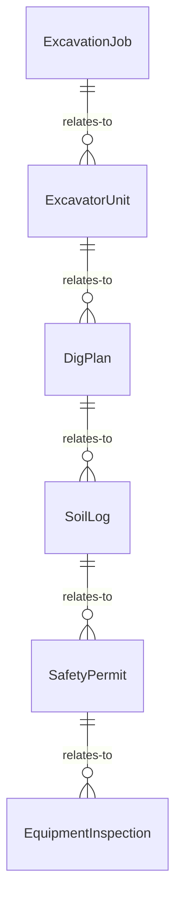
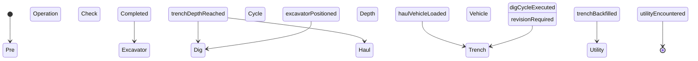
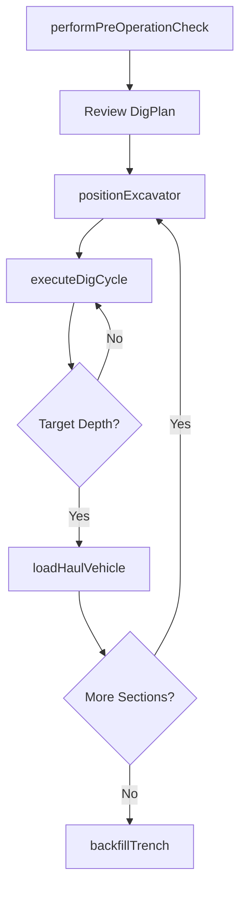
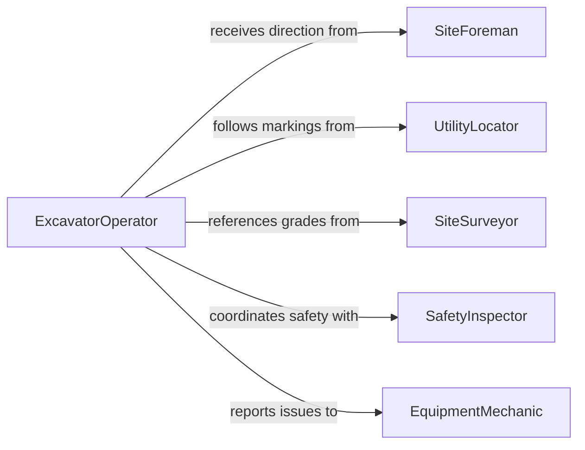

# Operate Excavation Equipment

> Business-as-Code definition for operating excavation equipment. Models the use of backhoes, excavators, trenchers, and similar earthmoving machines to dig, trench, and grade terrain for construction and utility projects.

## Overview

Operating excavation equipment involves controlling hydraulic excavators, backhoe loaders, trenchers, and related earthmoving machinery to dig foundations, trenches, and utility corridors. Operators position equipment, manage bucket depth and angle, and coordinate with ground crews to move soil, rock, and debris safely. This definition exposes actions for each excavation operation, events for progress tracking and safety monitoring, and searches for job and equipment records.

## Actors

| Actor | Description |
|-------|-------------|
| GeneralContractor | Commissions excavation work as part of a construction project |
| EquipmentDealer | Supplies or leases excavators, backhoes, and trenchers |
| UtilityLocator | Marks underground utility lines before excavation begins |
| SiteSurveyor | Provides grade stakes and elevation references for dig depth |
| SafetyInspector | Monitors compliance with excavation safety regulations |

## Roles

| Role | Description |
|------|-------------|
| ExcavatorOperator | Controls the excavation equipment from the cab |
| SiteForeman | Directs excavation sequences and coordinates with ground crews |
| Spotter | Guides the operator and monitors for underground obstructions |
| EquipmentMechanic | Maintains and repairs excavation machinery |

## Entities

| Entity | Description |
|--------|-------------|
| ExcavationJob | A work order specifying location, depth, and scope of excavation |
| ExcavatorUnit | A registered excavator, backhoe, or trencher with specifications |
| DigPlan | A documented plan with coordinates, depths, and utility clearances |
| SoilLog | A record of soil conditions encountered during excavation |
| SafetyPermit | Authorization to excavate in a specific area |
| EquipmentInspection | A pre-operation safety check record for the machine |

## Actions

| Action | Description |
|--------|-------------|
| performPreOperationCheck | Inspect equipment for mechanical fitness before use |
| positionExcavator | Move and stabilize the machine at the designated dig location |
| executeDigCycle | Operate the bucket to dig, swing, and dump material |
| setTrenchDepth | Configure and maintain the target depth for trenching operations |
| loadHaulVehicle | Transfer excavated material into dump trucks or haulers |
| backfillTrench | Replace soil into a completed trench and compact it |
| recordSoilConditions | Document soil type and conditions encountered during digging |

## Events

| Event | Description |
|-------|-------------|
| preOperationCheckCompleted | Equipment has passed the pre-operation safety inspection |
| excavatorPositioned | The machine has been placed and stabilized at the dig site |
| digCycleExecuted | A bucket load of material has been excavated and placed |
| trenchDepthReached | The target trench depth has been achieved at the current section |
| haulVehicleLoaded | A dump truck or hauler has been filled with excavated material |
| trenchBackfilled | A trench section has been backfilled and compacted |
| utilityEncountered | An underground utility or obstruction has been detected |

## Searches

| Search | Description |
|--------|-------------|
| findExcavationJobs | List excavation jobs by site, status, or date range |
| getEquipmentStatus | Retrieve current status and location of excavation units |
| getSoilLogs | Look up soil condition records by job or location |
| findDigPlans | List dig plans by project, area, or approval status |


## Entity Relationships



## State Diagram



## Workflow



## Actor Relationships



## Usage

### Calling Actions

```typescript
import { operateExcavationEquipment } from '@headlessly/operate-excavation-equipment'

const excavation = operateExcavationEquipment()

// Perform pre-operation check
await excavation.performPreOperationCheck({
  unitId: 'EXC-CAT-320F',
  operatorId: 'OP-4421',
  checklistItems: ['hydraulics', 'tracks', 'bucket-teeth', 'cab-controls']
})

// Position and begin digging
await excavation.positionExcavator({
  unitId: 'EXC-CAT-320F',
  coordinates: { lat: 40.7128, lng: -74.006 },
  digPlanId: 'DP-2026-0048'
})

// Execute dig cycles
await excavation.executeDigCycle({
  unitId: 'EXC-CAT-320F',
  targetDepthM: 3.0,
  bucketWidthCm: 90
})
```

### Event-Driven Automation

```typescript
// Alert when underground utility is detected
excavation.utilityEncountered(async ({ unitId, location, utilityType }) => {
  await notify({
    to: 'site-foreman',
    message: `Utility detected at ${location}: ${utilityType} - halt digging on ${unitId}`
  })
})

// Log completion when trench reaches target depth
excavation.trenchDepthReached(async ({ jobId, sectionId, depthM }) => {
  await notify({
    to: 'project-manager',
    message: `Section ${sectionId} on job ${jobId} reached ${depthM}m depth`
  })
})
```
