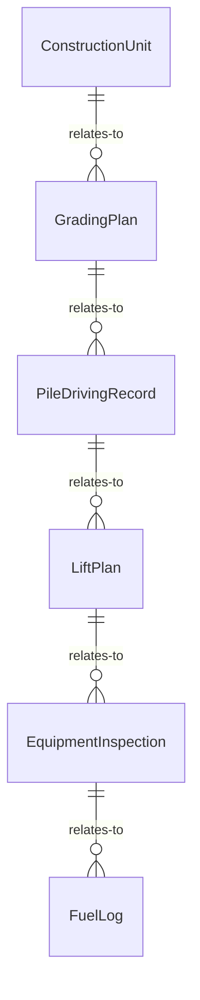
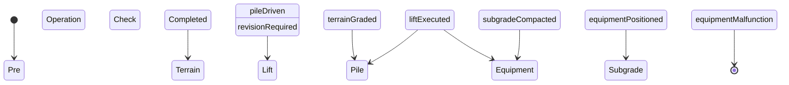
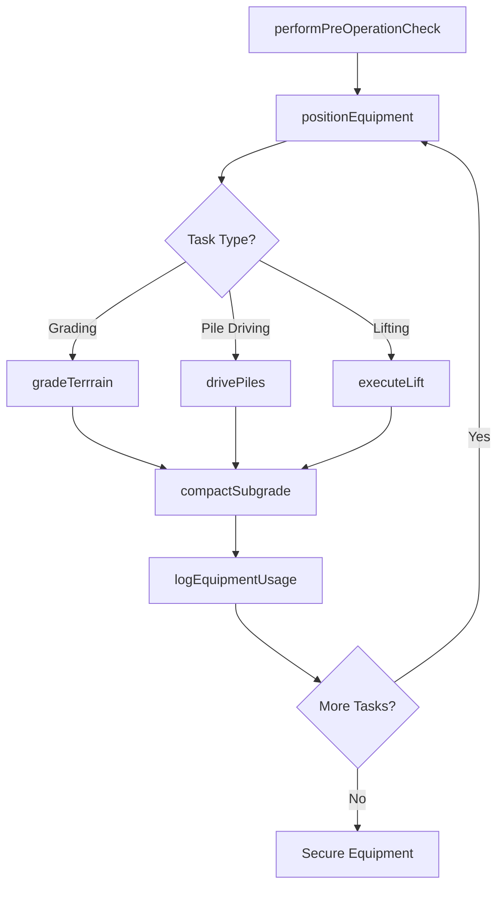
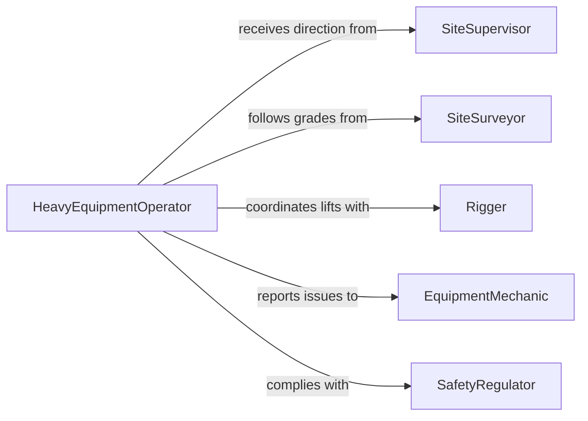

# Operate Heavy-duty Construction Installation Equipment

> Business-as-Code definition for operating heavy-duty construction or installation equipment. Models the use of bulldozers, graders, pile drivers, cranes, and similar large-scale machinery to shape terrain, drive foundations, and install structural components on construction sites.

## Overview

Operating heavy-duty construction or installation equipment involves controlling bulldozers, motor graders, pile drivers, large cranes, and other heavyweight machinery to move earth, grade surfaces, drive pilings, and position structural elements. Operators manage blade angles, boom positions, load capacities, and travel paths while coordinating with survey crews, riggers, and site supervisors. This definition exposes actions for each equipment operation, events for progress and safety monitoring, and searches for project and equipment records.

## Actors

| Actor | Description |
|-------|-------------|
| GeneralContractor | Manages the construction project and schedules heavy equipment work |
| EquipmentLeasing | Provides bulldozers, graders, pile drivers, and cranes on lease |
| SiteSurveyor | Establishes grades, elevations, and layout references for earthwork |
| StructuralEngineer | Specifies foundation depths, load requirements, and pile spacing |
| SafetyRegulator | Enforces OSHA and local safety standards for heavy equipment operations |
| MaterialSupplier | Delivers pilings, beams, and structural components to the site |

## Roles

| Role | Description |
|------|-------------|
| HeavyEquipmentOperator | Controls bulldozers, graders, pile drivers, and cranes from the cab |
| SiteSupervisor | Directs equipment placement, sequences, and daily work plans |
| Rigger | Attaches loads, signals crane operators, and manages lift plans |
| EquipmentMechanic | Performs maintenance, fueling, and repairs on heavy machinery |

## Entities

| Entity | Description |
|--------|-------------|
| ConstructionUnit | A registered bulldozer, grader, pile driver, or crane with specifications |
| GradingPlan | A documented plan specifying cut and fill elevations and slopes |
| PileDrivingRecord | A log of piles driven including depth, resistance, and location |
| LiftPlan | A documented plan for crane lifts specifying load weight, radius, and rigging |
| EquipmentInspection | A pre-operation or periodic safety check record for the machine |
| FuelLog | A record of fuel consumption by equipment unit and shift |

## Actions

| Action | Description |
|--------|-------------|
| performPreOperationCheck | Inspect the machine for mechanical and safety fitness before use |
| gradeTerrrain | Shape the ground surface to specified elevations using a bulldozer or grader |
| drivePiles | Operate a pile driver to install foundation pilings to the required depth |
| executeLift | Use a crane to raise and position structural components per the lift plan |
| positionEquipment | Move heavy machinery to the designated work area and stabilize it |
| compactSubgrade | Run compaction equipment over prepared ground to achieve target density |
| logEquipmentUsage | Record operating hours, fuel consumption, and tasks performed |

## Events

| Event | Description |
|-------|-------------|
| preOperationCheckCompleted | The machine has passed its pre-operation safety inspection |
| terrainGraded | A section of ground has been shaped to the specified elevation |
| pileDriven | A foundation piling has been driven to the required depth and resistance |
| liftExecuted | A structural component has been raised and positioned by the crane |
| equipmentPositioned | Heavy machinery has been moved and stabilized at the work area |
| subgradeCompacted | Prepared ground has been compacted to the target density |
| equipmentMalfunction | A mechanical failure or safety issue has been detected on a machine |

## Searches

| Search | Description |
|--------|-------------|
| findConstructionUnits | List heavy equipment by type, site, or operational status |
| getPileDrivingRecords | Retrieve pile driving logs by project, location, or depth |
| getLiftPlans | Look up crane lift plans by project, load, or approval status |
| getEquipmentInspections | List inspection records by unit, date, or result |


## Entity Relationships



## State Diagram



## Workflow



## Actor Relationships



## Usage

### Calling Actions

```typescript
import { operateHeavyDutyConstructionInstallationEquipment } from '@headlessly/operate-heavy-duty-construction-installation-equipment'

const heavyEquip = operateHeavyDutyConstructionInstallationEquipment()

// Grade terrain for a building pad
await heavyEquip.gradeTerrrain({
  unitId: 'CAT-D8T-0045',
  gradingPlanId: 'GP-SITE-12-PAD-A',
  targetElevationM: 102.5,
  toleranceCm: 3
})

// Drive a foundation pile
await heavyEquip.drivePiles({
  unitId: 'PD-ICE-42S',
  pileId: 'PILE-A1-001',
  targetDepthM: 18.0,
  pileType: 'steel-H',
  projectId: 'PROJ-BRIDGE-2026'
})

// Execute a crane lift
await heavyEquip.executeLift({
  unitId: 'CRN-LIEB-LTM1300',
  liftPlanId: 'LP-STEEL-BEAM-07',
  loadWeightKg: 12000,
  radiusM: 24,
  heightM: 30
})
```

### Event-Driven Automation

```typescript
// Alert on equipment malfunction
heavyEquip.equipmentMalfunction(async ({ unitId, malfunctionType, severity }) => {
  await notify({
    to: 'site-supervisor',
    message: `Malfunction on ${unitId}: ${malfunctionType} (severity: ${severity}) - halt operations`
  })
})

// Track pile driving progress
heavyEquip.pileDriven(async ({ projectId, pileId, depthM, blowCount }) => {
  await notify({
    to: 'structural-engineer',
    message: `Pile ${pileId} on ${projectId} driven to ${depthM}m with ${blowCount} blows`
  })
})
```
