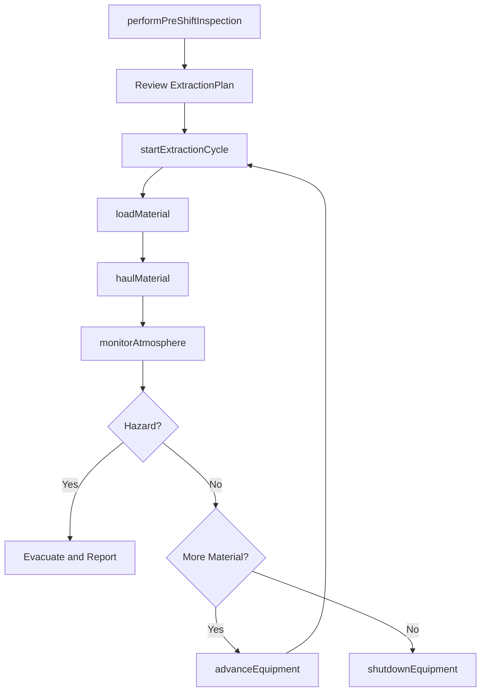
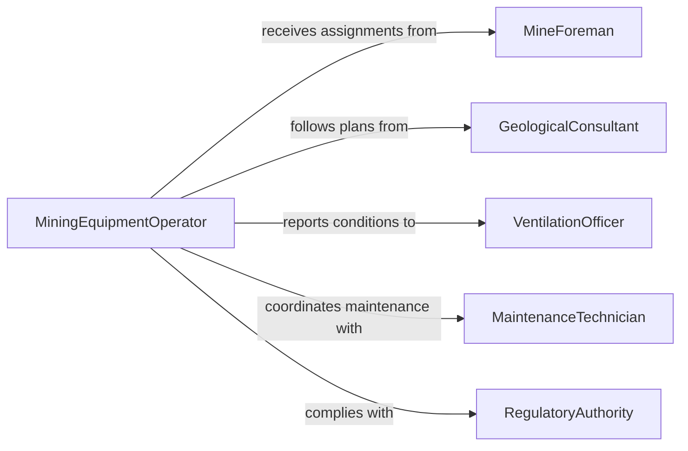

# Operate Mining Equipment

> Business-as-Code definition for operating mining equipment. Models the use of continuous miners, longwall shearers, haul trucks, loaders, and conveyors to extract minerals, ore, and coal from surface and underground mines.

## Overview

Operating mining equipment involves controlling heavy machinery used for extracting, loading, hauling, and processing minerals and ore in surface and underground mining operations. This includes continuous miners, longwall shearers, haul trucks, front-end loaders, and conveyor systems. Operators must manage equipment within strict safety protocols, monitor environmental conditions, and coordinate with mining engineers and ground support crews. This definition exposes actions for equipment operation and monitoring, events for production tracking and safety alerts, and searches for operational records.

## Actors

| Actor | Description |
|-------|-------------|
| MiningCompany | Owns the mine and commissions extraction operations |
| EquipmentManufacturer | Designs and supplies mining machinery and replacement parts |
| RegulatoryAuthority | Enforces mine safety, ventilation, and environmental standards |
| GeologicalConsultant | Provides geological surveys and ore body assessments |
| HaulContractor | Operates contract haul trucks for material transport |

## Roles

| Role | Description |
|------|-------------|
| MiningEquipmentOperator | Controls extraction and haulage machinery underground or at the surface |
| MineForeman | Supervises daily extraction activities and crew assignments |
| VentilationOfficer | Monitors air quality and gas levels in underground workings |
| MaintenanceTechnician | Services and repairs mining machinery on schedule |
| SafetyOfficer | Enforces safety protocols and conducts hazard assessments |

## Entities

| Entity | Description |
|--------|-------------|
| MiningUnit | A registered piece of mining equipment with specifications and service history |
| ExtractionPlan | A documented plan defining the ore body, cut sequence, and production targets |
| ProductionShift | A scheduled work period with assigned equipment and crew |
| HaulCycle | A single load-haul-dump cycle for moving extracted material |
| EquipmentInspection | A pre-shift or periodic safety and mechanical check record |
| GasReading | A record of atmospheric conditions measured in the mine |

## Actions

| Action | Description |
|--------|-------------|
| performPreShiftInspection | Complete a safety and mechanical check before operating equipment |
| startExtractionCycle | Begin cutting, boring, or loading ore at the active face |
| loadMaterial | Fill haul trucks or conveyors with extracted material |
| haulMaterial | Transport loaded material from the face to the processing area |
| monitorAtmosphere | Check gas levels, ventilation flow, and dust concentrations |
| advanceEquipment | Reposition equipment to the next cut or extraction point |
| shutdownEquipment | Safely power down and secure equipment at shift end |

## Events

| Event | Description |
|-------|-------------|
| preShiftInspectionCompleted | Equipment has passed the pre-shift safety check |
| extractionCycleStarted | Cutting or boring operations have begun at the active face |
| materialLoaded | A haul vehicle or conveyor has been loaded with extracted material |
| materialHauled | Extracted material has been delivered to the processing area |
| atmosphereMonitored | Gas and ventilation readings have been recorded |
| equipmentAdvanced | Equipment has been repositioned to the next extraction point |
| hazardDetected | Dangerous gas levels, ground instability, or other hazards have been identified |

## Searches

| Search | Description |
|--------|-------------|
| findMiningUnits | List mining equipment by type, location, or operational status |
| getProductionData | Retrieve tonnage and cycle counts by shift, equipment, or date |
| getGasReadings | Look up atmospheric monitoring records by location or time |
| findExtractionPlans | List extraction plans by ore body, status, or production target |

## Workflow



## Actor Relationships



## Usage

### Calling Actions

```typescript
import { operateMiningEquipment } from '@headlessly/operate-mining-equipment'

const mining = operateMiningEquipment()

// Perform pre-shift inspection
await mining.performPreShiftInspection({
  unitId: 'CM-JOY-12HM36',
  operatorId: 'OP-8812',
  shiftId: 'SHIFT-2026-0205-A',
  checklistItems: ['cutter-head', 'conveyor-chain', 'hydraulics', 'fire-suppression']
})

// Start extraction cycle
await mining.startExtractionCycle({
  unitId: 'CM-JOY-12HM36',
  extractionPlanId: 'EP-PANEL-7B',
  cutDepthM: 0.6,
  cutWidthM: 3.5
})

// Monitor atmospheric conditions
await mining.monitorAtmosphere({
  locationId: 'FACE-7B-ENTRY-3',
  readings: { methanePercent: 0.3, oxygenPercent: 20.1, dustMgPerM3: 1.2 }
})
```

### Event-Driven Automation

```typescript
// Emergency alert on hazardous gas detection
mining.hazardDetected(async ({ locationId, hazardType, reading }) => {
  await notify({
    to: 'mine-foreman',
    message: `HAZARD at ${locationId}: ${hazardType} reading ${reading} - initiate evacuation`
  })
})

// Track production per shift
mining.materialHauled(async ({ shiftId, unitId, tonnage }) => {
  await notify({
    to: 'production-manager',
    message: `${tonnage}t hauled by ${unitId} during shift ${shiftId}`
  })
})
```
