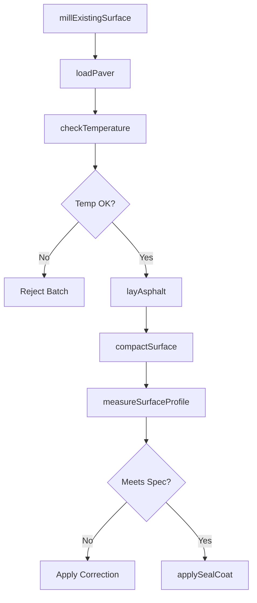
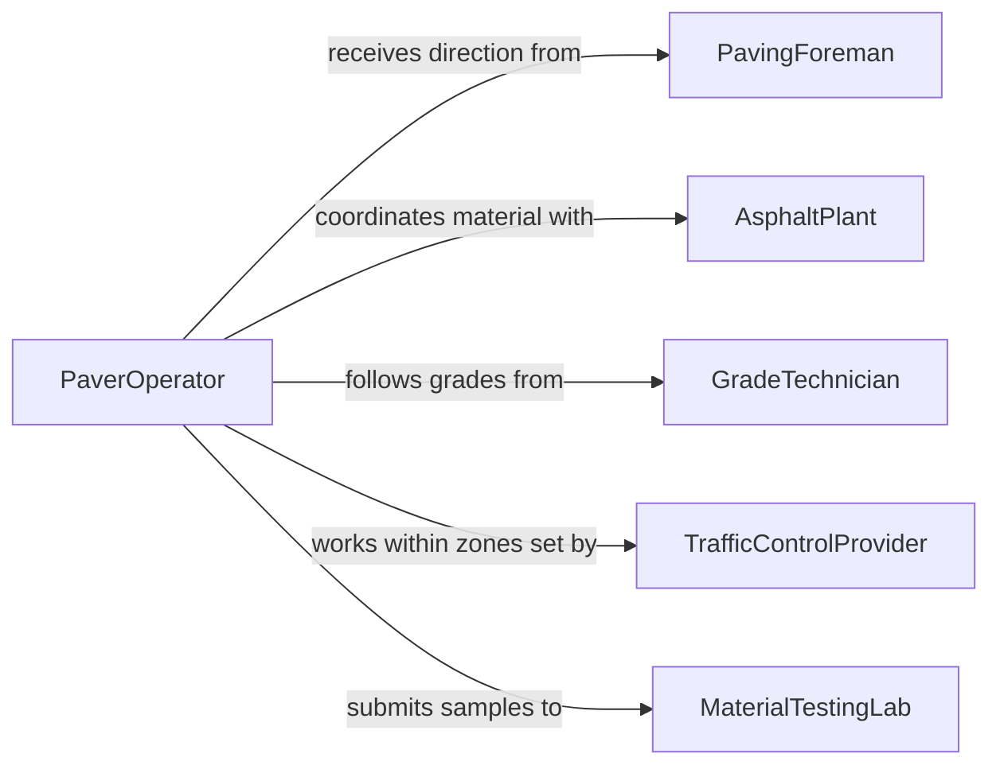

# Operate Road-surfacing Equipment

> Business-as-Code definition for operating road-surfacing equipment. Models the use of asphalt pavers, rollers, milling machines, and chip spreaders to construct, resurface, and maintain roadways and parking surfaces.

## Overview

Operating road-surfacing equipment involves controlling asphalt pavers, compaction rollers, milling machines, chip spreaders, and related machinery to lay, compact, and finish road surfaces. Operators manage material flow rates, screed settings, roller patterns, and surface temperatures to achieve specified thickness, density, and smoothness. This definition exposes actions for each stage of the paving process, events for quality and progress tracking, and searches for project and equipment records.

## Actors

| Actor | Description |
|-------|-------------|
| AsphaltPlant | Produces and delivers hot-mix asphalt to the job site |
| TransportDepartment | Commissions road construction and maintenance projects |
| MaterialTestingLab | Tests asphalt density, temperature, and mix compliance |
| TrafficControlProvider | Sets up lane closures, signage, and flagging for work zones |
| EquipmentDealer | Supplies pavers, rollers, and milling machines |

## Roles

| Role | Description |
|------|-------------|
| PaverOperator | Controls the asphalt paver and screed settings during placement |
| RollerOperator | Compacts freshly laid asphalt using vibratory and static rollers |
| PavingForeman | Coordinates the paving crew, material deliveries, and work sequence |
| GradeTechnician | Monitors surface elevation, thickness, and slope during paving |

## Entities

| Entity | Description |
|--------|-------------|
| PavingProject | A work order defining the road segment, mix design, and specifications |
| AsphaltBatch | A load of hot-mix asphalt delivered from the plant |
| PavingPass | A single lane-width run of the paver along the road segment |
| CompactionRecord | Density and temperature measurements taken during rolling |
| MillingPlan | A specification for removing existing pavement to a target depth |
| SurfaceProfile | Elevation and smoothness measurements of the finished surface |

## Actions

| Action | Description |
|--------|-------------|
| millExistingSurface | Remove deteriorated pavement to a specified depth using a milling machine |
| loadPaver | Transfer hot-mix asphalt from delivery trucks into the paver hopper |
| layAsphalt | Spread and screed asphalt to the specified thickness and width |
| compactSurface | Roll the freshly laid asphalt to achieve target density |
| checkTemperature | Measure asphalt temperature to ensure it is within the compaction window |
| applySealCoat | Spread a protective seal coat or tack coat over the finished surface |
| measureSurfaceProfile | Survey the finished surface for elevation, slope, and smoothness |

## Events

| Event | Description |
|-------|-------------|
| existingSurfaceMilled | Deteriorated pavement has been removed to the target depth |
| paverLoaded | Hot-mix asphalt has been transferred into the paver hopper |
| asphaltLaid | A paving pass has been completed at the specified thickness |
| surfaceCompacted | The roller has achieved target density on the compacted section |
| temperatureChecked | Asphalt temperature reading has been recorded |
| sealCoatApplied | A seal or tack coat has been applied to the surface |
| surfaceProfileMeasured | The finished surface has been surveyed for compliance |

## Searches

| Search | Description |
|--------|-------------|
| findPavingProjects | List paving projects by road segment, status, or date range |
| getCompactionRecords | Retrieve density and temperature data by section or date |
| getAsphaltBatches | Look up asphalt delivery records by plant, mix design, or project |
| findSurfaceProfiles | List surface profile surveys by segment or compliance status |

## Workflow



## Actor Relationships



## Usage

### Calling Actions

```typescript
import { operateRoadSurfacingEquipment } from '@headlessly/operate-road-surfacing-equipment'

const paving = operateRoadSurfacingEquipment()

// Mill existing deteriorated surface
await paving.millExistingSurface({
  projectId: 'PAV-HWY101-SEC-4',
  millingDepthMm: 50,
  stationStart: '12+00',
  stationEnd: '18+00'
})

// Lay asphalt on the milled section
await paving.layAsphalt({
  projectId: 'PAV-HWY101-SEC-4',
  batchId: 'BATCH-2026-0205-07',
  thicknessMm: 60,
  widthM: 3.7,
  screedTemperatureC: 145
})

// Compact the freshly laid surface
await paving.compactSurface({
  projectId: 'PAV-HWY101-SEC-4',
  rollerType: 'vibratory',
  passCount: 6,
  targetDensityPercent: 94
})
```

### Event-Driven Automation

```typescript
// Alert when asphalt temperature drops below compaction window
paving.temperatureChecked(async ({ projectId, temperatureC, minimumC }) => {
  if (temperatureC < minimumC) {
    await notify({
      to: 'paving-foreman',
      message: `Asphalt on ${projectId} at ${temperatureC}C, below minimum ${minimumC}C - stop rolling`
    })
  }
})

// Notify project manager when section is complete
paving.surfaceProfileMeasured(async ({ projectId, sectionId, meetsSpec }) => {
  if (meetsSpec) {
    await notify({
      to: 'project-manager',
      message: `Section ${sectionId} on ${projectId} meets profile specifications`
    })
  }
})
```
