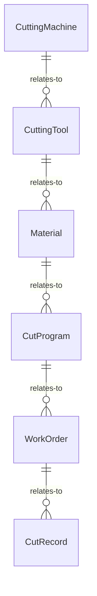
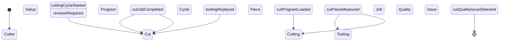
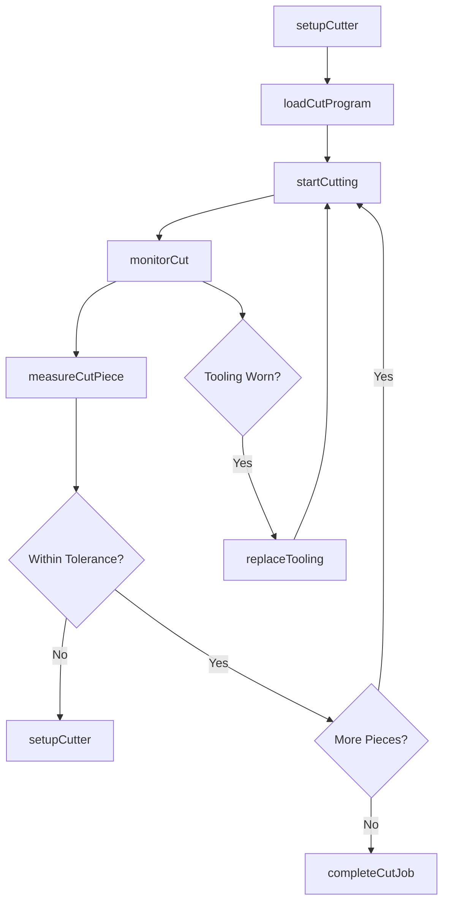
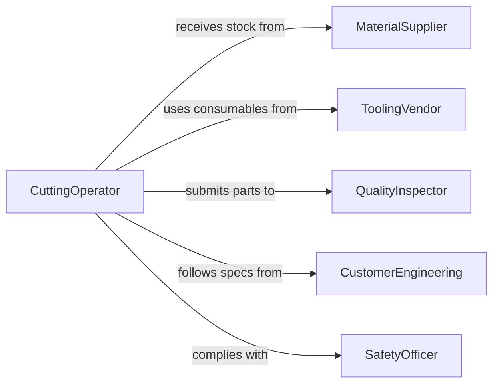

# Operate Cutting Equipment

> Business-as-Code definition for cutting equipment operation. Models the setup, execution, and quality control of industrial cutting processes including saws, shears, laser cutters, and plasma cutting systems.

## Overview

Operating cutting equipment involves configuring, running, and monitoring machines that sever, shape, or trim materials to specified dimensions. This encompasses band saws, circular saws, shears, laser cutters, plasma cutters, and waterjet systems used in metal fabrication, construction, and manufacturing environments.

## Actors

| Actor | Description |
|-------|-------------|
| MaterialSupplier | Provides raw stock, sheet metal, and bar stock for cutting |
| EquipmentManufacturer | Supplies cutting machines and replacement components |
| ToolingVendor | Provides saw blades, cutting tips, nozzles, and consumables |
| QualityInspector | Verifies cut dimensions and edge quality against specifications |
| SafetyOfficer | Ensures compliance with safety protocols for cutting operations |
| CustomerEngineering | Specifies cut dimensions, tolerances, and material requirements |

## Roles

| Role | Description |
|------|-------------|
| CuttingOperator | Sets up and runs cutting equipment to produce specified parts |
| SetupTechnician | Configures machine settings, installs tooling, and calibrates equipment |
| ProductionSupervisor | Assigns cutting jobs and monitors throughput |
| MaterialHandler | Loads raw material and removes finished cut pieces |

## Entities

| Entity | Description |
|--------|-------------|
| CuttingMachine | Equipment used to sever or shape material |
| CuttingTool | Blade, nozzle, or tip that performs the actual cut |
| Material | Raw stock being cut to specified dimensions |
| CutProgram | Programmed cutting path and parameters for CNC or automated systems |
| WorkOrder | Production instructions specifying cut requirements |
| CutRecord | Documentation of completed cuts with measurements |

## Actions

| Action | Description |
|--------|-------------|
| setupCutter | Configure machine parameters, install tooling, and load material |
| loadCutProgram | Upload or select the cutting path and parameters |
| startCutting | Initiate the cutting cycle on loaded material |
| monitorCut | Observe cutting operation for quality, speed, and safety |
| measureCutPiece | Verify cut dimensions and edge quality against specifications |
| replaceTooling | Swap worn blades, nozzles, or tips for fresh consumables |
| completeCutJob | Finalize cutting operation and log production results |

## Events

| Event | Description |
|-------|-------------|
| cutterSetupCompleted | Machine has been configured and material loaded |
| cutProgramLoaded | Cutting path and parameters have been applied |
| cuttingCycleStarted | Cutting operation has begun on material |
| cutPieceMeasured | Finished piece dimensions have been verified |
| toolingReplaced | Worn cutting consumables have been swapped out |
| cutJobCompleted | All pieces in the work order have been cut and recorded |
| cutQualityIssueDetected | Cut dimensions or edge quality fall outside tolerance |

## Searches

| Search | Description |
|--------|-------------|
| findCutJobs | Retrieve cutting work orders by status, material type, or machine |
| getMachineStatus | Query current state and utilization of cutting equipment |
| getToolingInventory | Check available blades, nozzles, and consumable stock levels |
| getCutRecords | Look up historical cut results by part number or date range |


## Entity Relationships



## State Diagram



## Workflow



## Actor Relationships



## Usage

### Calling Actions

```typescript
import { operateCuttingEquipment } from '@headlessly/operate-cutting-equipment'

const cutter = operateCuttingEquipment()

// Set up the band saw for a cutting job
const setup = await cutter.setupCutter({
  machineId: 'BS-220',
  tooling: { type: 'bi-metal-blade', teeth: 10, width: 1.5 },
  material: { type: 'mild-steel', dimensions: { length: 6000, width: 100, thickness: 50 } },
  parameters: { bladeSpeed: 250, feedRate: 2.5 }
})

// Start cutting the first piece
await cutter.startCutting({
  setupId: setup.id,
  workOrderId: 'WO-8834',
  cutLength: 500
})

// Measure the finished piece
const result = await cutter.measureCutPiece({
  pieceId: 'MS-500-001',
  checks: ['length', 'squareness', 'burr']
})
```

### Event-Driven Automation

```typescript
// Notify quality team on cut issues
cutter.cutQualityIssueDetected(async ({ pieceId, deviation, tolerance }) => {
  await notify({
    to: 'quality-team',
    message: `Cut piece ${pieceId} deviation: ${deviation}mm exceeds ${tolerance}mm tolerance`
  })
})

// Auto-reorder consumables when tooling is replaced frequently
cutter.toolingReplaced(async ({ machineId, toolType, replacementCount }) => {
  if (replacementCount >= 10) {
    await createPurchaseOrder({
      item: toolType,
      quantity: 20,
      reason: `High consumption on machine ${machineId}`
    })
  }
})
```
