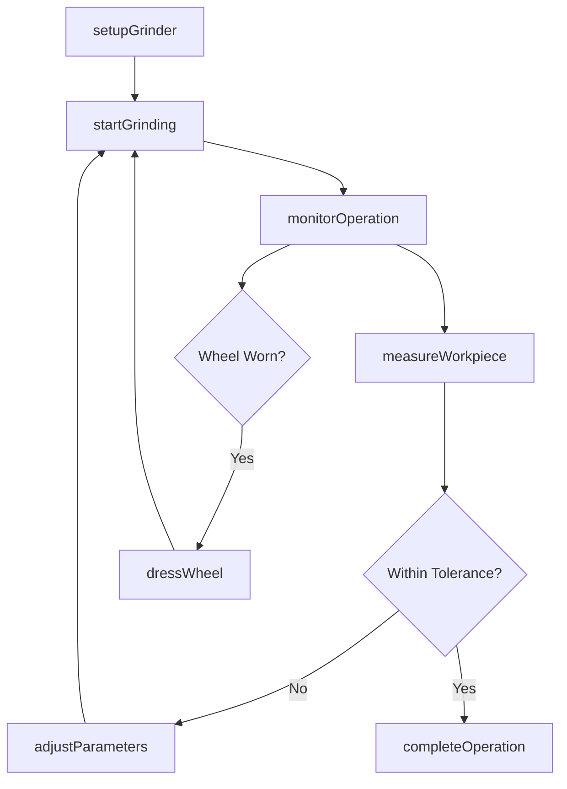
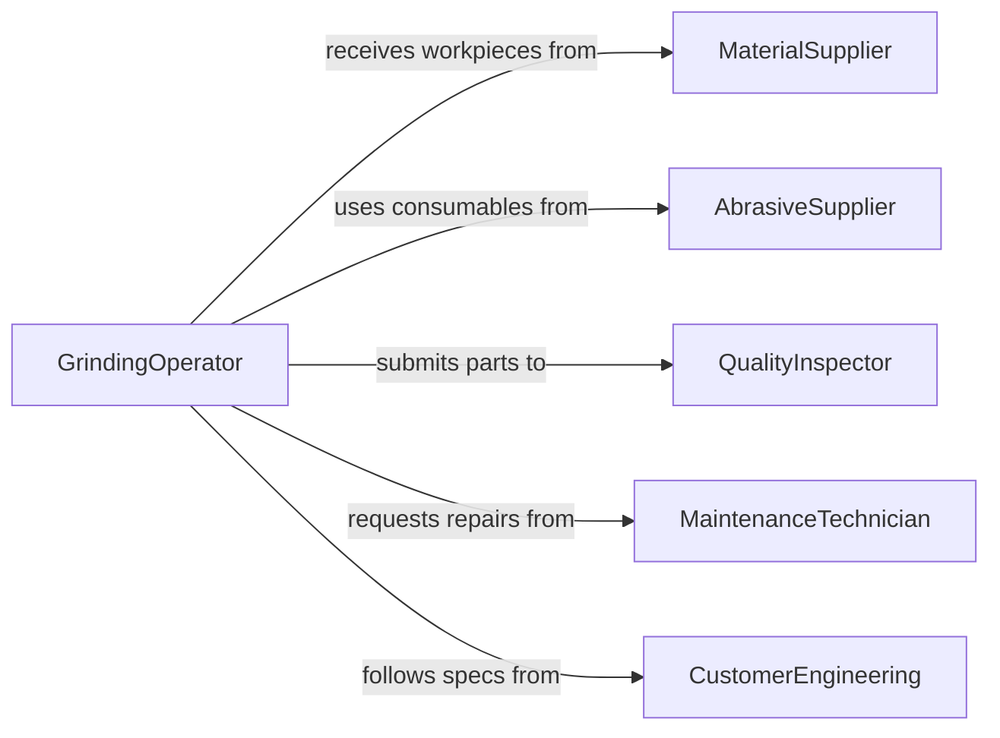

# Operate Grinding Equipment

> Business-as-Code definition for grinding equipment operation. Models the complete lifecycle of setting up, running, and maintaining grinding machines for precision material removal and surface finishing.

## Overview

Operating grinding equipment involves configuring, running, and monitoring machines that use abrasive wheels or belts to remove material, shape workpieces, or achieve precise surface finishes. This definition covers surface grinders, cylindrical grinders, centerless grinders, and tool-and-cutter grinders used across manufacturing, metalworking, and fabrication environments.

## Actors

| Actor | Description |
|-------|-------------|
| MaterialSupplier | Provides raw stock and workpiece blanks for grinding operations |
| EquipmentManufacturer | Supplies grinding machines, replacement parts, and technical support |
| AbrasiveSupplier | Provides grinding wheels, belts, and abrasive consumables |
| QualityInspector | Verifies dimensional accuracy and surface finish of ground parts |
| MaintenanceTechnician | Services and repairs grinding equipment |
| CustomerEngineering | Specifies tolerances and finish requirements for workpieces |

## Roles

| Role | Description |
|------|-------------|
| GrindingOperator | Sets up and runs grinding machines to produce finished parts |
| SetupTechnician | Configures machine parameters, mounts wheels, and aligns workpieces |
| ProductionSupervisor | Oversees grinding operations and assigns work orders |
| QualityController | Inspects ground parts and validates dimensional compliance |

## Entities

| Entity | Description |
|--------|-------------|
| GrindingMachine | The equipment used for material removal via abrasion |
| GrindingWheel | Abrasive disc mounted on the spindle for material removal |
| Workpiece | The part being ground to specified dimensions and finish |
| WorkOrder | Production instructions specifying part requirements |
| MachineSetup | Configuration parameters including speed, feed, and depth of cut |
| InspectionRecord | Documentation of measured dimensions and surface finish results |

## Actions

| Action | Description |
|--------|-------------|
| setupGrinder | Configure machine parameters, mount wheel, and align workpiece |
| startGrinding | Initiate the grinding cycle with specified feed and speed |
| monitorOperation | Observe machine performance, vibration, and surface quality during operation |
| measureWorkpiece | Check dimensional accuracy and surface finish against specifications |
| dressWheel | Restore grinding wheel profile and sharpness using a dressing tool |
| adjustParameters | Modify speed, feed, or depth of cut to correct quality deviations |
| completeOperation | Finalize the grinding cycle and document results |

## Events

| Event | Description |
|-------|-------------|
| grinderSetupCompleted | Machine has been configured and is ready for operation |
| grindingCycleStarted | Grinding operation has begun on a workpiece |
| workpieceMeasured | Dimensional and surface finish measurements have been recorded |
| wheelDressed | Grinding wheel has been dressed and restored to specification |
| parametersAdjusted | Machine settings have been modified during operation |
| operationCompleted | Grinding cycle has finished and part has been accepted |
| qualityDeviationDetected | Workpiece measurements fall outside tolerance limits |

## Searches

| Search | Description |
|--------|-------------|
| findWorkOrders | Retrieve grinding work orders by status, part number, or priority |
| getMachineStatus | Query current operating state and parameters of grinding equipment |
| getInspectionResults | Look up measurement records for ground workpieces |
| findWheelInventory | Check available grinding wheels by type, grit, and bond |

## Workflow



## Actor Relationships



## Usage

### Calling Actions

```typescript
import { operateGrindingEquipment } from '@headlessly/operate-grinding-equipment'

const grinder = operateGrindingEquipment()

// Set up the surface grinder for a production run
const setup = await grinder.setupGrinder({
  machineId: 'SG-400',
  wheelSpec: { type: 'aluminum-oxide', grit: 60, bond: 'vitrified' },
  workpiece: { partNumber: 'BRG-2024', material: 'hardened-steel' },
  parameters: { wheelSpeed: 1800, tableSpeed: 15, depthOfCut: 0.02 }
})

// Start the grinding cycle
await grinder.startGrinding({
  setupId: setup.id,
  workOrderId: 'WO-5567'
})

// Measure the finished workpiece
const measurement = await grinder.measureWorkpiece({
  workpieceId: 'BRG-2024-001',
  checks: ['diameter', 'surfaceFinish', 'roundness']
})
```

### Event-Driven Automation

```typescript
// Alert when quality deviation is detected
grinder.qualityDeviationDetected(async ({ workpieceId, measurement, tolerance }) => {
  await notify({
    to: 'quality-team',
    message: `Part ${workpieceId} out of tolerance: ${measurement.actual} vs ${tolerance.max}`
  })
})

// Auto-schedule wheel dressing based on part count
grinder.operationCompleted(async ({ machineId, partCount }) => {
  if (partCount % 50 === 0) {
    await grinder.dressWheel({ machineId, reason: 'scheduled-maintenance' })
  }
})
```
