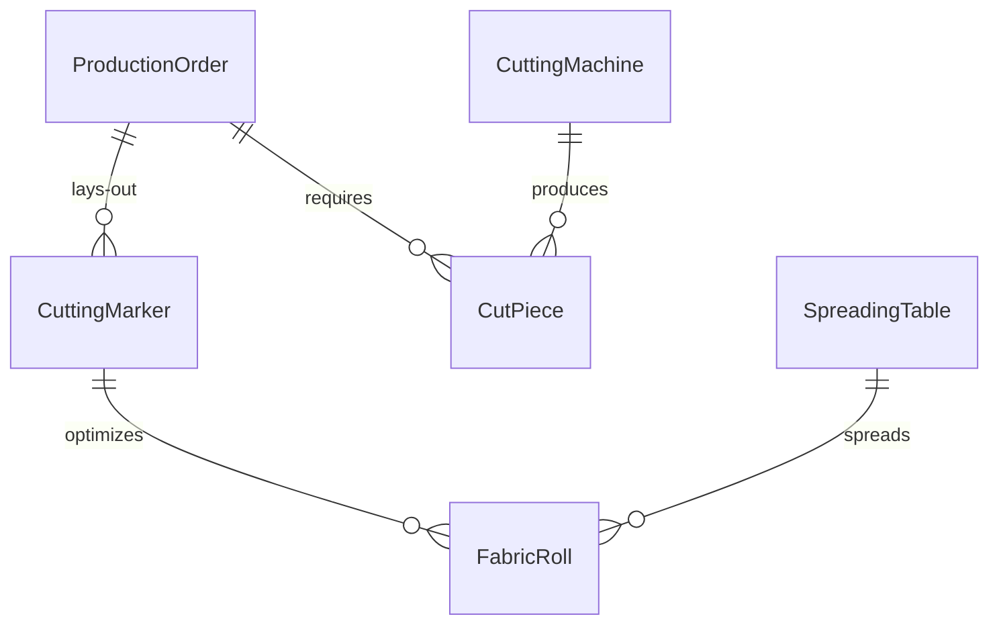
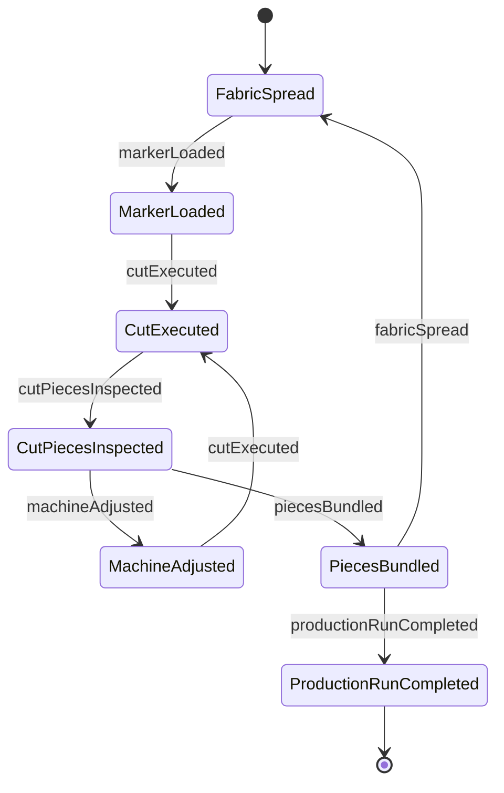
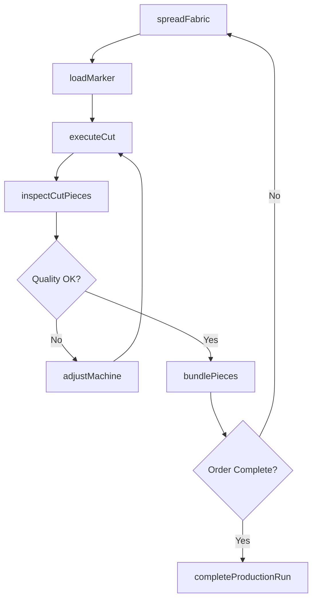
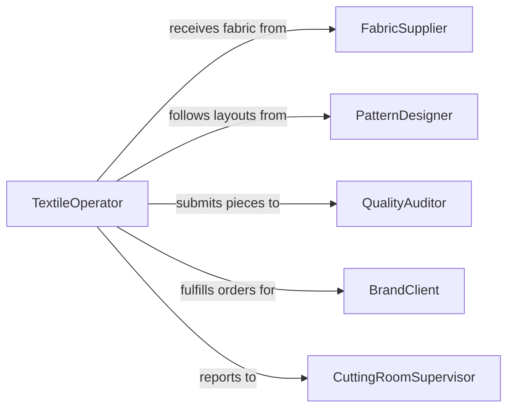

# Operate Textile Cutting Production Equipment

> Business-as-Code definition for textile cutting and production equipment operation. Models the setup, execution, and quality management of machines used to cut, sew, weave, knit, and process fabrics and textiles.

## Overview

Operating textile cutting and production equipment involves configuring and running machines that cut fabric to pattern specifications, weave or knit textiles, and process materials through dyeing, pressing, or finishing stages. This encompasses automated fabric cutters, spreading machines, looms, knitting machines, and finishing presses used in apparel manufacturing, upholstery production, and industrial textile fabrication.

## Actors

| Actor | Description |
|-------|-------------|
| FabricSupplier | Provides rolls of fabric, yarn, and textile raw materials |
| PatternDesigner | Creates cutting patterns and marker layouts for production |
| EquipmentVendor | Supplies textile machinery and replacement parts |
| QualityAuditor | Inspects cut pieces and finished textiles for defect compliance |
| BrandClient | Specifies garment or textile product requirements and standards |

## Roles

| Role | Description |
|------|-------------|
| TextileOperator | Sets up and runs cutting and production textile machinery |
| CuttingRoomSupervisor | Manages cutting schedules, material usage, and team assignments |
| FabricSpreader | Lays out and aligns fabric layers for multi-ply cutting |
| QualityInspector | Checks cut pieces for dimensional accuracy and fabric defects |
| PatternMarker | Arranges pattern pieces on fabric to minimize waste |

## Entities

| Entity | Description |
|--------|-------------|
| CuttingMachine | Automated or manual equipment for cutting fabric to patterns |
| FabricRoll | A roll of textile material loaded for spreading and cutting |
| CuttingMarker | Layout arrangement of pattern pieces on fabric for optimal yield |
| CutPiece | An individual fabric piece cut to a pattern specification |
| ProductionOrder | Work instructions specifying styles, sizes, and quantities |
| SpreadingTable | Surface where fabric layers are laid out before cutting |

## Actions

| Action | Description |
|--------|-------------|
| spreadFabric | Lay fabric layers on the cutting table at specified ply count |
| loadMarker | Apply the cutting marker layout to the spread fabric |
| executeCut | Run the cutting machine along the marker pattern |
| inspectCutPieces | Check cut pieces for accuracy, fraying, and fabric defects |
| bundlePieces | Group cut pieces by style, size, and production lot |
| adjustMachine | Modify blade speed, pressure, or cutting path for material type |
| completeProductionRun | Finalize all cutting for a production order and record yield |

## Events

| Event | Description |
|-------|-------------|
| fabricSpread | Fabric layers have been laid out on the cutting table |
| markerLoaded | Cutting pattern has been applied to the fabric spread |
| cutExecuted | Cutting machine has completed a pass on the fabric layers |
| cutPiecesInspected | Quality check on cut pieces has been completed |
| piecesBundled | Cut pieces have been grouped and labeled for sewing |
| machineAdjusted | Equipment settings have been modified for the material |
| productionRunCompleted | All cutting for a production order has been finished |

## Searches

| Search | Description |
|--------|-------------|
| findProductionOrders | Retrieve cutting orders by style, deadline, or status |
| getFabricInventory | Check available fabric rolls by type, color, and yardage |
| getMarkerEfficiency | Query fabric utilization percentage for cutting markers |
| getCutProgress | Track pieces cut versus pieces required for an order |


## Entity Relationships



## State Diagram



## Workflow



## Actor Relationships



## Usage

### Calling Actions

```typescript
import { operateTextileCuttingProductionEquipment } from '@headlessly/operate-textile-cutting-production-equipment'

const textile = operateTextileCuttingProductionEquipment()

// Spread fabric for a multi-ply cut
const spread = await textile.spreadFabric({
  fabricRollId: 'FR-4420',
  material: { type: 'cotton-twill', width: 60, color: 'navy' },
  plyCount: 40,
  spreadLength: 15
})

// Load the cutting marker
await textile.loadMarker({
  spreadId: spread.id,
  markerId: 'MK-SS26-POLO',
  efficiency: 87.5
})

// Execute the cut
await textile.executeCut({
  spreadId: spread.id,
  productionOrderId: 'PO-2026-1145',
  bladeType: 'straight-knife'
})
```

### Event-Driven Automation

```typescript
// Alert on low marker efficiency
textile.markerLoaded(async ({ markerId, efficiency }) => {
  if (efficiency < 80) {
    await notify({
      to: 'pattern-team',
      message: `Marker ${markerId} has ${efficiency}% efficiency - review for optimization`
    })
  }
})

// Auto-trigger sewing workflow when pieces are bundled
textile.piecesBundled(async ({ productionOrderId, bundles }) => {
  await startSewingWorkflow({
    orderId: productionOrderId,
    bundleCount: bundles.length,
    priority: 'standard'
  })
})
```
