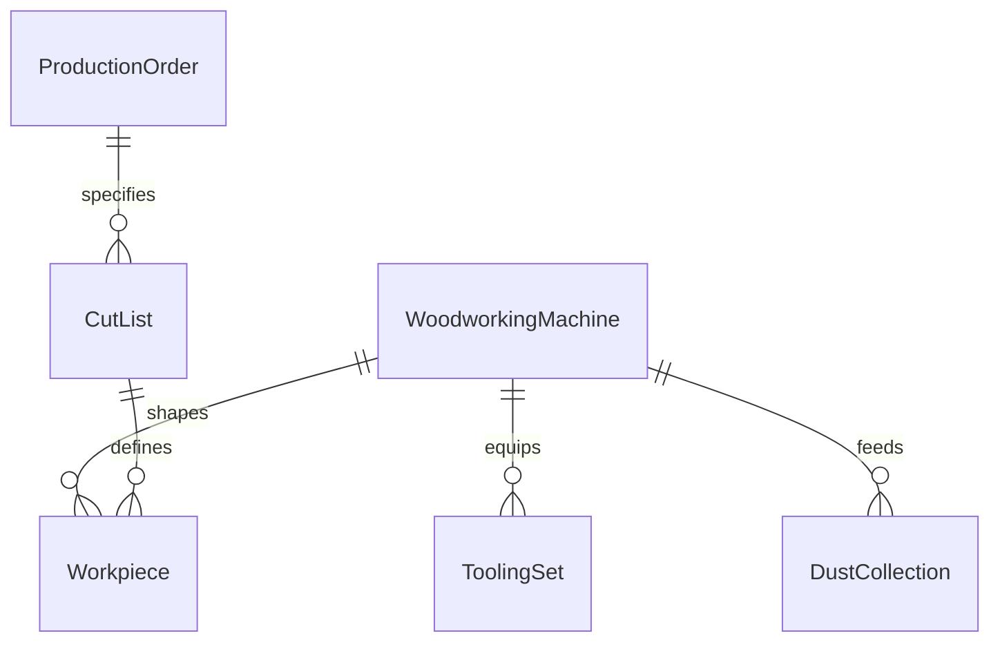
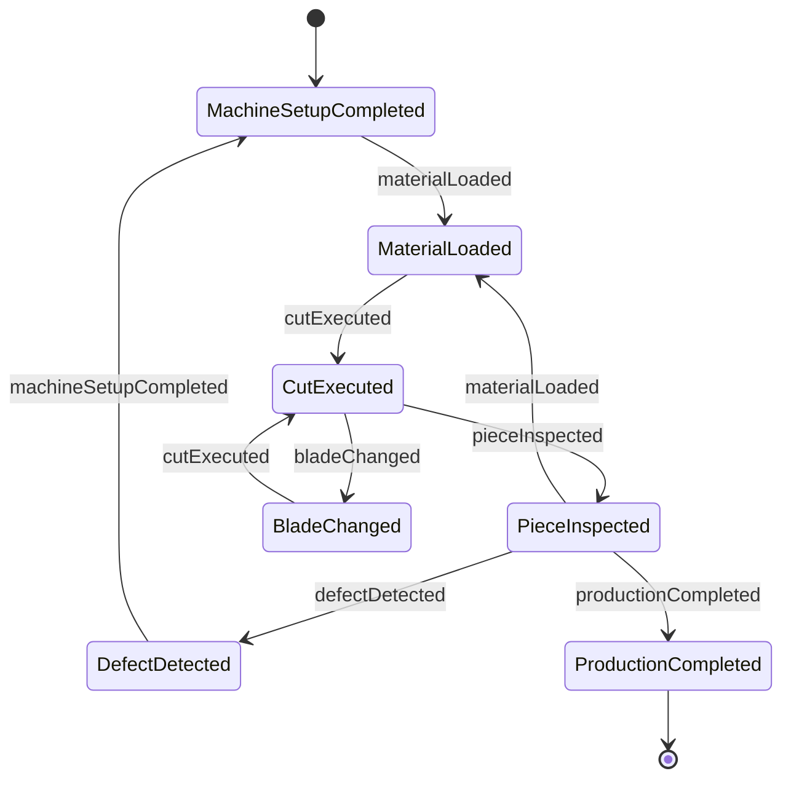
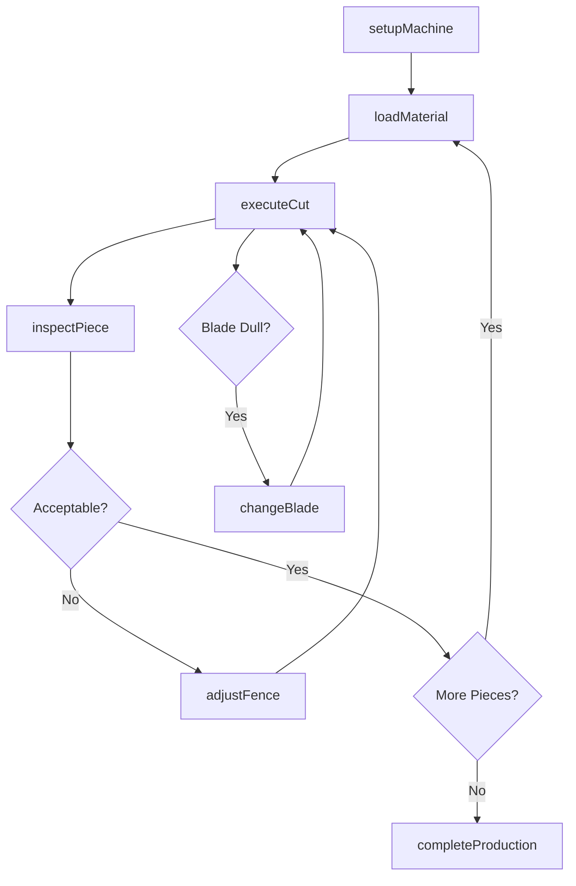
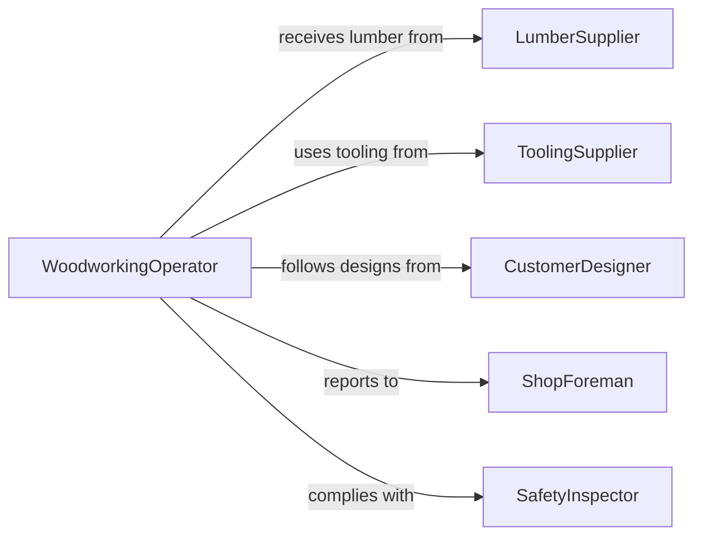

# Operate Woodworking Equipment

> Business-as-Code definition for woodworking equipment operation. Models the setup, execution, and quality management of machines used for cutting, shaping, joining, and finishing wood and wood products.

## Overview

Operating woodworking equipment involves configuring and running machines such as table saws, planers, jointers, routers, lathes, and CNC routers to shape lumber and wood products to specified dimensions and profiles. This activity spans furniture manufacturing, cabinetry, construction framing, and millwork operations.

## Actors

| Actor | Description |
|-------|-------------|
| LumberSupplier | Provides raw lumber, plywood, and engineered wood products |
| EquipmentManufacturer | Supplies woodworking machines and replacement components |
| ToolingSupplier | Provides saw blades, router bits, planer knives, and abrasives |
| CustomerDesigner | Specifies dimensions, profiles, and joinery requirements |
| SafetyInspector | Audits compliance with woodworking safety standards |

## Roles

| Role | Description |
|------|-------------|
| WoodworkingOperator | Sets up and runs woodworking machines to produce components |
| ShopForeman | Schedules production, assigns jobs, and oversees quality |
| Finisher | Applies sanding, staining, and protective coatings to finished pieces |
| QualityChecker | Inspects dimensions, joints, and surface quality of wood components |

## Entities

| Entity | Description |
|--------|-------------|
| WoodworkingMachine | Equipment used for cutting, shaping, or joining wood |
| Workpiece | Lumber or panel being processed to specifications |
| CutList | Detailed breakdown of required pieces with dimensions and quantities |
| ToolingSet | Collection of blades, bits, and knives configured for a job |
| ProductionOrder | Instructions specifying the components to be produced |
| DustCollection | System for capturing sawdust and wood chips during operation |

## Actions

| Action | Description |
|--------|-------------|
| setupMachine | Configure woodworking equipment with correct tooling and settings |
| loadMaterial | Position lumber or panels on the machine for processing |
| executeCut | Run the machine to cut, shape, or profile the workpiece |
| inspectPiece | Check dimensions, grain direction, and surface quality of output |
| changeBlade | Replace worn or damaged cutting tools on the machine |
| adjustFence | Reposition guides and fences for the next cut specification |
| completeProduction | Finalize all pieces for a production order and record results |

## Events

| Event | Description |
|-------|-------------|
| machineSetupCompleted | Equipment has been configured and is ready for operation |
| materialLoaded | Lumber or panel has been positioned on the machine |
| cutExecuted | A cutting or shaping operation has been completed on a workpiece |
| pieceInspected | Dimensional and quality checks have been recorded |
| bladeChanged | Cutting tool has been replaced with a fresh one |
| productionCompleted | All required pieces for an order have been produced |
| defectDetected | A workpiece has a dimensional error, tear-out, or other defect |

## Searches

| Search | Description |
|--------|-------------|
| findProductionOrders | Retrieve woodworking jobs by status, product type, or deadline |
| getMachineAvailability | Query which woodworking machines are available and their current load |
| getToolingCondition | Check wear status and remaining life of installed blades and bits |
| getCutListProgress | Track completion status of pieces against a cut list |


## Entity Relationships



## State Diagram



## Workflow



## Actor Relationships



## Usage

### Calling Actions

```typescript
import { operateWoodworkingEquipment } from '@headlessly/operate-woodworking-equipment'

const woodshop = operateWoodworkingEquipment()

// Set up the table saw for a cabinet panel job
const setup = await woodshop.setupMachine({
  machineId: 'TS-1200',
  tooling: { blade: 'carbide-80T', diameter: 10 },
  parameters: { bladeHeight: 0.75, fencePosition: 23.5, bladeAngle: 0 }
})

// Execute a rip cut on plywood
await woodshop.executeCut({
  setupId: setup.id,
  material: { type: 'birch-plywood', thickness: 0.75, length: 96, width: 48 },
  cutSpec: { type: 'rip', targetWidth: 23.5 }
})

// Inspect the finished piece
const inspection = await woodshop.inspectPiece({
  pieceId: 'CAB-SIDE-001',
  checks: ['width', 'squareness', 'edgeQuality']
})
```

### Event-Driven Automation

```typescript
// Flag defects for rework queue
woodshop.defectDetected(async ({ pieceId, defectType, severity }) => {
  await addToReworkQueue({
    pieceId,
    reason: `${defectType} detected with severity: ${severity}`,
    priority: severity === 'critical' ? 'high' : 'normal'
  })
})

// Track cut list completion and notify when order is ready
woodshop.productionCompleted(async ({ orderId, totalPieces }) => {
  await notify({
    to: 'assembly-team',
    message: `Order ${orderId}: all ${totalPieces} pieces ready for assembly`
  })
})
```
