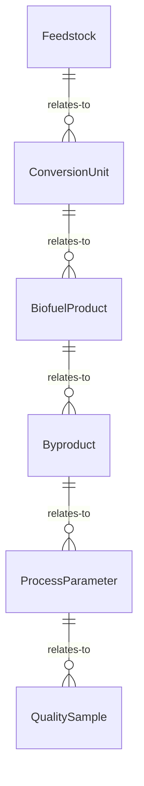
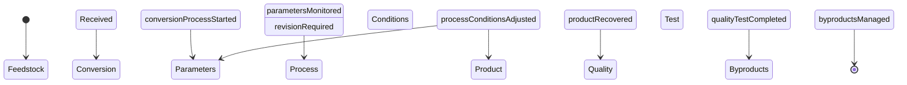
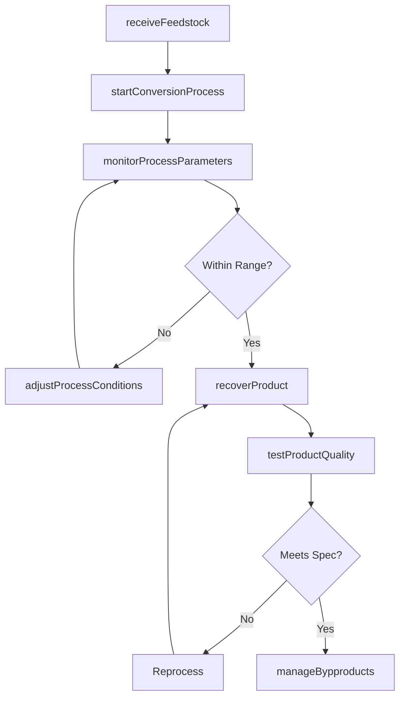
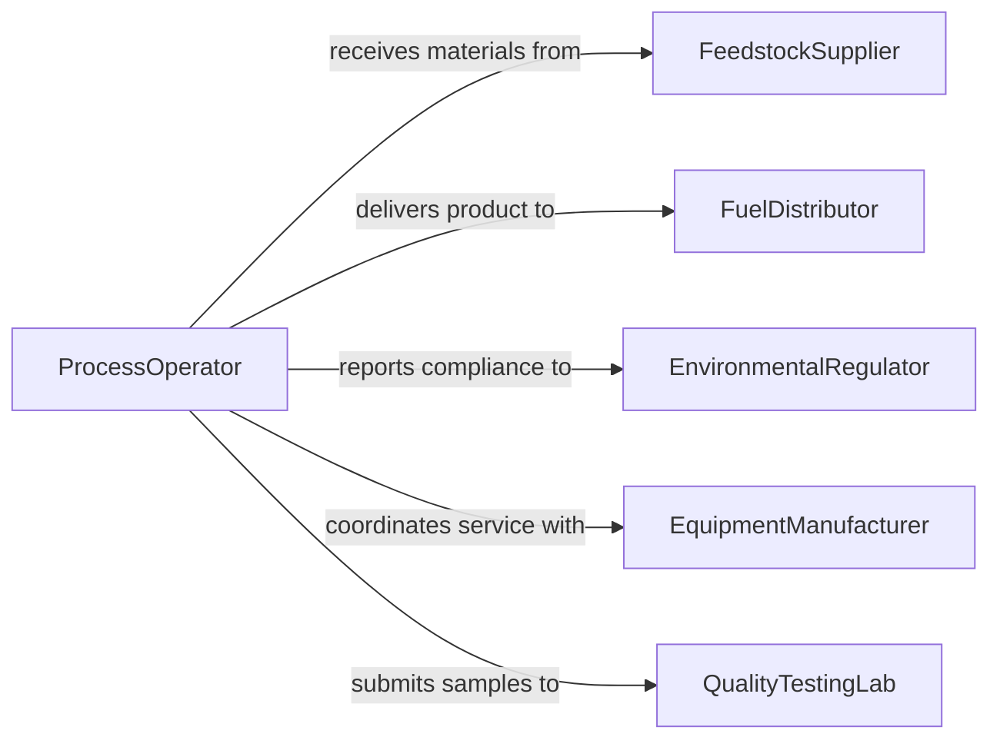

# Operate Biomass Biofuel Production Equipment

> Business-as-Code definition for biomass and biofuel production equipment operation. Models feedstock processing, conversion system control, product recovery, and quality assurance for renewable fuel production.

## Overview

Operating biomass or biofuel production equipment involves managing fermentation systems, gasifiers, anaerobic digesters, and distillation columns that convert organic feedstocks into renewable fuels such as ethanol, biodiesel, and biogas. This definition covers feedstock intake, conversion process monitoring, product recovery and purification, and byproduct management to maintain efficient and compliant biofuel production.

## Actors

| Actor | Description |
|-------|-------------|
| FeedstockSupplier | Delivers agricultural or waste biomass for processing |
| FuelDistributor | Purchases and distributes finished biofuel products |
| EnvironmentalRegulator | Enforces emissions and waste disposal standards |
| EquipmentManufacturer | Provides production equipment and technical support |
| QualityTestingLab | Performs independent fuel specification analysis |

## Roles

| Role | Description |
|------|-------------|
| ProcessOperator | Manages conversion equipment and monitors production |
| BiofuelEngineer | Optimizes process parameters and yield |
| QualityControlTechnician | Tests product samples against fuel specifications |
| FeedstockCoordinator | Manages raw material receiving and inventory |

## Entities

| Entity | Description |
|--------|-------------|
| Feedstock | Organic material such as corn, switchgrass, or waste oils |
| ConversionUnit | Equipment performing the biomass-to-fuel transformation |
| BiofuelProduct | Finished fuel meeting specification standards |
| Byproduct | Co-products such as distillers grains or glycerin |
| ProcessParameter | Temperature, pH, pressure, and flow settings for production |
| QualitySample | Product specimen tested against fuel grade requirements |

## Actions

| Action | Description |
|--------|-------------|
| receiveFeedstock | Accept and inventory incoming biomass materials |
| startConversionProcess | Initiate fermentation, gasification, or digestion |
| monitorProcessParameters | Track temperature, pH, pressure, and conversion rates |
| adjustProcessConditions | Modify operating parameters to optimize yield |
| recoverProduct | Separate and purify biofuel from process stream |
| testProductQuality | Analyze fuel samples against specification standards |
| manageBypproducts | Process, store, or route co-products for sale or disposal |

## Events

| Event | Description |
|-------|-------------|
| feedstockReceived | Biomass materials have been accepted into inventory |
| conversionProcessStarted | Production cycle has been initiated |
| parametersMonitored | Process conditions have been recorded |
| processConditionsAdjusted | Operating parameters have been modified |
| productRecovered | Biofuel has been separated and purified |
| qualityTestCompleted | Fuel sample analysis results are available |
| byproductsManaged | Co-products have been routed for sale or disposal |

## Searches

| Search | Description |
|--------|-------------|
| findFeedstockInventory | List available biomass by type, quantity, and receiving date |
| getProductionMetrics | Retrieve yield, throughput, and efficiency data by period |
| getQualityResults | Look up fuel testing results by batch or specification |
| getByproductInventory | Review co-product quantities and disposition status |


## Entity Relationships



## State Diagram



## Workflow



## Actor Relationships



## Usage

### Calling Actions

```typescript
import { operateBiomassBiofuelProductionEquipment } from '@headlessly/operate-biomass-biofuel-production-equipment'

const biofuel = operateBiomassBiofuelProductionEquipment()

// Receive feedstock
const feedstock = await biofuel.receiveFeedstock({
  type: 'corn-stover',
  quantityTons: 150,
  moisturePercent: 12.5,
  supplierId: 'FARM-COOP-07'
})

// Start fermentation
await biofuel.startConversionProcess({
  unitId: 'FERM-TANK-02',
  feedstockBatchId: feedstock.batchId,
  processType: 'cellulosic-ethanol'
})

// Monitor and recover
await biofuel.monitorProcessParameters({ unitId: 'FERM-TANK-02' })
const product = await biofuel.recoverProduct({ unitId: 'FERM-TANK-02', method: 'distillation' })
await biofuel.testProductQuality({ batchId: product.batchId, spec: 'ASTM-D4806' })
```

### Event-Driven Automation

```typescript
// Alert on off-spec quality
biofuel.qualityTestCompleted(async ({ batchId, meetsSpec, deviations }) => {
  if (!meetsSpec) {
    await notify({
      to: 'biofuel-engineer',
      message: `Batch ${batchId} off-spec: ${deviations.join(', ')}`
    })
  }
})

// Auto-adjust process conditions
biofuel.parametersMonitored(async ({ unitId, pH, temperature, targetpH }) => {
  if (Math.abs(pH - targetpH) > 0.3) {
    await biofuel.adjustProcessConditions({ unitId, parameter: 'pH', targetValue: targetpH })
  }
})
```
