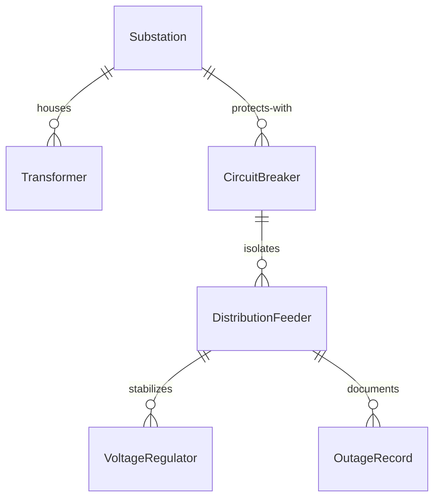
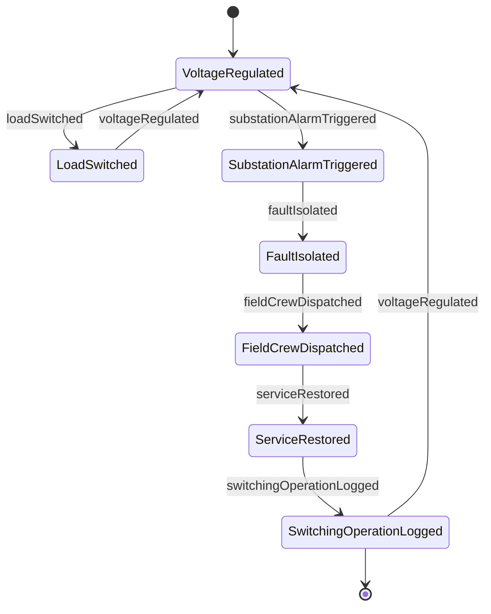
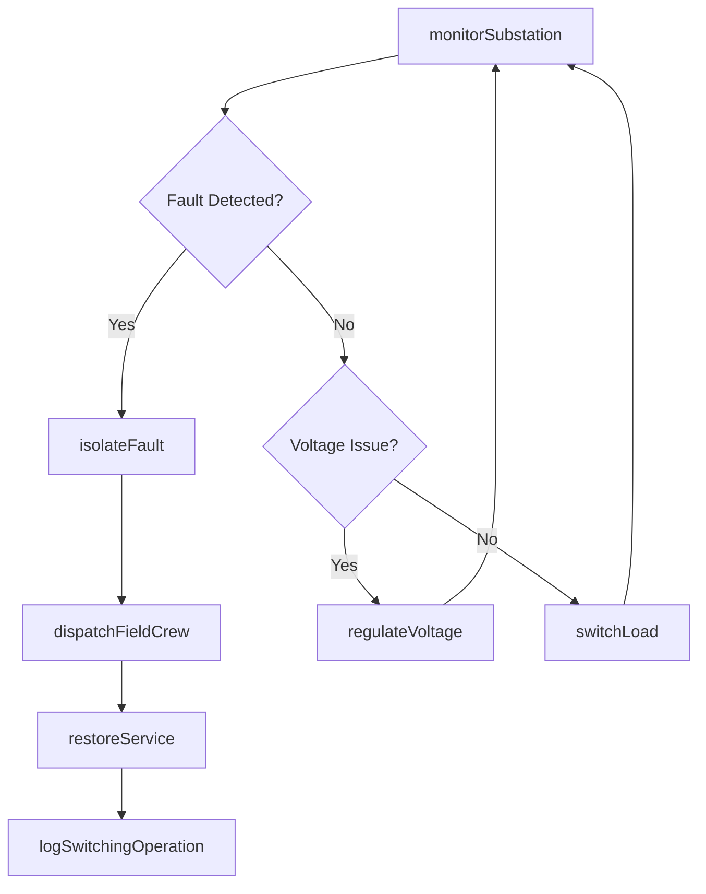
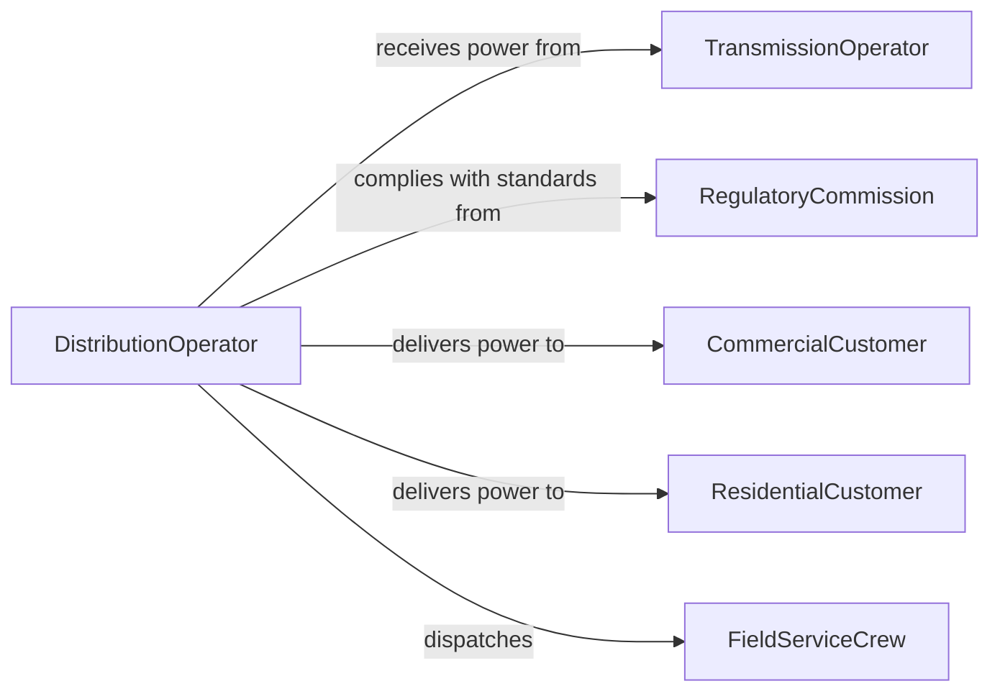

# Operate Energy Distribution Equipment

> Business-as-Code definition for energy distribution equipment operation. Models the control of substations, transformers, switchgear, and grid infrastructure to deliver electricity reliably to consumers.

## Overview

Operating energy distribution equipment involves managing substations, transformers, circuit breakers, and distribution feeders that deliver electricity from transmission networks to end consumers. This definition covers load switching, voltage regulation, fault isolation, and restoration procedures to maintain continuous power delivery across residential, commercial, and industrial service territories.

## Actors

| Actor | Description |
|-------|-------------|
| TransmissionOperator | Supplies bulk power to the distribution network |
| RegulatoryCommission | Sets reliability standards and rate structures |
| CommercialCustomer | Business consuming distributed electricity |
| ResidentialCustomer | Household consuming distributed electricity |
| FieldServiceCrew | Performs on-site switching and repair operations |

## Roles

| Role | Description |
|------|-------------|
| DistributionOperator | Controls switching and load management from the control center |
| SubstationTechnician | Maintains transformers, breakers, and relay equipment |
| SystemDispatcher | Coordinates outage response and restoration sequences |
| ProtectionEngineer | Designs and maintains relay protection schemes |

## Entities

| Entity | Description |
|--------|-------------|
| Substation | Facility housing transformers and switching equipment |
| Transformer | Device that steps voltage up or down for distribution |
| CircuitBreaker | Protective switching device that isolates faulted sections |
| DistributionFeeder | Electrical circuit delivering power to a service area |
| VoltageRegulator | Equipment that maintains voltage within specified limits |
| OutageRecord | Documentation of service interruption details and restoration |

## Actions

| Action | Description |
|--------|-------------|
| switchLoad | Transfer electrical load between feeders or substations |
| regulateVoltage | Adjust tap changers and capacitor banks for voltage control |
| isolateFault | Open breakers to disconnect a faulted circuit section |
| restoreService | Re-energize circuits after fault clearance or maintenance |
| monitorSubstation | Track transformer loading, temperature, and alarm status |
| dispatchFieldCrew | Send personnel to perform on-site switching or repairs |
| logSwitchingOperation | Record all switching actions for compliance and audit |

## Events

| Event | Description |
|-------|-------------|
| loadSwitched | Electrical load has been transferred to a different path |
| voltageRegulated | Voltage has been adjusted to within target range |
| faultIsolated | Faulted section has been disconnected from the network |
| serviceRestored | Power has been re-energized to affected customers |
| substationAlarmTriggered | Abnormal condition detected at a substation |
| fieldCrewDispatched | Personnel have been assigned to an on-site task |
| switchingOperationLogged | Switching action has been documented |

## Searches

| Search | Description |
|--------|-------------|
| findSubstations | List substations by region, capacity, or alarm status |
| getFeederLoading | Retrieve current and historical load data for feeders |
| getOutageHistory | Look up service interruptions by area or time period |
| getVoltageProfile | Review voltage measurements across a distribution circuit |


## Entity Relationships



## State Diagram



## Workflow



## Actor Relationships



## Usage

### Calling Actions

```typescript
import { operateEnergyDistributionEquipment } from '@headlessly/operate-energy-distribution-equipment'

const distribution = operateEnergyDistributionEquipment()

// Monitor substation status
const status = await distribution.monitorSubstation({
  substationId: 'SUB-NORTH-04',
  metrics: ['transformerLoad', 'temperature', 'alarms']
})

// Switch load between feeders
await distribution.switchLoad({
  fromFeeder: 'FDR-412',
  toFeeder: 'FDR-413',
  reason: 'planned-maintenance'
})

// Isolate a fault and restore
await distribution.isolateFault({ feederId: 'FDR-412', section: 'S3' })
await distribution.restoreService({ feederId: 'FDR-412', excludeSection: 'S3' })
```

### Event-Driven Automation

```typescript
// Auto-dispatch on fault detection
distribution.faultIsolated(async ({ feederId, section, customersAffected }) => {
  await distribution.dispatchFieldCrew({
    feederId,
    section,
    priority: customersAffected > 1000 ? 'emergency' : 'urgent'
  })
})

// Alert on substation alarm
distribution.substationAlarmTriggered(async ({ substationId, alarmType }) => {
  await notify({
    to: 'distribution-dispatch',
    message: `Alarm at ${substationId}: ${alarmType}`
  })
})
```
