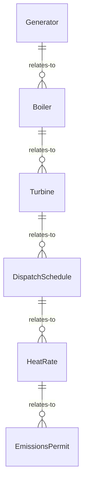
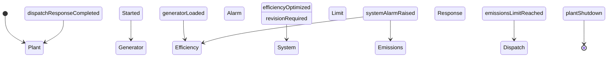
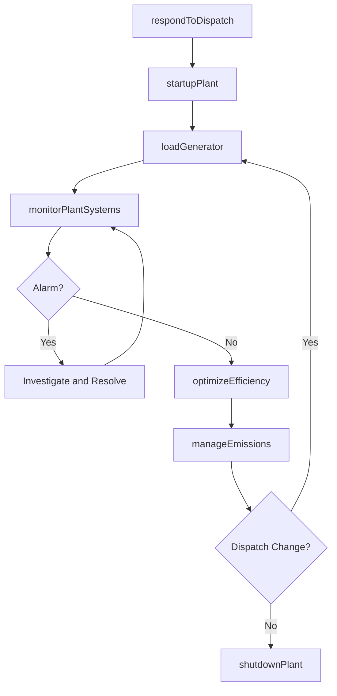
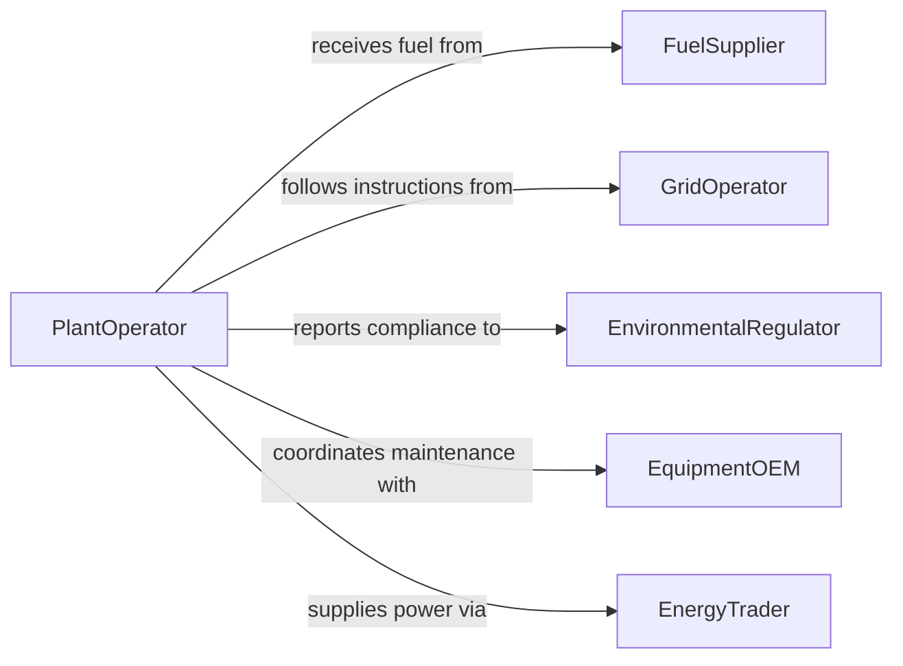

# Operate Energy Production Equipment

> Business-as-Code definition for energy production equipment operation. Models the lifecycle of power generation from startup through dispatch, monitoring, and shutdown across conventional and renewable sources.

## Overview

Operating energy production equipment involves managing generators, turbines, boilers, and associated systems that convert fuel or natural forces into electrical power. This definition covers plant startup procedures, load management, efficiency optimization, emissions monitoring, and shutdown protocols for coal, gas, nuclear, hydro, and other generation facilities.

## Actors

| Actor | Description |
|-------|-------------|
| FuelSupplier | Delivers coal, gas, uranium, or other energy feedstocks |
| GridOperator | Dispatches generation assets and manages system balance |
| EnvironmentalRegulator | Enforces emissions permits and environmental compliance |
| EquipmentOEM | Provides generation equipment and warranty services |
| EnergyTrader | Buys and sells power on wholesale markets |

## Roles

| Role | Description |
|------|-------------|
| PlantOperator | Controls generation equipment startup, loading, and shutdown |
| ShiftEngineer | Supervises plant operations during assigned shift |
| PerformanceEngineer | Analyzes heat rate and efficiency to optimize output |
| ComplianceOfficer | Ensures operations meet regulatory and permit requirements |

## Entities

| Entity | Description |
|--------|-------------|
| Generator | Machine that converts mechanical energy to electricity |
| Boiler | Vessel that produces steam to drive turbines |
| Turbine | Rotary engine extracting energy from fluid or gas flow |
| DispatchSchedule | Planned generation output levels over time |
| HeatRate | Measure of plant efficiency in BTU per kilowatt-hour |
| EmissionsPermit | Regulatory authorization specifying allowable pollutant levels |

## Actions

| Action | Description |
|--------|-------------|
| startupPlant | Execute the ignition and synchronization sequence |
| loadGenerator | Ramp output to meet dispatched generation target |
| optimizeEfficiency | Adjust parameters to minimize fuel consumption per MWh |
| monitorPlantSystems | Track boiler, turbine, and generator operating conditions |
| manageEmissions | Ensure pollutant output stays within permitted limits |
| respondToDispatch | Adjust output in response to grid operator instructions |
| shutdownPlant | Execute controlled cooldown and disconnection sequence |

## Events

| Event | Description |
|-------|-------------|
| plantStarted | Generation unit has been synchronized to the grid |
| generatorLoaded | Output has reached the dispatched target level |
| efficiencyOptimized | Operating parameters have been tuned for best heat rate |
| systemAlarmRaised | An abnormal condition has been detected in plant systems |
| emissionsLimitReached | Pollutant output is approaching permitted threshold |
| dispatchResponseCompleted | Output adjustment per grid instruction is complete |
| plantShutdown | Controlled shutdown sequence has been completed |

## Searches

| Search | Description |
|--------|-------------|
| findGenerationUnits | List production equipment by fuel type, capacity, or status |
| getPlantPerformance | Retrieve output, heat rate, and availability metrics |
| getEmissionsData | Look up pollutant output by unit or reporting period |
| getDispatchHistory | Review generation schedules and actual output delivered |


## Entity Relationships



## State Diagram



## Workflow



## Actor Relationships



## Usage

### Calling Actions

```typescript
import { operateEnergyProductionEquipment } from '@headlessly/operate-energy-production-equipment'

const plant = operateEnergyProductionEquipment()

// Respond to dispatch and start up
const dispatch = await plant.respondToDispatch({
  orderId: 'DISP-2026-0831',
  targetMW: 500,
  rampRateMWPerMin: 10
})

await plant.startupPlant({ unitId: 'GEN-UNIT-02', fuelType: 'natural-gas' })
await plant.loadGenerator({ unitId: 'GEN-UNIT-02', targetMW: dispatch.targetMW })

// Monitor and optimize
await plant.monitorPlantSystems({ unitId: 'GEN-UNIT-02' })
await plant.optimizeEfficiency({ unitId: 'GEN-UNIT-02', targetHeatRate: 7200 })
```

### Event-Driven Automation

```typescript
// Auto-adjust on emissions approach
plant.emissionsLimitReached(async ({ unitId, pollutant, percentage }) => {
  await plant.optimizeEfficiency({ unitId, strategy: 'emissions-priority' })
  await notify({
    to: 'compliance-officer',
    message: `${pollutant} at ${percentage}% of limit on ${unitId}`
  })
})

// Log performance on shutdown
plant.plantShutdown(async ({ unitId, totalMWhProduced, runHours }) => {
  await logMetrics({
    unitId,
    mwh: totalMWhProduced,
    hours: runHours,
    avgHeatRate: totalMWhProduced / runHours
  })
})
```
