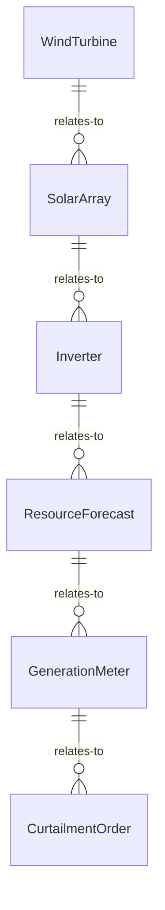
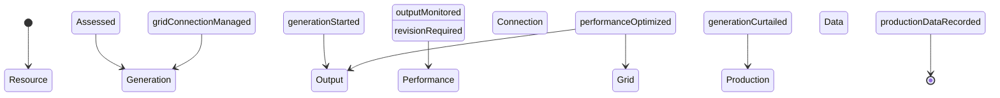
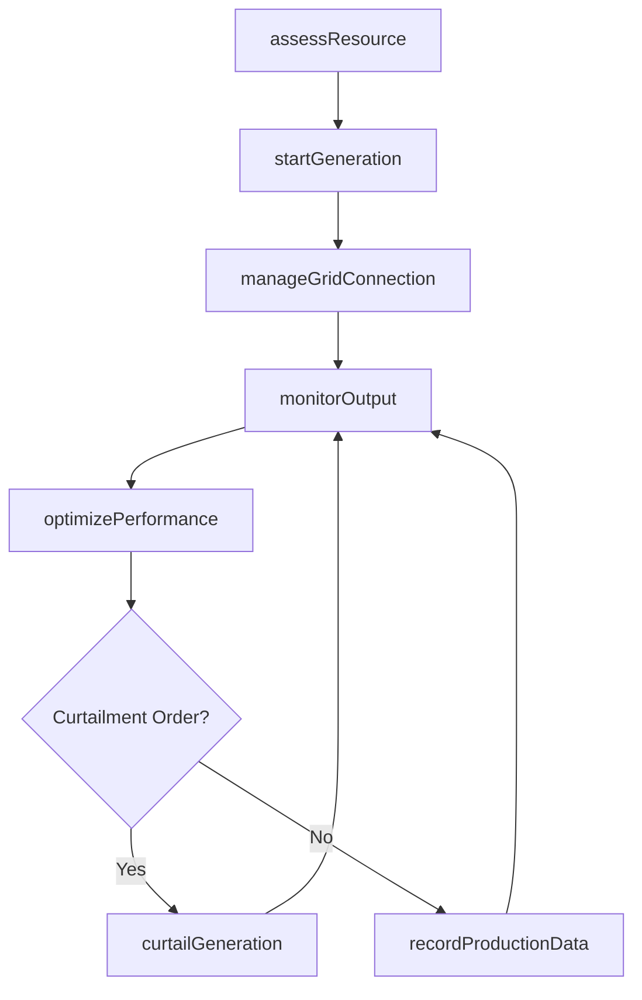
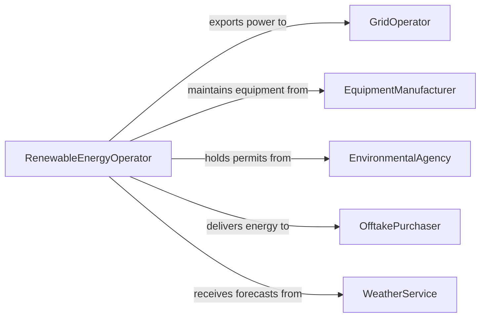

# Operate Green Energy Production Equipment

> Business-as-Code definition for green energy production equipment operation. Models the operation of solar, wind, hydroelectric, and geothermal systems for renewable electricity generation.

## Overview

Operating green energy production equipment involves managing wind turbines, solar panel arrays, hydroelectric generators, and geothermal plants to produce electricity from renewable sources. This definition covers resource assessment, equipment startup and monitoring, inverter and grid-tie management, performance optimization, and curtailment handling to maximize clean energy output while maintaining grid stability.

## Actors

| Actor | Description |
|-------|-------------|
| GridOperator | Manages grid interconnection and dispatches renewable output |
| EquipmentManufacturer | Supplies turbines, panels, inverters, and spare parts |
| EnvironmentalAgency | Issues permits and monitors environmental impact |
| OfftakePurchaser | Buys renewable energy under power purchase agreements |
| WeatherService | Provides forecasts for wind, solar, and hydrological conditions |

## Roles

| Role | Description |
|------|-------------|
| RenewableEnergyOperator | Monitors and controls generation equipment |
| SiteManager | Oversees the overall renewable energy facility |
| PerformanceAnalyst | Evaluates energy output against resource availability |
| MaintenanceTechnician | Performs inspections, cleaning, and repairs on equipment |

## Entities

| Entity | Description |
|--------|-------------|
| WindTurbine | Machine converting wind kinetic energy to electricity |
| SolarArray | Collection of photovoltaic panels generating direct current |
| Inverter | Device converting DC output to grid-compatible AC power |
| ResourceForecast | Predicted wind speed, solar irradiance, or water flow |
| GenerationMeter | Equipment measuring total electricity produced |
| CurtailmentOrder | Instruction to reduce or cease generation output |

## Actions

| Action | Description |
|--------|-------------|
| assessResource | Evaluate current wind, solar, or hydro conditions |
| startGeneration | Bring renewable generation equipment online |
| monitorOutput | Track real-time power production and equipment status |
| optimizePerformance | Adjust tracking angles, blade pitch, or flow gates |
| manageGridConnection | Control inverter synchronization and power export |
| curtailGeneration | Reduce output per grid operator or safety instructions |
| recordProductionData | Log energy output, availability, and resource metrics |

## Events

| Event | Description |
|-------|-------------|
| resourceAssessed | Current renewable resource conditions have been evaluated |
| generationStarted | Equipment has been brought online and is producing power |
| outputMonitored | Real-time production data has been captured |
| performanceOptimized | Equipment adjustments have improved energy capture |
| gridConnectionManaged | Inverter synchronization and export settings are configured |
| generationCurtailed | Output has been reduced per instructions |
| productionDataRecorded | Generation metrics have been logged for the period |

## Searches

| Search | Description |
|--------|-------------|
| findGenerationAssets | List renewable equipment by type, site, or status |
| getProductionHistory | Retrieve energy output data by asset or time period |
| getResourceForecasts | Look up predicted wind, solar, or hydro conditions |
| getCurtailmentHistory | Review past curtailment events and lost generation |


## Entity Relationships



## State Diagram



## Workflow



## Actor Relationships



## Usage

### Calling Actions

```typescript
import { operateGreenEnergyProductionEquipment } from '@headlessly/operate-green-energy-production-equipment'

const green = operateGreenEnergyProductionEquipment()

// Assess wind conditions and start turbines
const resource = await green.assessResource({
  siteId: 'WIND-FARM-RIDGE-03',
  type: 'wind',
  metrics: ['windSpeed', 'windDirection', 'turbulenceIntensity']
})

await green.startGeneration({
  siteId: 'WIND-FARM-RIDGE-03',
  turbines: ['WT-01', 'WT-02', 'WT-03'],
  cutInWindSpeed: 3.5
})

// Monitor and optimize
await green.monitorOutput({ siteId: 'WIND-FARM-RIDGE-03' })
await green.optimizePerformance({
  turbineId: 'WT-01',
  adjustment: 'blade-pitch',
  targetYawAngle: resource.windDirection
})
```

### Event-Driven Automation

```typescript
// Handle curtailment orders
green.generationCurtailed(async ({ siteId, reductionMW, reason }) => {
  await green.recordProductionData({
    siteId,
    event: 'curtailment',
    lostMW: reductionMW,
    reason
  })
})

// Optimize based on changing resource conditions
green.resourceAssessed(async ({ siteId, windSpeed, previousWindSpeed }) => {
  if (Math.abs(windSpeed - previousWindSpeed) > 2) {
    await green.optimizePerformance({ siteId, adjustment: 'auto-yaw' })
  }
})
```
