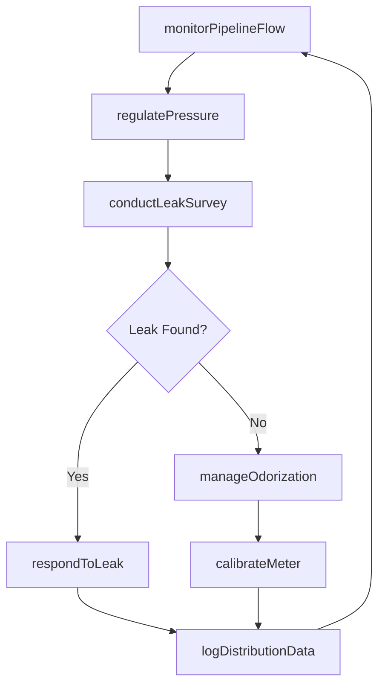
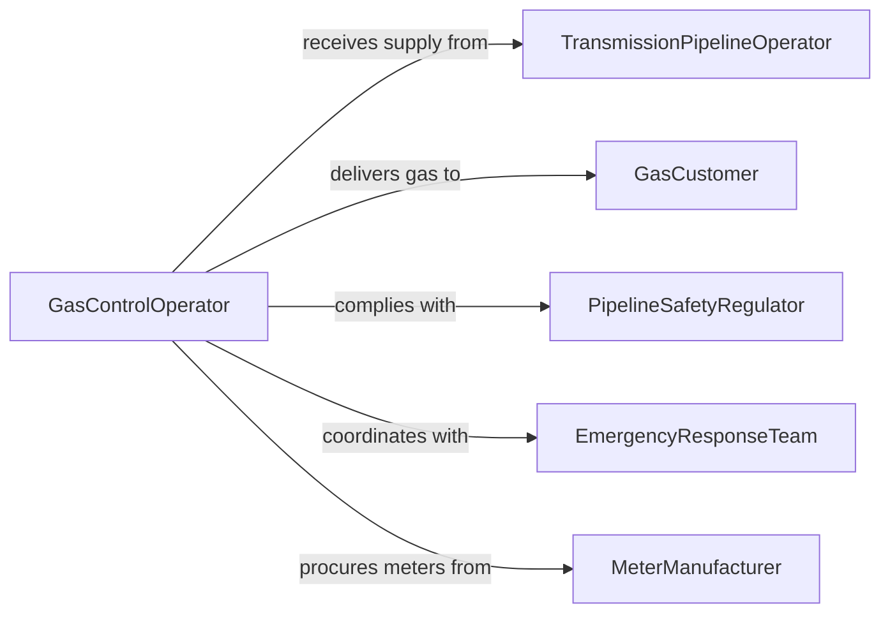

# Operate Natural Gas Distribution Equipment

> Business-as-Code definition for natural gas distribution equipment operation. Models pipeline pressure management, metering station control, leak detection, and delivery to end consumers.

## Overview

Operating natural gas distribution equipment involves managing pressure regulation stations, pipeline networks, metering systems, and odorization equipment that deliver gas from transmission mains to residential, commercial, and industrial customers. This definition covers pressure regulation, flow measurement, leak surveillance, and emergency response to maintain safe and reliable gas delivery.

## Actors

| Actor | Description |
|-------|-------------|
| TransmissionPipelineOperator | Supplies high-pressure gas to the distribution network |
| GasCustomer | End consumer receiving natural gas service |
| PipelineSafetyRegulator | Enforces pipeline safety and integrity standards |
| EmergencyResponseTeam | Responds to gas leaks and other hazardous conditions |
| MeterManufacturer | Supplies and calibrates gas measurement equipment |

## Roles

| Role | Description |
|------|-------------|
| GasControlOperator | Monitors SCADA systems and manages pipeline pressures |
| FieldTechnician | Performs on-site valve operations and equipment checks |
| LeakSurveyTechnician | Conducts routine pipeline inspections for gas leaks |
| DistributionEngineer | Designs pressure management and flow optimization strategies |

## Entities

| Entity | Description |
|--------|-------------|
| PressureRegulatorStation | Facility that reduces gas pressure for distribution |
| DistributionMain | Pipeline network carrying gas at distribution pressure |
| GasMeter | Device measuring gas volume delivered to a customer |
| OdorizationSystem | Equipment injecting odorant into gas for leak detection |
| LeakReport | Documentation of detected gas leaks and remediation actions |
| PressureReading | Real-time or logged gas pressure at monitoring points |

## Actions

| Action | Description |
|--------|-------------|
| regulatePressure | Adjust regulator setpoints to maintain distribution pressure |
| monitorPipelineFlow | Track gas flow rates and pressure throughout the network |
| conductLeakSurvey | Inspect pipeline segments for gas leaks using detection equipment |
| respondToLeak | Isolate and remediate a detected gas leak |
| calibrateMeter | Verify and adjust gas measurement accuracy |
| manageOdorization | Ensure odorant concentration meets safety requirements |
| logDistributionData | Record pressure, flow, and operational metrics |

## Events

| Event | Description |
|-------|-------------|
| pressureRegulated | Distribution pressure has been adjusted to target |
| flowMonitored | Pipeline flow data has been captured and reviewed |
| leakDetected | Gas leak has been identified during survey or monitoring |
| leakRemediated | Detected gas leak has been repaired and cleared |
| meterCalibrated | Gas meter accuracy has been verified and adjusted |
| odorizationVerified | Odorant concentration meets safety standards |
| distributionDataLogged | Operating metrics have been recorded for the period |

## Searches

| Search | Description |
|--------|-------------|
| findRegulatorStations | List stations by district, pressure setting, or status |
| getPipelinePressures | Retrieve pressure readings across the distribution network |
| getLeakHistory | Look up leak reports by location, severity, or date range |
| getMeterReadings | Review gas consumption data by customer or meter |

## Workflow



## Actor Relationships



## Usage

### Calling Actions

```typescript
import { operateNaturalGasDistributionEquipment } from '@headlessly/operate-natural-gas-distribution-equipment'

const gasDist = operateNaturalGasDistributionEquipment()

// Regulate pressure at a station
await gasDist.regulatePressure({
  stationId: 'REG-STATION-15',
  targetPressurePSIG: 45,
  upstreamPressurePSIG: 300
})

// Conduct leak survey on a main
const survey = await gasDist.conductLeakSurvey({
  mainId: 'DIST-MAIN-042',
  method: 'flame-ionization',
  segmentStart: 'VALVE-042A',
  segmentEnd: 'VALVE-042F'
})

// Respond to detected leak
if (survey.leaksFound > 0) {
  await gasDist.respondToLeak({
    leakId: survey.leaks[0].id,
    priority: 'grade-1',
    isolationValves: ['VALVE-042C', 'VALVE-042D']
  })
}
```

### Event-Driven Automation

```typescript
// Emergency response on leak detection
gasDist.leakDetected(async ({ location, severity, mainId }) => {
  if (severity === 'grade-1') {
    await gasDist.respondToLeak({ mainId, location, priority: 'immediate' })
    await notify({
      to: 'emergency-response-team',
      message: `Grade 1 leak detected on ${mainId} at ${location}`
    })
  }
})

// Auto-log after pressure adjustments
gasDist.pressureRegulated(async ({ stationId, newPressure }) => {
  await gasDist.logDistributionData({ stationId, event: 'pressure-change', value: newPressure })
})
```
