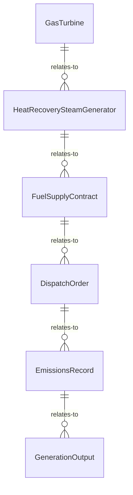
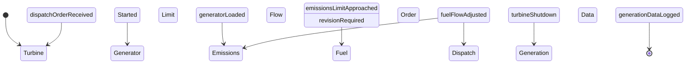
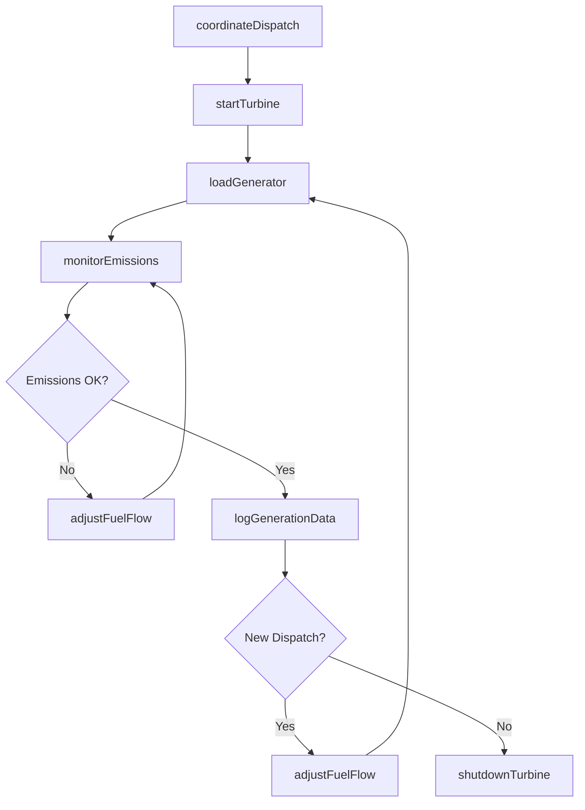
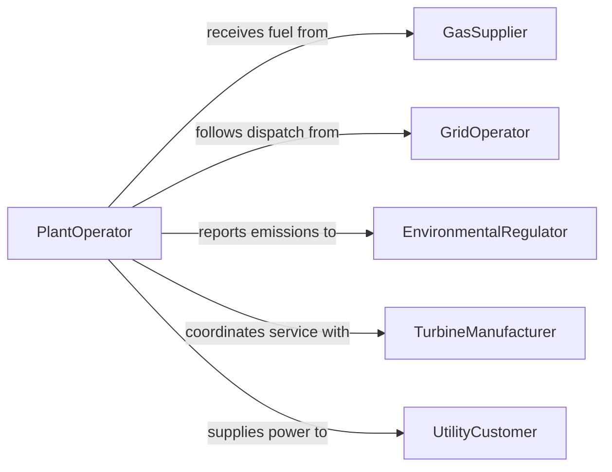

# Operate Natural Gas Generation Equipment

> Business-as-Code definition for natural gas generation equipment operation. Models the process of operating gas-fired turbines, reciprocating engines, and combined-cycle systems for electricity generation.

## Overview

Operating natural gas generation equipment involves managing gas turbines, combined-cycle plants, and reciprocating engine generators to produce electricity from natural gas fuel. This definition covers fuel supply management, turbine startup and loading, heat recovery steam generation, emissions monitoring, and coordinated dispatch to match grid demand.

## Actors

| Actor | Description |
|-------|-------------|
| GasSupplier | Delivers natural gas fuel under supply contracts |
| GridOperator | Dispatches generation and manages grid stability |
| EnvironmentalRegulator | Enforces emissions limits and reporting requirements |
| TurbineManufacturer | Provides equipment, parts, and technical support |
| UtilityCustomer | Consumes electricity produced by the generation facility |

## Roles

| Role | Description |
|------|-------------|
| PlantOperator | Controls turbine startup, loading, and shutdown |
| ControlRoomEngineer | Monitors plant SCADA systems and coordinates dispatch |
| EmissionsSpecialist | Tracks and reports air quality compliance data |
| MaintenancePlanner | Schedules inspections and overhauls based on run hours |

## Entities

| Entity | Description |
|--------|-------------|
| GasTurbine | Primary power generation unit burning natural gas |
| HeatRecoverySteamGenerator | Captures exhaust heat to produce steam for additional power |
| FuelSupplyContract | Agreement defining gas delivery volumes and pricing |
| DispatchOrder | Grid operator instruction specifying generation output level |
| EmissionsRecord | Logged data on NOx, CO, and CO2 output |
| GenerationOutput | Measured electrical power produced in megawatts |

## Actions

| Action | Description |
|--------|-------------|
| startTurbine | Execute ignition and ramp-up sequence for a gas turbine |
| loadGenerator | Synchronize and increase output to meet dispatch target |
| monitorEmissions | Track stack emissions against permitted limits |
| adjustFuelFlow | Modify gas supply rate to optimize efficiency |
| coordinateDispatch | Respond to grid operator instructions for output changes |
| shutdownTurbine | Execute controlled cooldown and stop sequence |
| logGenerationData | Record output, fuel consumption, and emissions metrics |

## Events

| Event | Description |
|-------|-------------|
| turbineStarted | Gas turbine has reached operating speed and ignited |
| generatorLoaded | Output has been synchronized and ramped to target |
| emissionsLimitApproached | Stack emissions are nearing permitted thresholds |
| fuelFlowAdjusted | Gas supply rate has been modified |
| dispatchOrderReceived | Grid operator has issued a new generation instruction |
| turbineShutdown | Controlled shutdown sequence has been completed |
| generationDataLogged | Operating metrics have been recorded for the period |

## Searches

| Search | Description |
|--------|-------------|
| findGenerationUnits | List turbines and generators by capacity, status, or fuel type |
| getGenerationOutput | Retrieve power output data by unit or time period |
| getEmissionsHistory | Look up emissions records by pollutant or reporting period |
| getDispatchHistory | Review grid dispatch orders and compliance records |


## Entity Relationships



## State Diagram



## Workflow



## Actor Relationships



## Usage

### Calling Actions

```typescript
import { operateNaturalGasGenerationEquipment } from '@headlessly/operate-natural-gas-generation-equipment'

const gasGen = operateNaturalGasGenerationEquipment()

// Start turbine per dispatch order
const dispatch = await gasGen.coordinateDispatch({
  dispatchOrderId: 'DISP-2026-0412',
  targetOutputMW: 180
})

await gasGen.startTurbine({ unitId: 'GT-UNIT-03', fuelSource: 'pipeline-A' })
await gasGen.loadGenerator({ unitId: 'GT-UNIT-03', targetMW: dispatch.targetOutputMW })

// Monitor emissions
const emissions = await gasGen.monitorEmissions({
  unitId: 'GT-UNIT-03',
  pollutants: ['NOx', 'CO', 'CO2']
})

// Log data
await gasGen.logGenerationData({ unitId: 'GT-UNIT-03', period: '2026-02-05T00:00/PT8H' })
```

### Event-Driven Automation

```typescript
// Adjust fuel when emissions approach limits
gasGen.emissionsLimitApproached(async ({ unitId, pollutant, currentLevel, limit }) => {
  await gasGen.adjustFuelFlow({
    unitId,
    adjustment: 'reduce',
    reason: `${pollutant} at ${currentLevel}/${limit}`
  })
})

// Respond to new dispatch orders
gasGen.dispatchOrderReceived(async ({ unitId, targetMW }) => {
  await gasGen.loadGenerator({ unitId, targetMW })
})
```
