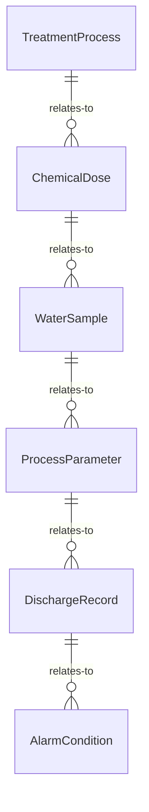
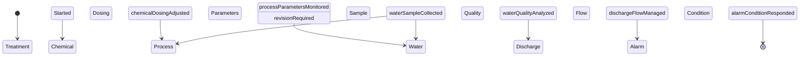
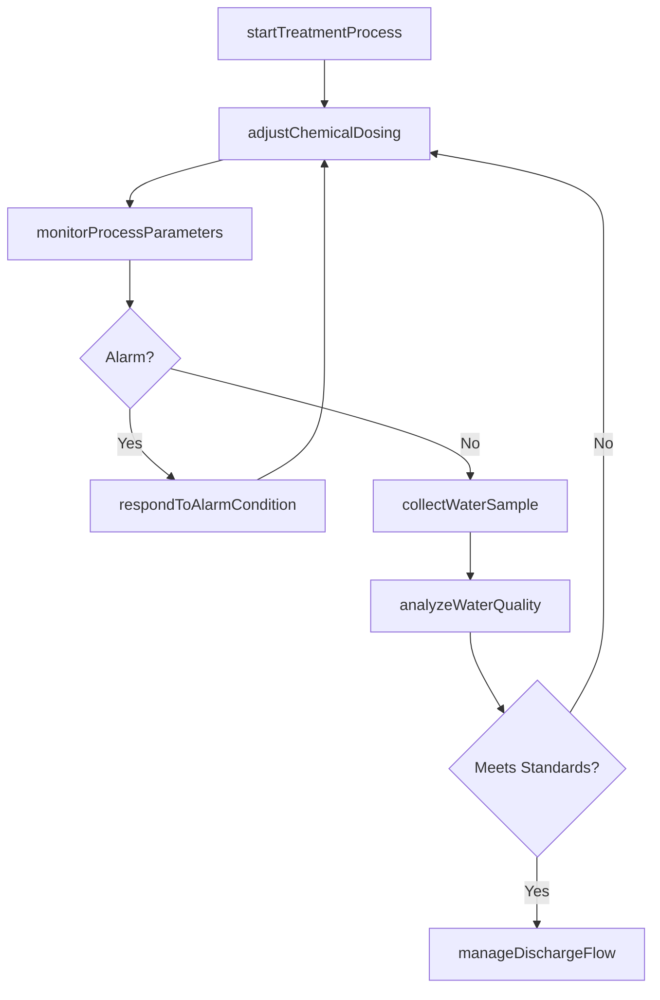
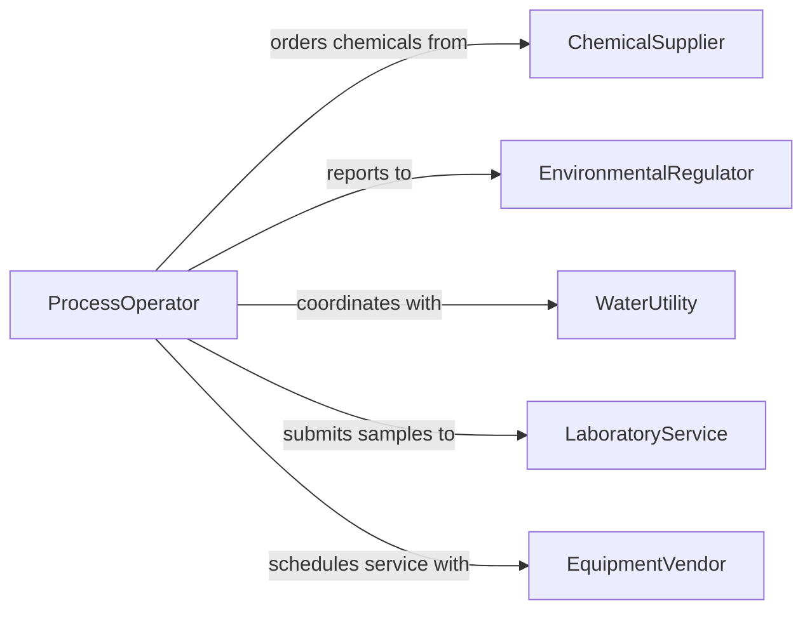

# Operate Chemical Processing Water Treatment

> Business-as-Code definition for chemical processing and water treatment equipment operation. Models the complete process control workflow from system startup through chemical dosing, reaction monitoring, quality testing, and effluent management.

## Overview

Operating chemical processing or water treatment systems involves controlling reactors, distillation columns, filtration units, clarifiers, chlorination systems, and reverse osmosis equipment to transform raw materials or purify water. This includes managing chemical feeds, monitoring pH and turbidity, controlling reaction parameters, and ensuring discharge meets environmental standards. The definition covers industrial chemical plants, municipal water treatment facilities, and wastewater processing operations.

## Actors

| Actor | Description |
|-------|-------------|
| ChemicalSupplier | Provides reagents, treatment chemicals, and processing additives |
| EnvironmentalRegulator | Enforces discharge limits, emissions standards, and permits |
| WaterUtility | Receives treated water or sends raw water for processing |
| LaboratoryService | Performs independent water quality and chemical analysis |
| EquipmentVendor | Supplies pumps, filters, reactors, and instrumentation |
| CommunityStakeholder | Affected by water quality and facility operations |

## Roles

| Role | Description |
|------|-------------|
| ProcessOperator | Controls chemical feeds, valves, and equipment during shifts |
| WaterTreatmentSpecialist | Manages treatment protocols and dosing schedules |
| LabTechnician | Conducts on-site water quality tests and sampling |
| PlantEngineer | Designs and optimizes process flows and equipment configurations |
| ComplianceOfficer | Ensures operations meet regulatory discharge and safety requirements |

## Entities

| Entity | Description |
|--------|-------------|
| TreatmentProcess | A configured sequence of chemical or physical treatment steps |
| ChemicalDose | A measured quantity of reagent added to the process stream |
| WaterSample | A collected specimen for quality analysis |
| ProcessParameter | A measurable value such as pH, turbidity, or dissolved oxygen |
| DischargeRecord | Documentation of treated effluent quality and volume |
| AlarmCondition | A threshold exceedance triggering operator intervention |

## Actions

| Action | Description |
|--------|-------------|
| startTreatmentProcess | Initialize and bring treatment systems online |
| adjustChemicalDosing | Modify reagent feed rates based on process conditions |
| monitorProcessParameters | Track pH, turbidity, flow, and other critical measurements |
| collectWaterSample | Take a sample from the process stream for testing |
| analyzeWaterQuality | Test sample properties against regulatory and process standards |
| manageDischargeFlow | Control the release of treated water or effluent |
| respondToAlarmCondition | Take corrective action when parameters exceed thresholds |

## Events

| Event | Description |
|-------|-------------|
| treatmentProcessStarted | Treatment systems have been initialized and are operational |
| chemicalDosingAdjusted | Reagent feed rates have been modified |
| processParametersMonitored | Critical measurements have been captured and reviewed |
| waterSampleCollected | A process sample has been taken for analysis |
| waterQualityAnalyzed | Sample test results have been completed and recorded |
| dischargeFlowManaged | Treated effluent release has been controlled and documented |
| alarmConditionResponded | Corrective action has been taken for a threshold exceedance |

## Searches

| Search | Description |
|--------|-------------|
| findTreatmentProcesses | Retrieve processes by facility, type, or operational status |
| getProcessParameters | Query real-time or historical parameter readings |
| getWaterQualityResults | Fetch lab analysis results by sample, parameter, or date |
| getDischargeRecords | Look up effluent quality and volume records by period |
| findAlarmHistory | Search past alarm events by type, severity, or equipment |


## Entity Relationships



## State Diagram



## Workflow



## Actor Relationships



## Usage

### Calling Actions

```typescript
import { operateChemicalProcessingWaterTreatment } from '@headlessly/operate-chemical-processing-water-treatment'

const treatment = operateChemicalProcessingWaterTreatment()

// Start the treatment process
const process = await treatment.startTreatmentProcess({
  facilityId: 'WTP-CENTRAL',
  processType: 'municipal-potable',
  flowRate: 5000
})

// Adjust chemical dosing
await treatment.adjustChemicalDosing({
  processId: process.id,
  chemical: 'sodium-hypochlorite',
  doseRate: 2.5,
  unit: 'mg/L'
})

// Collect and analyze a sample
const sample = await treatment.collectWaterSample({
  processId: process.id,
  location: 'post-filtration',
  parameters: ['pH', 'turbidity', 'chlorine-residual']
})

const results = await treatment.analyzeWaterQuality({
  sampleId: sample.id
})
```

### Event-Driven Automation

```typescript
// Auto-adjust dosing on parameter drift
treatment.processParametersMonitored(async ({ processId, pH, turbidity }) => {
  if (pH < 6.5 || pH > 8.5) {
    await treatment.adjustChemicalDosing({
      processId,
      chemical: 'sodium-hydroxide',
      adjustment: pH < 6.5 ? 'increase' : 'decrease'
    })
  }
})

// Alert compliance officer on discharge exceedance
treatment.waterQualityAnalyzed(async ({ sampleId, results }) => {
  const violations = results.filter(r => r.value > r.limit)
  if (violations.length > 0) {
    await notify({
      to: 'compliance-officer',
      message: `Discharge limit exceeded: ${violations.map(v => v.parameter).join(', ')}`
    })
  }
})
```
