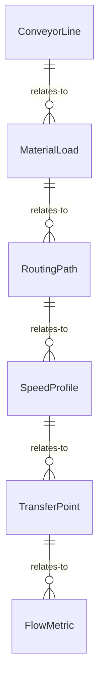
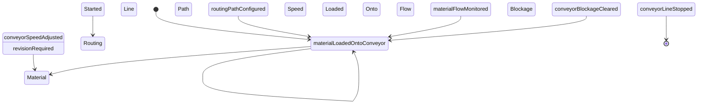
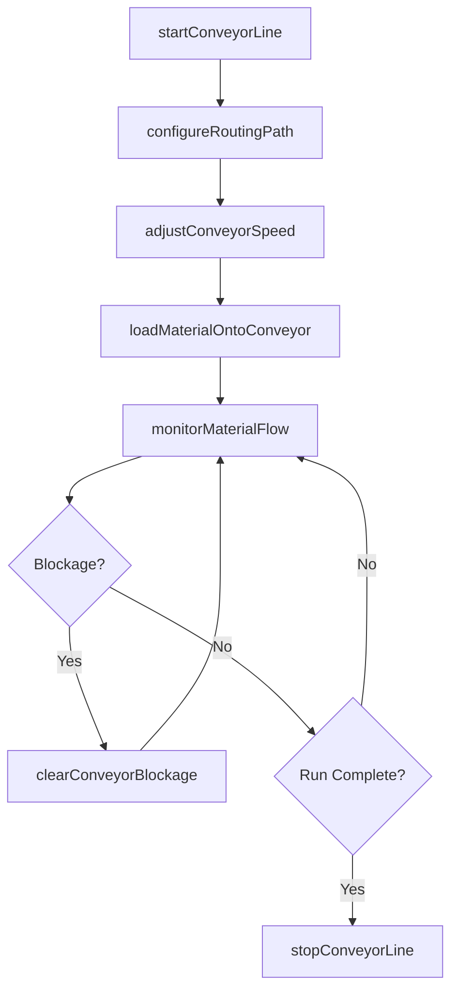
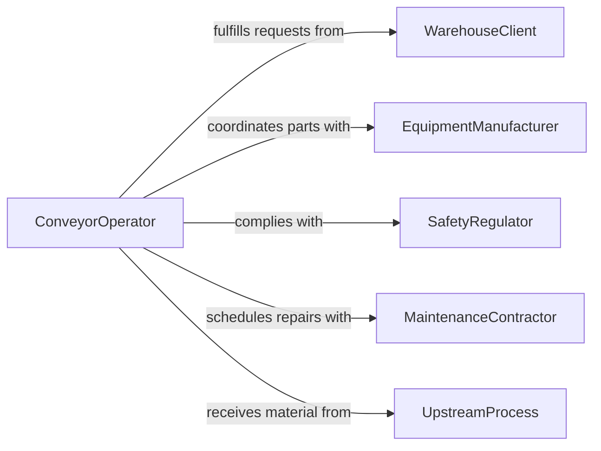

# Operate Conveyors Industrial Material Moving

> Business-as-Code definition for conveyor and industrial material moving equipment operation. Models the complete material handling workflow from system configuration through routing, load management, and throughput monitoring.

## Overview

Operating conveyors or other industrial material moving equipment involves controlling belt conveyors, roller systems, pneumatic tubes, bucket elevators, and automated guided vehicles to transport materials within a facility. This includes configuring speed and routing, loading and unloading stations, monitoring material flow, and managing jams or blockages. The definition covers both continuous and batch material handling operations across manufacturing and distribution environments.

## Actors

| Actor | Description |
|-------|-------------|
| WarehouseClient | Requests material movement between facility zones |
| EquipmentManufacturer | Provides conveyor systems and replacement components |
| SafetyRegulator | Enforces safety standards for material handling equipment |
| MaintenanceContractor | Performs specialized conveyor repairs and installations |
| UpstreamProcess | Feeds materials onto the conveyor from preceding production stages |

## Roles

| Role | Description |
|------|-------------|
| ConveyorOperator | Starts, stops, and adjusts conveyor systems during shifts |
| MaterialHandler | Loads and unloads materials at conveyor stations |
| SystemsEngineer | Designs and optimizes conveyor routing and speed profiles |
| ShiftLeader | Coordinates material flow across multiple conveyor lines |

## Entities

| Entity | Description |
|--------|-------------|
| ConveyorLine | A specific conveyor belt or roller system segment |
| MaterialLoad | A batch or unit of material being transported |
| RoutingPath | The configured route materials follow through the facility |
| SpeedProfile | Belt or roller speed settings for a conveyor segment |
| TransferPoint | A junction where material moves between conveyor lines |
| FlowMetric | Throughput, speed, and utilization data for a conveyor |

## Actions

| Action | Description |
|--------|-------------|
| startConveyorLine | Activate a conveyor segment or system |
| configureRoutingPath | Set the material flow route through conveyor segments |
| adjustConveyorSpeed | Modify belt or roller speed for a conveyor line |
| loadMaterialOntoConveyor | Place materials at the infeed station |
| monitorMaterialFlow | Track throughput and detect jams or blockages |
| clearConveyorBlockage | Resolve a jam or obstruction on the conveyor |
| stopConveyorLine | Deactivate a conveyor segment safely |

## Events

| Event | Description |
|-------|-------------|
| conveyorLineStarted | A conveyor segment has been activated |
| routingPathConfigured | Material flow route has been set |
| conveyorSpeedAdjusted | Belt or roller speed has been changed |
| materialLoadedOntoConveyor | Materials have been placed at the infeed |
| materialFlowMonitored | Throughput data has been captured and reviewed |
| conveyorBlockageCleared | A jam or obstruction has been resolved |
| conveyorLineStopped | A conveyor segment has been safely deactivated |

## Searches

| Search | Description |
|--------|-------------|
| findConveyorLines | Retrieve conveyor segments by zone, status, or capacity |
| getMaterialLoads | Query material batches by location, destination, or type |
| getFlowMetrics | Fetch throughput and utilization data for conveyor lines |
| findBlockageHistory | Look up past blockage events by conveyor and time period |


## Entity Relationships



## State Diagram



## Workflow



## Actor Relationships



## Usage

### Calling Actions

```typescript
import { operateConveyorsIndustrialMaterialMoving } from '@headlessly/operate-conveyors-industrial-material-moving'

const conveyors = operateConveyorsIndustrialMaterialMoving()

// Start a conveyor line for the shift
const line = await conveyors.startConveyorLine({
  lineId: 'BELT-A3',
  zone: 'Packaging'
})

// Configure routing and speed
await conveyors.configureRoutingPath({
  lineId: line.id,
  route: ['BELT-A3', 'TRANSFER-01', 'BELT-B2']
})

await conveyors.adjustConveyorSpeed({
  lineId: line.id,
  speedMetersPerMinute: 15.0
})

// Monitor flow during operation
const metrics = await conveyors.monitorMaterialFlow({
  lineId: line.id,
  interval: 'realtime'
})
```

### Event-Driven Automation

```typescript
// Alert on blockage detection
conveyors.materialFlowMonitored(async ({ lineId, throughput, expectedThroughput }) => {
  if (throughput < expectedThroughput * 0.5) {
    await notify({
      to: 'conveyor-operators',
      message: `Possible blockage on ${lineId} - throughput at ${throughput} units/min`
    })
  }
})

// Log production metrics when line stops
conveyors.conveyorLineStopped(async ({ lineId, totalUnits, runDuration }) => {
  await logProduction({
    lineId,
    units: totalUnits,
    duration: runDuration,
    efficiency: totalUnits / runDuration
  })
})
```
