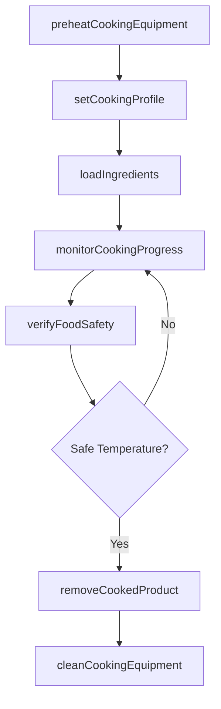
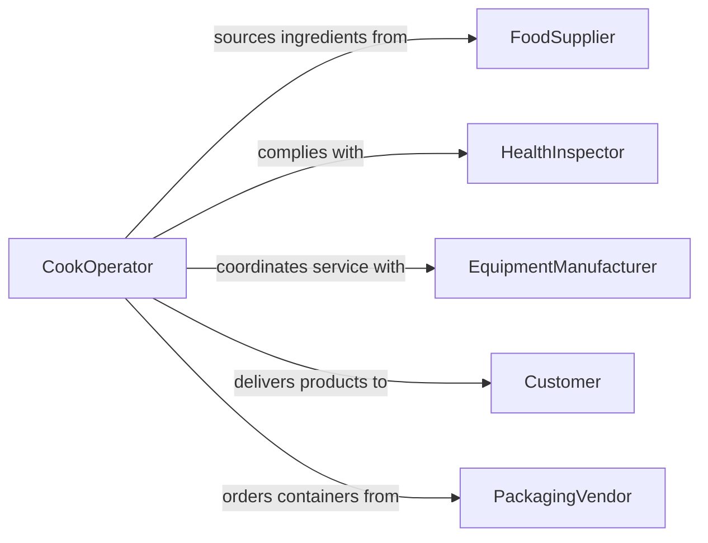

# Operate Cooking Baking Food Preparation

> Business-as-Code definition for cooking, baking, and food preparation equipment operation. Models the complete food production workflow from recipe setup through cooking execution, temperature monitoring, and output quality verification.

## Overview

Operating cooking, baking, or other food preparation equipment involves controlling commercial ovens, fryers, grills, steamers, mixers, and automated cooking lines to produce food products at scale. This includes programming cook times and temperatures, loading ingredients, monitoring doneness, and ensuring food safety compliance throughout the cooking process. The definition covers both commercial kitchen and food manufacturing environments.

## Actors

| Actor | Description |
|-------|-------------|
| FoodSupplier | Provides ingredients, raw materials, and food commodities |
| HealthInspector | Audits food preparation operations for safety compliance |
| EquipmentManufacturer | Supplies and services commercial cooking equipment |
| Customer | Receives finished food products or prepared meals |
| PackagingVendor | Provides food-safe containers and packaging materials |

## Roles

| Role | Description |
|------|-------------|
| CookOperator | Runs cooking and baking equipment during production |
| HeadChef | Develops recipes and oversees cooking parameters |
| FoodSafetyOfficer | Monitors temperature logs and sanitation compliance |
| ProductionScheduler | Coordinates cooking batch timing and equipment availability |
| QualityTaster | Evaluates finished products for taste, texture, and appearance |

## Entities

| Entity | Description |
|--------|-------------|
| CookingBatch | A group of food items processed together in a single cycle |
| Recipe | Defined ingredients, quantities, and cooking parameters |
| CookingProfile | Temperature, time, and humidity settings for a cooking cycle |
| TemperatureLog | A time-series record of cooking temperatures |
| FoodProduct | The finished output of a cooking or baking cycle |
| SanitationRecord | Documentation of cleaning and hygiene procedures |

## Actions

| Action | Description |
|--------|-------------|
| preheatCookingEquipment | Bring ovens, grills, or fryers to target temperature |
| loadIngredients | Place prepared ingredients into cooking equipment |
| setCookingProfile | Configure temperature, time, and humidity parameters |
| monitorCookingProgress | Track internal temperatures and visual doneness indicators |
| verifyFoodSafety | Check that product has reached safe internal temperature |
| removeCookedProduct | Extract finished food from the cooking equipment |
| cleanCookingEquipment | Sanitize equipment after each cooking cycle |

## Events

| Event | Description |
|-------|-------------|
| cookingEquipmentPreheated | Equipment has reached the target operating temperature |
| ingredientsLoaded | Prepared ingredients have been placed in the equipment |
| cookingProfileSet | Temperature and timing parameters have been configured |
| cookingProgressMonitored | Doneness and temperature data have been reviewed |
| foodSafetyVerified | Product has met required internal temperature thresholds |
| cookedProductRemoved | Finished food has been extracted from equipment |
| cookingEquipmentCleaned | Equipment has been sanitized and readied for next cycle |

## Searches

| Search | Description |
|--------|-------------|
| findCookingBatches | Retrieve batches by product type, date, or equipment |
| getRecipes | Look up recipes by product name, cuisine, or ingredient |
| getTemperatureLogs | Query temperature history by batch or equipment |
| getSanitationRecords | Fetch cleaning records by equipment or date range |

## Workflow



## Actor Relationships



## Usage

### Calling Actions

```typescript
import { operateCookingBakingFoodPreparation } from '@headlessly/operate-cooking-baking-food-preparation'

const cooking = operateCookingBakingFoodPreparation()

// Preheat the commercial oven
const session = await cooking.preheatCookingEquipment({
  equipmentId: 'OVEN-DECK-04',
  targetTemperature: 220,
  mode: 'convection'
})

// Set profile and load
await cooking.setCookingProfile({
  sessionId: session.id,
  recipe: 'sourdough-loaf',
  temperature: 220,
  duration: 35,
  steamInjection: true
})

await cooking.loadIngredients({
  sessionId: session.id,
  batchSize: 48,
  product: 'Sourdough Loaf'
})

// Verify safety and remove
const check = await cooking.verifyFoodSafety({
  sessionId: session.id,
  targetInternalTemp: 96
})
```

### Event-Driven Automation

```typescript
// Alert on temperature deviation during cooking
cooking.cookingProgressMonitored(async ({ sessionId, currentTemp, targetTemp }) => {
  const deviation = Math.abs(currentTemp - targetTemp)
  if (deviation > 15) {
    await notify({
      to: 'kitchen-staff',
      message: `Temperature deviation of ${deviation}C in session ${sessionId}`
    })
  }
})

// Auto-schedule cleaning after product removal
cooking.cookedProductRemoved(async ({ sessionId, equipmentId }) => {
  await cooking.cleanCookingEquipment({ equipmentId })
  await logProduction({ sessionId, completedAt: new Date() })
})
```
