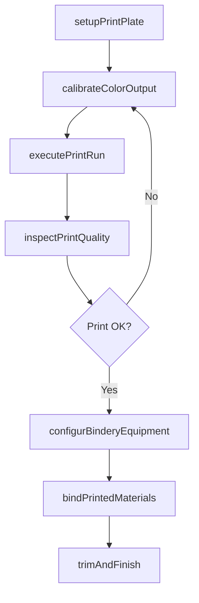
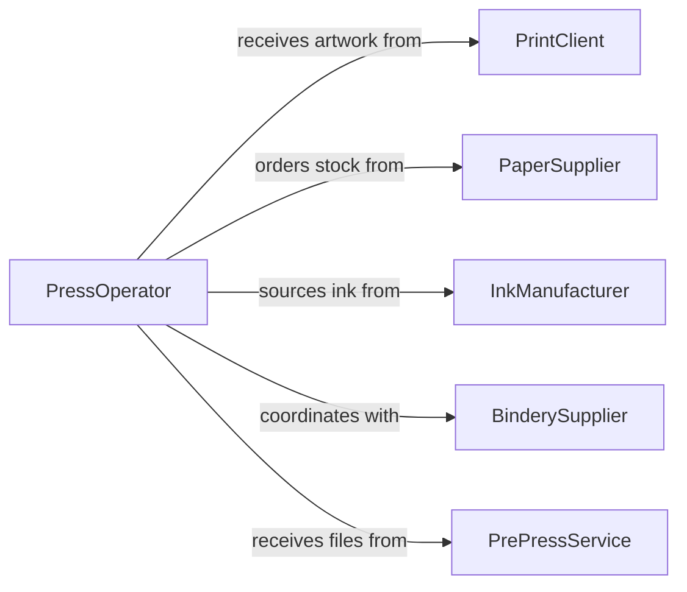

# Operate Equipment Print Images Bind

> Business-as-Code definition for printing and binding equipment operation. Models the complete print production workflow from file preparation through press operation, binding, and finished product inspection.

## Overview

Operating equipment to print images or bind printed images together involves running offset presses, digital printers, screen printing machines, and bindery equipment such as perfect binders, saddle stitchers, and laminating systems. This includes setting up print plates or digital files, calibrating color output, managing paper feeds, and assembling printed materials into finished publications or products. The definition covers commercial printing and finishing operations.

## Actors

| Actor | Description |
|-------|-------------|
| PrintClient | Submits artwork and specifications for printed materials |
| PaperSupplier | Provides paper stock, card stock, and specialty substrates |
| InkManufacturer | Supplies inks, toners, and specialty printing consumables |
| BinderySupplier | Provides binding materials such as adhesives, covers, and thread |
| PrePressService | Delivers print-ready files, plates, and color proofs |

## Roles

| Role | Description |
|------|-------------|
| PressOperator | Runs printing presses and manages ink and registration |
| BinderyOperator | Operates folding, stitching, and binding equipment |
| ColorTechnician | Calibrates color output and matches proofs |
| ProductionManager | Schedules print and binding jobs and manages deadlines |
| QualityReviewer | Inspects printed and bound products for accuracy and defects |

## Entities

| Entity | Description |
|--------|-------------|
| PrintJob | A customer order specifying artwork, quantity, and finish |
| PrintPlate | A physical or digital template used to transfer images |
| PressSheet | A single sheet as it passes through the printing press |
| BindingOrder | A specification for assembling printed sheets into products |
| ColorProfile | Ink density and registration settings for accurate reproduction |
| FinishedProduct | A completed printed and bound item ready for delivery |

## Actions

| Action | Description |
|--------|-------------|
| setupPrintPlate | Mount plates or load digital files into the press |
| calibrateColorOutput | Adjust ink density and registration for color accuracy |
| executePrintRun | Run the press to produce printed sheets |
| configurBinderyEquipment | Set up folding, stitching, or binding machines |
| bindPrintedMaterials | Assemble printed sheets into finished publications |
| inspectPrintQuality | Check registration, color accuracy, and print defects |
| trimAndFinish | Cut, laminate, or apply final finishing to products |

## Events

| Event | Description |
|-------|-------------|
| printPlateSetup | Plates or digital files have been loaded into the press |
| colorOutputCalibrated | Ink and registration settings have been verified |
| printRunCompleted | A batch of sheets has been printed successfully |
| binderyEquipmentConfigured | Binding equipment has been set up for the job |
| printedMaterialsBound | Printed sheets have been assembled into finished form |
| printQualityInspected | Output has been checked for defects and accuracy |
| productTrimmedAndFinished | Final cutting and finishing has been completed |

## Searches

| Search | Description |
|--------|-------------|
| findPrintJobs | Retrieve jobs by client, due date, or press type |
| getColorProfiles | Look up color settings by ink system or substrate |
| findBindingOrders | Query binding jobs by type, status, or production date |
| getProductionMetrics | Fetch press run counts, waste rates, and throughput data |

## Workflow



## Actor Relationships



## Usage

### Calling Actions

```typescript
import { operateEquipmentPrintImagesBind } from '@headlessly/operate-equipment-print-images-bind'

const printing = operateEquipmentPrintImagesBind()

// Set up the press for a job
const setup = await printing.setupPrintPlate({
  pressId: 'OFFSET-4C-01',
  jobId: 'PJ-3350',
  plates: ['cyan', 'magenta', 'yellow', 'black']
})

// Calibrate color and run
await printing.calibrateColorOutput({
  jobId: setup.jobId,
  targetDensity: { cyan: 1.40, magenta: 1.50, yellow: 1.05, black: 1.70 }
})

const run = await printing.executePrintRun({
  jobId: setup.jobId,
  quantity: 5000,
  substrate: 'Coated-100gsm'
})

// Bind into booklets
await printing.bindPrintedMaterials({
  jobId: setup.jobId,
  bindingType: 'saddle-stitch',
  pageCount: 32
})
```

### Event-Driven Automation

```typescript
// Auto-configure bindery after print run
printing.printRunCompleted(async ({ jobId, sheetsProduced }) => {
  const job = await printing.findPrintJobs({ jobId })
  if (job.bindingRequired) {
    await printing.configurBinderyEquipment({
      jobId,
      bindingType: job.bindingType
    })
  }
})

// Alert on color drift during production
printing.colorOutputCalibrated(async ({ jobId, deviation }) => {
  if (deviation > 0.1) {
    await notify({
      to: 'press-room',
      message: `Color deviation of ${deviation} on job ${jobId} - recalibration needed`
    })
  }
})
```
