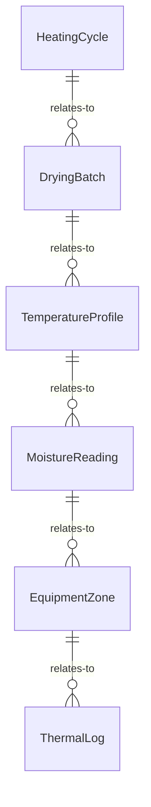
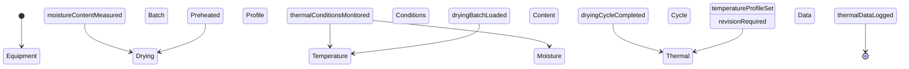
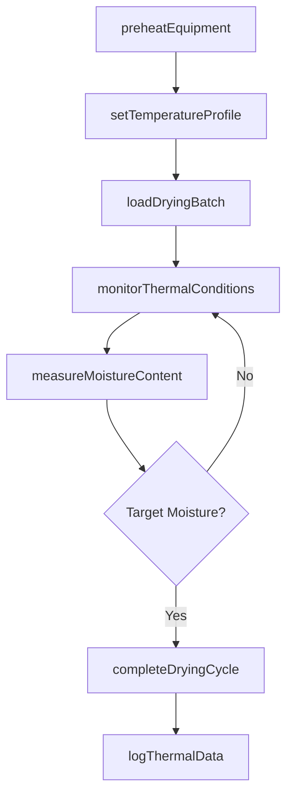
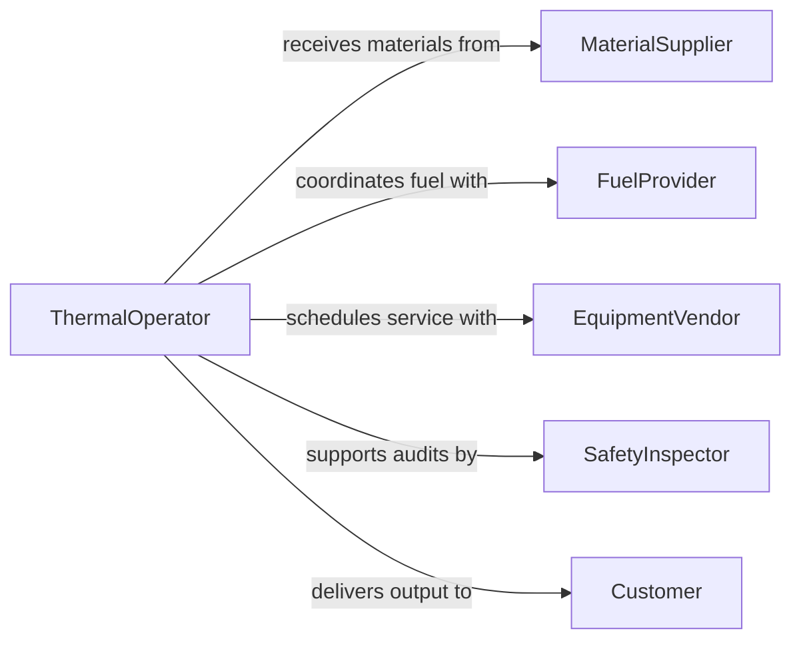

# Operate Heating Drying Equipment

> Business-as-Code definition for heating and drying equipment operation. Models the complete thermal processing workflow from equipment setup through temperature control, material drying, and output verification.

## Overview

Operating heating or drying equipment involves managing furnaces, ovens, kilns, dryers, and dehydrators used across manufacturing, food processing, and materials treatment. This includes preheating systems, loading materials, controlling temperature profiles and airflow, monitoring moisture content, and ensuring uniform heat distribution. The definition covers batch and continuous thermal processing operations.

## Actors

| Actor | Description |
|-------|-------------|
| MaterialSupplier | Provides raw materials requiring thermal processing |
| FuelProvider | Supplies gas, electricity, or fuel for heating systems |
| EquipmentVendor | Provides and services heating and drying machinery |
| SafetyInspector | Audits thermal equipment for compliance with safety codes |
| Customer | Receives thermally processed materials or products |

## Roles

| Role | Description |
|------|-------------|
| ThermalOperator | Runs heating and drying equipment and monitors conditions |
| ProcessEngineer | Designs temperature profiles and drying schedules |
| MaintenanceTechnician | Performs preventive and corrective equipment maintenance |
| QualityController | Verifies moisture content and material properties post-processing |

## Entities

| Entity | Description |
|--------|-------------|
| HeatingCycle | A defined temperature and time profile for a processing run |
| DryingBatch | A group of materials loaded for drying in a single session |
| TemperatureProfile | Setpoints and ramp rates for a heating process |
| MoistureReading | A measurement of water content in the processed material |
| EquipmentZone | A section of the dryer or oven with independent temperature control |
| ThermalLog | A recorded history of temperatures during a processing run |

## Actions

| Action | Description |
|--------|-------------|
| preheatEquipment | Bring heating system to the target operating temperature |
| loadDryingBatch | Place materials into the oven, kiln, or dryer |
| setTemperatureProfile | Configure temperature setpoints and ramp rates |
| monitorThermalConditions | Track temperature, humidity, and airflow in real time |
| measureMoistureContent | Test material samples for remaining water content |
| completeDryingCycle | Conclude the heating process and begin cooldown |
| logThermalData | Record temperature and process data for the run |

## Events

| Event | Description |
|-------|-------------|
| equipmentPreheated | Heating system has reached operating temperature |
| dryingBatchLoaded | Materials have been placed in the thermal equipment |
| temperatureProfileSet | Heating parameters have been configured |
| thermalConditionsMonitored | Real-time conditions have been checked and recorded |
| moistureContentMeasured | Water content of processed material has been tested |
| dryingCycleCompleted | The heating process has finished and cooldown initiated |
| thermalDataLogged | Temperature and process records have been saved |

## Searches

| Search | Description |
|--------|-------------|
| findDryingBatches | Retrieve batches by material type, date, or status |
| getTemperatureProfiles | Look up profiles by product type or equipment |
| getMoistureReadings | Query moisture test results by batch or material |
| getThermalLogs | Fetch historical temperature data for a specific run |


## Entity Relationships



## State Diagram



## Workflow



## Actor Relationships



## Usage

### Calling Actions

```typescript
import { operateHeatingDryingEquipment } from '@headlessly/operate-heating-drying-equipment'

const thermal = operateHeatingDryingEquipment()

// Preheat the kiln
const session = await thermal.preheatEquipment({
  equipmentId: 'KILN-03',
  targetTemperature: 850,
  rampRate: 5.0
})

// Load materials and set profile
await thermal.loadDryingBatch({
  sessionId: session.id,
  material: 'Ceramic Greenware',
  quantity: 200
})

await thermal.setTemperatureProfile({
  sessionId: session.id,
  stages: [
    { temperature: 200, duration: 60 },
    { temperature: 850, duration: 240 },
    { temperature: 500, duration: 120 }
  ]
})

// Check moisture after processing
const reading = await thermal.measureMoistureContent({
  sessionId: session.id,
  sampleCount: 5
})
```

### Event-Driven Automation

```typescript
// Alert on temperature deviation
thermal.thermalConditionsMonitored(async ({ sessionId, zone, temperature, setpoint }) => {
  const deviation = Math.abs(temperature - setpoint)
  if (deviation > 10) {
    await notify({
      to: 'thermal-operators',
      message: `Zone ${zone} deviating ${deviation}C from setpoint in session ${sessionId}`
    })
  }
})

// Auto-log when cycle completes
thermal.dryingCycleCompleted(async ({ sessionId, batchId }) => {
  await thermal.logThermalData({ sessionId })
  await updateBatchStatus({ batchId, status: 'dried' })
})
```
