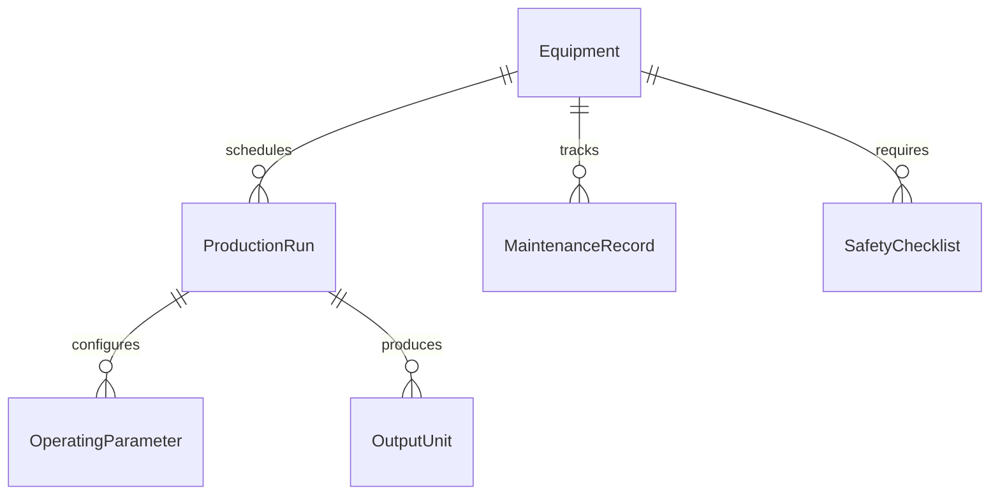
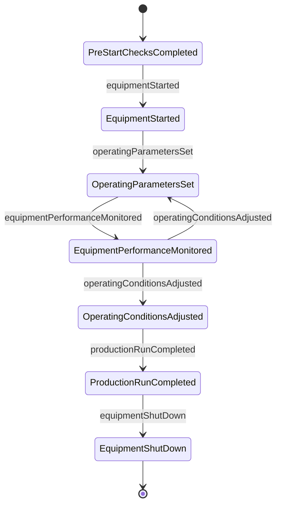
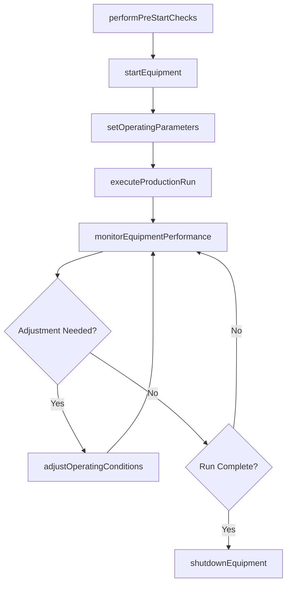
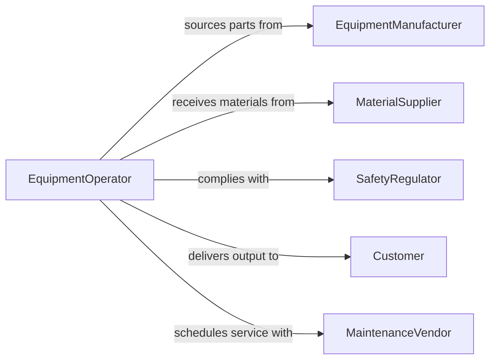

# Operate Industrial Equipment

> Business-as-Code definition for general industrial equipment operation. Models the complete operational lifecycle from equipment startup through production runs, monitoring, and shutdown across diverse manufacturing contexts.

## Overview

Operating industrial equipment encompasses running a broad range of machinery used in manufacturing, processing, and production environments. This includes compressors, pumps, generators, CNC machines, lathes, and specialized production apparatus. The definition covers equipment startup procedures, operational monitoring, parameter adjustments during production, safety protocol adherence, and orderly shutdown sequences applicable across industrial settings.

## Actors

| Actor | Description |
|-------|-------------|
| EquipmentManufacturer | Provides machinery, spare parts, and technical documentation |
| MaterialSupplier | Delivers raw materials and consumables for production |
| SafetyRegulator | Enforces workplace safety and equipment operation standards |
| Customer | Receives products or services produced by the equipment |
| MaintenanceVendor | Provides specialized repair and calibration services |
| UtilityProvider | Supplies power, compressed air, water, and other utilities |

## Roles

| Role | Description |
|------|-------------|
| EquipmentOperator | Runs machinery according to standard operating procedures |
| ProductionSupervisor | Oversees equipment scheduling and production targets |
| MaintenanceTechnician | Performs routine maintenance and troubleshoots equipment issues |
| SafetyOfficer | Ensures compliance with lockout-tagout and safety protocols |

## Entities

| Entity | Description |
|--------|-------------|
| Equipment | A specific machine or system used in production |
| ProductionRun | A scheduled period of equipment operation for a specific job |
| OperatingParameter | A measurable setting such as speed, pressure, or temperature |
| MaintenanceRecord | A log of servicing, repairs, and inspections performed |
| SafetyChecklist | Pre-operation and post-operation safety verification items |
| OutputUnit | A product or material produced during the production run |

## Actions

| Action | Description |
|--------|-------------|
| performPreStartChecks | Execute safety and readiness inspections before startup |
| startEquipment | Power on and bring equipment to operating conditions |
| setOperatingParameters | Configure speed, feed, temperature, or pressure settings |
| monitorEquipmentPerformance | Track output quality, vibration, temperature, and throughput |
| adjustOperatingConditions | Modify parameters in response to performance data |
| executeProductionRun | Run the equipment for a scheduled production cycle |
| shutdownEquipment | Safely power down and secure the equipment |

## Events

| Event | Description |
|-------|-------------|
| preStartChecksCompleted | Safety and readiness inspections have been verified |
| equipmentStarted | Equipment has been powered on and reached operating state |
| operatingParametersSet | Production parameters have been configured |
| equipmentPerformanceMonitored | Performance data has been captured and reviewed |
| operatingConditionsAdjusted | Parameters have been modified based on monitoring data |
| productionRunCompleted | A scheduled production cycle has finished |
| equipmentShutDown | Equipment has been safely powered off and secured |

## Searches

| Search | Description |
|--------|-------------|
| findEquipment | Retrieve equipment by type, zone, or operational status |
| getProductionRuns | Query runs by equipment, date range, or output volume |
| getOperatingParameters | Look up current or historical parameter settings |
| getMaintenanceRecords | Fetch servicing history for specific equipment |
| getPerformanceMetrics | Retrieve uptime, throughput, and efficiency data |


## Entity Relationships



## State Diagram



## Workflow



## Actor Relationships



## Usage

### Calling Actions

```typescript
import { operateIndustrialEquipment } from '@headlessly/operate-industrial-equipment'

const equipment = operateIndustrialEquipment()

// Perform safety checks and start
await equipment.performPreStartChecks({
  equipmentId: 'CNC-LATHE-12',
  checklist: 'standard-pre-start'
})

const session = await equipment.startEquipment({
  equipmentId: 'CNC-LATHE-12',
  warmupDuration: 300
})

// Configure and execute production
await equipment.setOperatingParameters({
  sessionId: session.id,
  spindleSpeed: 2400,
  feedRate: 0.15,
  coolantFlow: 'high'
})

const run = await equipment.executeProductionRun({
  sessionId: session.id,
  jobId: 'JOB-7820',
  targetQuantity: 150
})
```

### Event-Driven Automation

```typescript
// Monitor for abnormal conditions
equipment.equipmentPerformanceMonitored(async ({ sessionId, vibration, temperature }) => {
  if (vibration > 8.0 || temperature > 95) {
    await notify({
      to: 'maintenance-team',
      message: `Equipment anomaly in session ${sessionId}: vibration=${vibration}mm/s, temp=${temperature}C`
    })
  }
})

// Auto-log maintenance after shutdown
equipment.equipmentShutDown(async ({ equipmentId, runHours }) => {
  if (runHours > 500) {
    await scheduleMaintenanceReview({ equipmentId, reason: 'run-hour-threshold' })
  }
})
```
