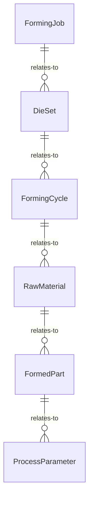
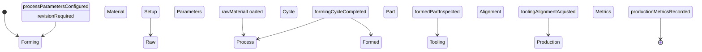
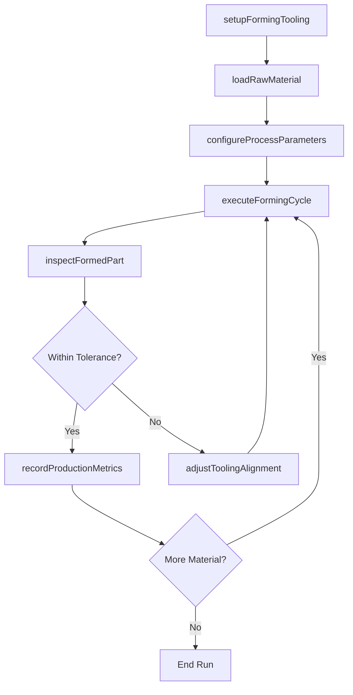
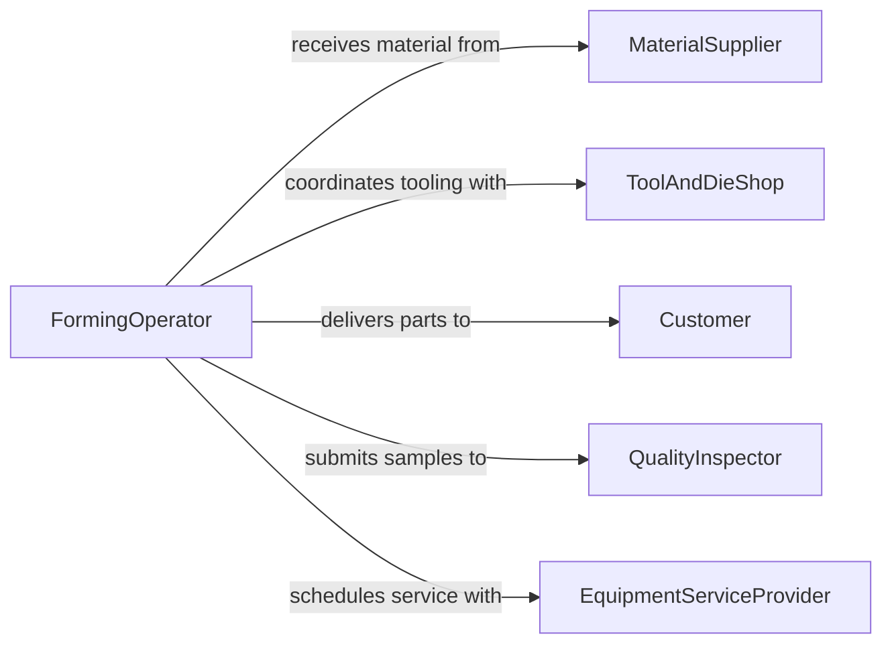

# Operate Metal Plastic Forming Equipment

> Business-as-Code definition for metal and plastic forming equipment operation. Models the complete forming process from material preparation through die setup, forming cycles, and finished part inspection.

## Overview

Operating metal or plastic forming equipment involves controlling presses, stamping machines, injection molders, extruders, and other forming apparatus to shape raw materials into finished components. This includes configuring die sets, managing temperature and pressure parameters, monitoring cycle times, and verifying dimensional accuracy of formed parts. The definition covers the full spectrum of forming operations across manufacturing environments.

## Actors

| Actor | Description |
|-------|-------------|
| MaterialSupplier | Provides metal stock, plastic pellets, and raw forming materials |
| ToolAndDieShop | Fabricates and repairs dies, molds, and tooling |
| Customer | Specifies part requirements and receives finished components |
| QualityInspector | Independently verifies part dimensions and tolerances |
| EquipmentServiceProvider | Maintains and repairs forming machinery |
| RegulatoryAgency | Enforces safety and environmental standards for forming operations |

## Roles

| Role | Description |
|------|-------------|
| FormingOperator | Runs the forming equipment and monitors cycle parameters |
| ToolSetter | Installs and aligns dies, molds, and tooling |
| ProcessEngineer | Develops and optimizes forming process parameters |
| ShiftSupervisor | Oversees production scheduling and operator assignments |
| QualityTechnician | Performs in-process dimensional checks on formed parts |

## Entities

| Entity | Description |
|--------|-------------|
| FormingJob | A production order specifying parts to be formed |
| DieSet | The tooling assembly used to shape material |
| FormingCycle | A single press stroke or injection cycle with parameters |
| RawMaterial | Metal blanks, coils, or plastic pellets to be formed |
| FormedPart | A finished component after the forming operation |
| ProcessParameter | Temperature, pressure, speed, or timing configuration |

## Actions

| Action | Description |
|--------|-------------|
| setupFormingTooling | Install and align dies or molds in the equipment |
| loadRawMaterial | Feed metal stock or plastic material into the machine |
| configureProcessParameters | Set temperature, pressure, speed, and timing values |
| executeFormingCycle | Run the press, molder, or extruder to shape material |
| inspectFormedPart | Measure and verify dimensions of the output part |
| adjustToolingAlignment | Fine-tune die or mold positioning based on output quality |
| recordProductionMetrics | Log cycle counts, reject rates, and throughput data |

## Events

| Event | Description |
|-------|-------------|
| formingToolingSetup | Dies or molds have been installed and aligned |
| rawMaterialLoaded | Material has been fed into the forming equipment |
| processParametersConfigured | Operating parameters have been set for the run |
| formingCycleCompleted | A forming cycle has produced an output part |
| formedPartInspected | A part has been dimensionally verified |
| toolingAlignmentAdjusted | Die or mold positioning has been corrected |
| productionMetricsRecorded | Run statistics have been logged to the system |

## Searches

| Search | Description |
|--------|-------------|
| findFormingJobs | Retrieve jobs by part number, customer, or schedule date |
| getProcessParameters | Look up configured parameters by die set or material type |
| findFormedParts | Query parts by dimension, quality status, or production batch |
| getToolingHistory | Retrieve maintenance and usage records for die sets |
| getProductionMetrics | Fetch cycle counts, uptime, and reject rates for equipment |


## Entity Relationships



## State Diagram



## Workflow



## Actor Relationships



## Usage

### Calling Actions

```typescript
import { operateMetalPlasticFormingEquipment } from '@headlessly/operate-metal-plastic-forming-equipment'

const forming = operateMetalPlasticFormingEquipment()

// Set up tooling for a stamping run
const setup = await forming.setupFormingTooling({
  dieSetId: 'DS-4520',
  equipmentId: 'PRESS-07',
  material: 'Steel-1018',
  thickness: 2.0
})

// Configure process parameters
await forming.configureProcessParameters({
  jobId: setup.jobId,
  tonnage: 250,
  strokeRate: 30,
  shutHeight: 450.5
})

// Execute forming cycles
const result = await forming.executeFormingCycle({
  jobId: setup.jobId,
  quantity: 500
})
```

### Event-Driven Automation

```typescript
// Trigger inspection on cycle completion
forming.formingCycleCompleted(async ({ jobId, partId, cycleNumber }) => {
  if (cycleNumber % 50 === 0) {
    await forming.inspectFormedPart({ jobId, partId })
  }
})

// Alert on tooling adjustment
forming.toolingAlignmentAdjusted(async ({ dieSetId, adjustmentType }) => {
  await notify({
    to: 'process-engineering',
    message: `Tooling ${dieSetId} required ${adjustmentType} adjustment`
  })
})
```
